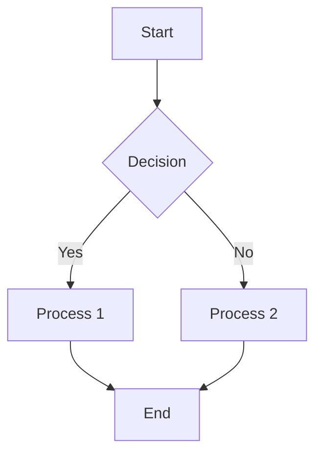
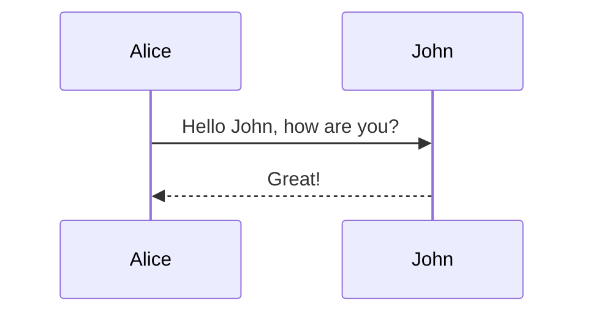
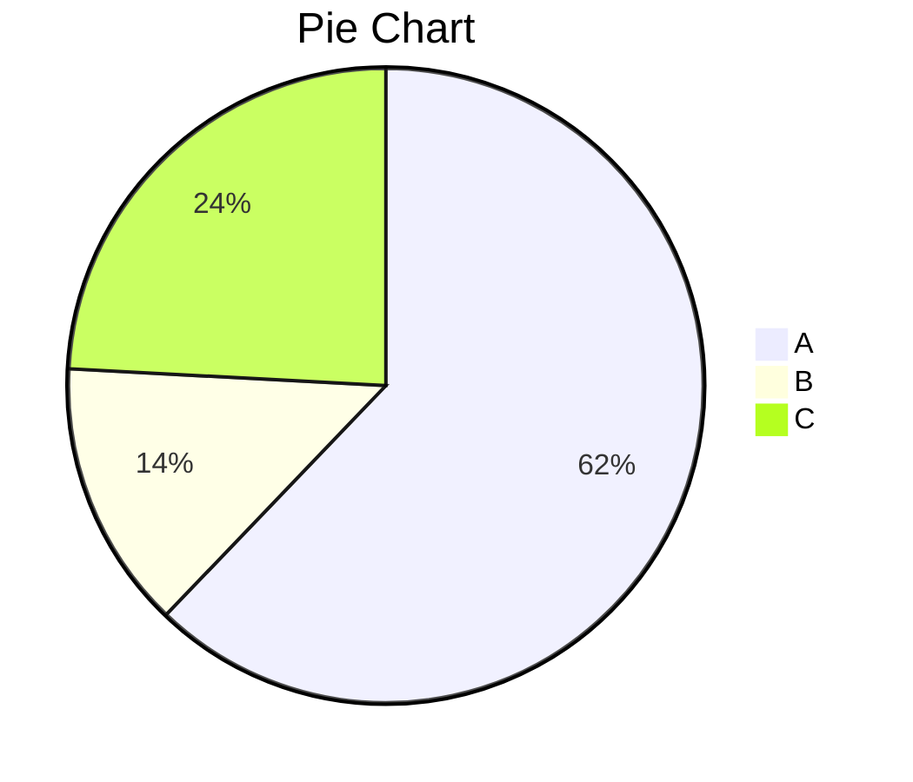

# Markdown Learning Guide

## Table of Contents

1. [Markdown Basics](#markdown-basics)
   1. [What is Markdown](#what-is-markdown)
   2. [Headers](#headers)
   3. [Text Formatting](#text-formatting)
   4. [Line Breaks and Paragraphs](#line-breaks-and-paragraphs)
2. [Lists](#lists)
   1. [Unordered Lists](#unordered-lists)
   2. [Ordered Lists](#ordered-lists)
   3. [Nested Lists](#nested-lists)
   4. [Task Lists](#task-lists)
3. [Links and Images](#links-and-images)
   1. [Links](#links)
   2. [Images](#images)
   3. [Reference Links](#reference-links)
   4. [Image Links](#image-links)
4. [Code](#code)
   1. [Inline Code](#inline-code)
   2. [Code Blocks](#code-blocks)
   3. [Syntax Highlighting](#syntax-highlighting)
   4. [Code Fences](#code-fences)
5. [Tables](#tables)
   1. [Basic Tables](#basic-tables)
   2. [Table Alignment](#table-alignment)
   3. [Complex Tables](#complex-tables)
6. [Block Elements](#block-elements)
   1. [Blockquotes](#blockquotes)
   2. [Horizontal Rules](#horizontal-rules)
   3. [Escape Characters](#escape-characters)
7. [GitHub Flavored Markdown](#github-flavored-markdown)
   1. [Strikethrough](#strikethrough)
   2. [Emoji](#emoji)
   3. [Mentions and References](#mentions-and-references)
   4. [Keyboard Keys](#keyboard-keys)
8. [Advanced Features](#advanced-features)
   1. [HTML in Markdown](#html-in-markdown)
   2. [Math Expressions](#math-expressions)
   3. [Mermaid Diagrams](#mermaid-diagrams)
   4. [Footnotes](#footnotes)
9. [Best Practices](#best-practices)
   1. [Document Structure](#document-structure)
   2. [Readability](#readability)
   3. [Cross-Platform Compatibility](#cross-platform-compatibility)
10. [Tools and Editors](#tools-and-editors)
    1. [Markdown Editors](#markdown-editors)
    2. [Live Preview](#live-preview)
    3. [Conversion Tools](#conversion-tools)

---

## Markdown Basics

### What is Markdown

**Markdown** is a lightweight markup language for creating formatted text using plain text syntax.

**Key Benefits:**
- Easy to read and write
- Platform independent
- Version control friendly
- Converts to HTML, PDF, etc.

**Common Uses:**
- Documentation (README files)
- Blog posts and articles
- Notes and wikis
- GitHub/GitLab issues and PRs

### Headers

```markdown
# H1 Header
## H2 Header
### H3 Header
#### H4 Header
##### H5 Header
###### H6 Header

Alternative H1
==============

Alternative H2
--------------
```

**Output:**
# H1 Header
## H2 Header
### H3 Header

### Text Formatting

```markdown
**Bold text**
__Also bold__

*Italic text*
_Also italic_

***Bold and italic***
___Also bold and italic___

~~Strikethrough~~

`Inline code`

==Highlighted text==
```

**Output:**
**Bold text**
*Italic text*
***Bold and italic***
~~Strikethrough~~
`Inline code`

### Line Breaks and Paragraphs

```markdown
This is a paragraph.

This is another paragraph.

Line break with two spaces at end
Next line appears below

Line break with backslash\
Also creates line break
```

**Rules:**
- Empty line = new paragraph
- Two spaces + Enter = line break
- Backslash + Enter = line break

---

## Lists

### Unordered Lists

```markdown
- Item 1
- Item 2
- Item 3

* Item A
* Item B
* Item C

+ Item X
+ Item Y
+ Item Z
```

**Output:**
- Item 1
- Item 2
- Item 3

### Ordered Lists

```markdown
1. First item
2. Second item
3. Third item

1. First item
1. Auto-numbered
1. All ones work

1) Alternative syntax
2) With parentheses
3) Also works
```

**Output:**
1. First item
2. Second item
3. Third item

### Nested Lists

```markdown
1. Main item
   - Sub item
   - Another sub item
     - Deep nested item
2. Second main item
   1. Numbered sub item
   2. Another numbered sub

- Mixed list
  1. Numbered inside
  2. Unordered parent
    - Back to bullets
```

**Output:**
1. Main item
   - Sub item
   - Another sub item
2. Second main item

### Task Lists

```markdown
- [x] Completed task
- [ ] Pending task
- [ ] Another pending task
  - [x] Sub-task done
  - [ ] Sub-task pending

* [x] Alternative syntax
* [ ] Also works
```

**Output:**
- [x] Completed task
- [ ] Pending task
- [ ] Another pending task

---

## Links and Images

### Links

```markdown
[Link text](https://example.com)
[Link with title](https://example.com "Hover title")

<https://example.com>
<email@example.com>

[Internal link](#markdown-basics)
[Relative link](./other-file.md)
```

**Output:**
[Link text](https://example.com)
[Internal link](#markdown-basics)

### Images

```markdown


```

**Syntax:** ``

### Reference Links

```markdown
[Link text][1]
[Another link][link-ref]

[1]: https://example.com
[link-ref]: https://example.com "Optional title"

![Image][img-ref]
[img-ref]: image.jpg "Image title"
```

**Benefits:** Cleaner text, reusable references

### Image Links

```markdown
[](https://example.com)

[![Alt text][img-ref]][link-ref]

[img-ref]: image.jpg
[link-ref]: https://example.com
```

---

## Code

### Inline Code

```markdown
Use `console.log()` to print output.
Install with `npm install package-name`.
The `grep` command searches text.

Use backticks: `code here`
```

**Output:**
Use `console.log()` to print output.

### Code Blocks

```markdown
    // Indented code block (4 spaces)
    function hello() {
        console.log("Hello World");
    }

```
Three backticks
function hello() {
    console.log("Hello World");
}
```

### Syntax Highlighting

````markdown
```javascript
function greet(name) {
    return `Hello, ${name}!`;
}
```

```python
def greet(name):
    return f"Hello, {name}!"
```

```bash
npm install
git commit -m "Update docs"
```

```json
{
    "name": "example",
    "version": "1.0.0"
}
```
````

### Code Fences

````markdown
```typescript
interface User {
    name: string;
    age: number;
}

const user: User = { name: "Alice", age: 30 };
```

```html
<div class="container">
    <h1>Title</h1>
    <p>Paragraph</p>
</div>
```

```css
.container {
    max-width: 1200px;
    margin: 0 auto;
    padding: 20px;
}
```
````

---

## Tables

### Basic Tables

```markdown
| Name  | Age | City     |
|-------|-----|----------|
| Alice | 30  | New York |
| Bob   | 25  | London   |
| Carol | 35  | Tokyo    |

Simple table:
Name | Age | City
-----|-----|-----
Alice | 30 | New York
Bob | 25 | London
```

**Output:**
| Name  | Age | City     |
|-------|-----|----------|
| Alice | 30  | New York |
| Bob   | 25  | London   |

### Table Alignment

```markdown
| Left Align | Center Align | Right Align |
|:-----------|:------------:|------------:|
| Left       |   Center     |       Right |
| Text       |   Text       |        Text |

| Default | Left | Center | Right |
|---------|:-----|:------:|------:|
| Default | Left | Center | Right |
```

**Alignment:**
- `:---` = Left align
- `:---:` = Center align
- `---:` = Right align

### Complex Tables

```markdown
| Feature | Basic | Pro | Enterprise |
|---------|:-----:|:---:|:----------:|
| Users   | 5     | 50  | Unlimited  |
| Storage | 1GB   | 10GB| 100GB      |
| Support | Email | Chat| Phone      |
| Price   | Free  | $10 | $50        |

| Code | Language | Example |
|------|----------|---------|
| `js` | JavaScript | `console.log("hello")` |
| `py` | Python | `print("hello")` |
| `sh` | Shell | `echo "hello"` |
```

---

## Block Elements

### Blockquotes

```markdown
> This is a blockquote.
> It can span multiple lines.

> **Note:** Important information here.

> Nested quote:
>> This is nested inside.

> ## Header in quote
>
> Regular text in quote.
>
> - List in quote
> - Another item
```

**Output:**
> This is a blockquote.
> It can span multiple lines.

### Horizontal Rules

```markdown
---

***

___

---

Use three or more:
- Hyphens (---)
- Asterisks (***)
- Underscores (___)
```

### Escape Characters

```markdown
\*Not italic\*
\[Not a link\]
\# Not a header

Use backslash (\) to escape:
\* \` \_ \{ \} \[ \] \( \) \# \+ \- \. \! \\ \| \~
```

**Output:**
\*Not italic\*
\[Not a link\]

---

## GitHub Flavored Markdown

### Strikethrough

```markdown
~~Strikethrough text~~
~~This is crossed out~~

Normal text ~~deleted text~~ normal text.
```

**Output:**
~~Strikethrough text~~

### Emoji

```markdown
:smile: :heart: :thumbsup: :rocket:
:warning: :information_source: :heavy_check_mark:

GitHub emoji shortcodes:
:octocat: :git: :github: :computer:
```

**Output:**
:smile: :heart: :thumbsup: :rocket:

### Mentions and References

```markdown
@username mentions user
#123 references issue/PR
SHA: a5c3785ed8d6a35868bc169f07e40e889087fd2e
User@SHA: jlord@a5c3785
```

### Keyboard Keys

```markdown
Press <kbd>Ctrl</kbd> + <kbd>C</kbd> to copy
<kbd>Ctrl</kbd> + <kbd>Shift</kbd> + <kbd>P</kbd> for command palette

<kbd>Enter</kbd> <kbd>Esc</kbd> <kbd>Tab</kbd>
```

**Output:**
Press <kbd>Ctrl</kbd> + <kbd>C</kbd> to copy

---

## Advanced Features

### HTML in Markdown

```markdown
<div align="center">
  <h2>Centered Title</h2>
  
</div>

<details>
<summary>Click to expand</summary>

Hidden content here.
- List item
- Another item

</details>

<mark>Highlighted text</mark>
<small>Small text</small>
<sup>Superscript</sup> <sub>Subscript</sub>
```

### Math Expressions

```markdown
Inline math: $E = mc^2$

Block math:
$$
\sum_{i=1}^{n} x_i = x_1 + x_2 + \ldots + x_n
$$

$$
\begin{align}
f(x) &= x^2 + 2x + 1 \\
     &= (x + 1)^2
\end{align}
$$
```

### Mermaid Diagrams

````markdown





````

### Footnotes

```markdown
Here's a sentence with a footnote[^1].

Another footnote[^note].

[^1]: This is the first footnote.
[^note]: This is a named footnote.
```

---

## Best Practices

### Document Structure

```markdown
# Document Title

Brief description of the document.

## Table of Contents
- [Section 1](#section-1)
- [Section 2](#section-2)

## Section 1
Content here...

### Subsection 1.1
More specific content...

## Section 2
More content...

---
*Last updated: 2024-01-01*
```

### Readability

```markdown
<!-- Good: Clear structure -->
## Installation

1. Download the package
2. Extract files
3. Run installer

### Prerequisites
- Node.js 16+
- npm 8+

<!-- Bad: Wall of text -->
Installation Download the package and extract files then run installer you need Node.js 16+ and npm 8+...
```

### Cross-Platform Compatibility

```markdown
<!-- Use forward slashes for paths -->
[Documentation](./docs/readme.md)

<!-- Avoid platform-specific examples -->
<!-- Good -->
npm install package-name

<!-- Bad -->
C:\Users\Name\project\npm install
```

**Guidelines:**
- Use consistent header hierarchy
- Add table of contents for long documents
- Use descriptive link text
- Include alt text for images
- Test on different platforms

---

## Tools and Editors

### Markdown Editors

**Desktop:**
- **Typora**: WYSIWYG editor
- **Mark Text**: Real-time preview
- **Obsidian**: Note-taking with links
- **Notion**: All-in-one workspace

**Online:**
- **Dillinger**: Browser-based editor
- **StackEdit**: GitHub integration
- **HackMD**: Collaborative editing

**VS Code Extensions:**
- Markdown All in One
- Markdown Preview Enhanced
- markdownlint

### Live Preview

```markdown
<!-- VS Code: Ctrl+Shift+V -->
<!-- Command palette: "Markdown: Open Preview" -->

<!-- Browser tools -->
- Marked.js for parsing
- Remarkable for rendering
- markdown-it for features
```

### Conversion Tools

```bash
# Pandoc - universal converter
pandoc input.md -o output.html
pandoc input.md -o output.pdf
pandoc input.md -o output.docx

# GitHub Pages - Jekyll
gem install jekyll bundler
jekyll new myblog
jekyll serve

# Static site generators
# Gatsby, Next.js, Hugo, VuePress
```

**Popular Converters:**
- **Pandoc**: Universal document converter
- **GitBook**: Documentation platform
- **MkDocs**: Documentation generator
- **Docsify**: Documentation site generator

**Export Formats:**
- HTML
- PDF
- Word (.docx)
- LaTeX
- EPUB
- Presentation slides